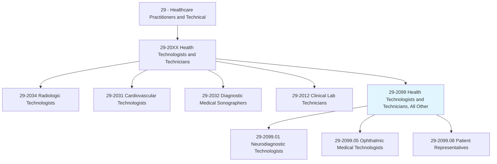
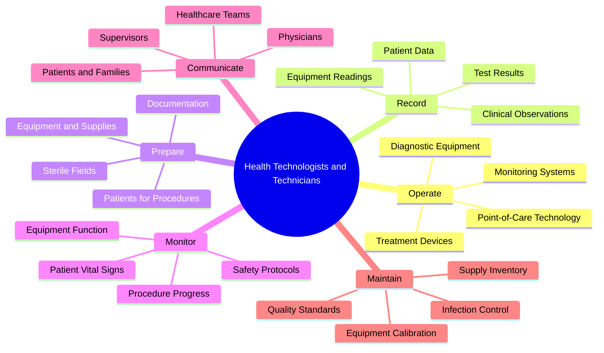
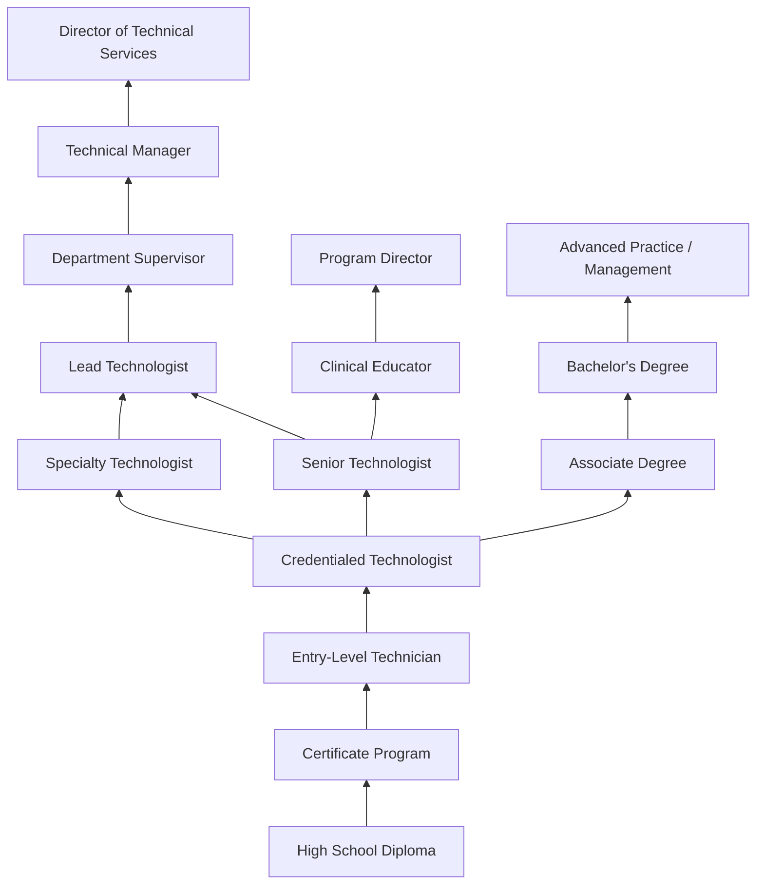
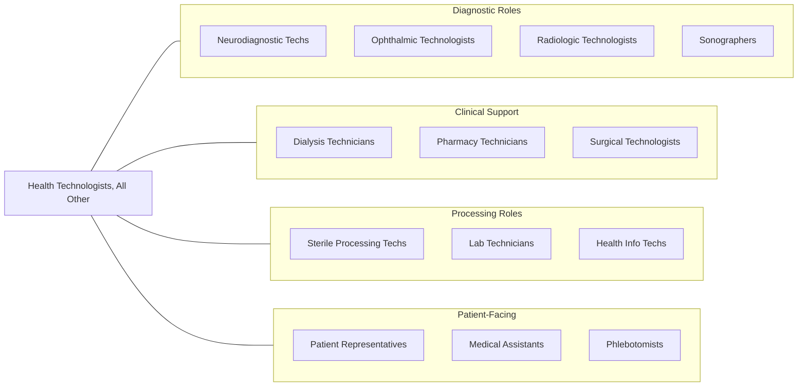

# Health Technologists and Technicians, All Other

> All health technologists and technicians not listed separately.

## Overview

Health Technologists and Technicians, All Other encompasses specialized health technology professionals not separately classified in the SOC system. This diverse category includes neurodiagnostic technologists, ophthalmic medical technologists, patient representatives, dialysis technicians, sterile processing technicians, surgical neurophysiologists, perfusionists, phlebotomists in specialized settings, and other technical healthcare workers who require specialized training and certification to perform diagnostic, therapeutic, or support functions.

These professionals operate specialized equipment, perform technical procedures, collect and analyze clinical data, and support licensed practitioners in delivering healthcare services. They typically hold associate degrees or certificates, maintain professional certifications, and work under the supervision of physicians, advanced practice providers, or other licensed healthcare professionals. Many positions require hands-on clinical training through accredited programs and ongoing continuing education to maintain competency with rapidly evolving medical technologies.

The category continues to grow as medical technology advances create new specialized roles in areas such as telehealth support, remote patient monitoring, point-of-care testing, clinical informatics support, genetic testing assistance, and specialized imaging modalities. These emerging roles reflect healthcare's increasing reliance on technology-mediated diagnostics and patient care delivery systems.

## Classification Hierarchy

## Key Statistics

| Metric | Value |
|--------|-------|
| SOC Code | 29-2099.00 |
| Median Annual Salary | $48,820 |
| Employment | ~85,000 |
| Projected Growth | 8% (2022-2032) |
| Job Zone | 3 (Medium Preparation) |
| Category | [Healthcare Practitioners](/occupations/HealthcarePractitioners) |
| Source | O*NET |

## Sub-Occupations

### Classified Sub-Occupations

| Occupation | SOC Code | Description | Link |
|-----------|----------|-------------|------|
| Neurodiagnostic Technologists | 29-2099.01 | Conduct electroneurodiagnostic tests such as EEGs, evoked potentials, and polysomnograms | [View Details](/occupations/HealthcarePractitioners/NeurodiagnosticTechnologists) |
| Ophthalmic Medical Technologists | 29-2099.05 | Assist ophthalmologists with advanced diagnostic tests, ophthalmic imaging, and surgical procedures | [View Details](/occupations/HealthcarePractitioners/OphthalmicMedicalTechnologists) |
| Patient Representatives | 29-2099.08 | Assist patients in obtaining services, understanding policies, and making healthcare decisions | [View Details](/occupations/HealthcarePractitioners/PatientRepresentatives) |

### Additional Specialty Technicians in This Category

| Specialty | Description |
|-----------|-------------|
| Dialysis Technicians | Operate hemodialysis machines and monitor patients during kidney dialysis treatment |
| Sterile Processing Technicians | Decontaminate, sterilize, and prepare surgical instruments and medical equipment |
| Perfusionists | Operate heart-lung machines during cardiac surgery and other procedures requiring cardiopulmonary bypass |
| Surgical Neurophysiologists | Monitor neural function during surgical procedures to prevent neurological damage |
| Genetic Laboratory Assistants | Support genetic testing operations and sample processing in molecular diagnostics laboratories |
| Sleep Lab Technicians | Assist with polysomnography studies and continuous positive airway pressure (CPAP) titration |
| Point-of-Care Testing Technicians | Operate and maintain point-of-care diagnostic devices in clinical settings |
| Telehealth Technicians | Support remote patient monitoring systems and virtual care technology platforms |

## Core Tasks

### operate.DiagnosticEquipment

Health technologists operate specialized medical devices and equipment.

**Actions:**
- `operate.DiagnosticEquipment.for.PatientAssessment` - Equipment operation
- `calibrate.MedicalDevices.per.ManufacturerSpecifications` - Device calibration
- `troubleshoot.EquipmentMalfunctions.during.Procedures` - Technical problem-solving
- `maintain.EquipmentReadiness.for.ClinicalOperations` - Maintenance protocols

### record.ClinicalData

Health technologists document patient information and test results.

**Actions:**
- `record.PatientData.in.ElectronicHealthRecords` - EHR documentation
- `document.TestResults.for.PhysicianReview` - Results reporting
- `maintain.QualityAssuranceRecords.per.RegulatoryRequirements` - QA documentation
- `report.CriticalFindings.to.SupervisingClinician` - Critical value communication

### prepare.PatientsAndEquipment

Health technologists ready patients and equipment for procedures.

**Actions:**
- `prepare.Patients.for.DiagnosticProcedures` - Patient preparation
- `setup.SterileFields.for.InvasiveProcedures` - Sterile technique
- `gather.SuppliesAndEquipment.for.ClinicalProcedures` - Equipment assembly
- `verify.PatientIdentification.using.SafetyProtocols` - Patient safety

## Common Skills Across the Group

### Technical Skills

| Skill | Proficiency | Description |
|-------|-------------|-------------|
| Medical Equipment Operation | Expert | Operating diagnostic and therapeutic devices |
| Clinical Documentation | Advanced | Recording patient data and test results in EHR systems |
| Patient Safety Protocols | Advanced | Following infection control and safety procedures |
| Quality Assurance | Advanced | Maintaining equipment calibration and quality standards |
| Specimen Collection/Handling | Advanced | Proper collection and processing of biological samples |
| Technical Troubleshooting | Intermediate-Advanced | Diagnosing and resolving equipment issues |
| Medical Terminology | Advanced | Understanding clinical language and abbreviations |
| Sterile Technique | Advanced | Maintaining aseptic conditions for procedures |

### Soft Skills

| Skill | Importance | Application |
|-------|------------|-------------|
| Attention to Detail | Critical | Accurate readings, proper documentation, safety verification |
| Patient Communication | Essential | Explaining procedures, providing reassurance, obtaining cooperation |
| Teamwork | Essential | Collaborating with physicians, nurses, and other technologists |
| Adaptability | Essential | Adjusting to new equipment, protocols, and patient needs |
| Composure Under Pressure | Important | Maintaining focus during emergencies and high-stress situations |
| Time Management | Important | Efficiently completing procedures within clinical workflows |
| Problem-Solving | Important | Addressing technical issues and patient concerns |

## Education & Training Pathways

| Pathway | Duration | Credential | Typical Roles |
|---------|----------|------------|---------------|
| Certificate Programs | 6-12 months | Certificate | Entry-level technician positions |
| Associate Degree | 2 years | AAS/AS | Most health technologist positions |
| Bachelor's Degree | 4 years | BS | Advanced technologist, supervisory roles |
| On-the-Job Training | Varies | Employer certification | Some specialty technician roles |

### Common Requirements

- High school diploma or equivalent (minimum)
- Clinical training through accredited program
- BLS (Basic Life Support) certification
- Professional certification specific to specialty
- Continuing education for certification maintenance
- Background check and health screening

## Certifications by Specialty

| Specialty | Certification | Certifying Body |
|-----------|---------------|-----------------|
| Neurodiagnostic Technology | R.EEG T., CNIM | ABRET |
| Ophthalmic Technology | COT, COMT | JCAHPO |
| Dialysis Technology | CHT, BONENT | NNCC, BONENT |
| Sterile Processing | CRCST, CIS | HSPA |
| Surgical Neurophysiology | CNIM, D.ABNM | ABRET, ABNM |
| Sleep Technology | RPSGT | BRPT |
| Phlebotomy | CPT, PBT | NHA, ASCP |

## Career Progression

### Advancement Opportunities

| Level | Typical Experience | Responsibilities |
|-------|-------------------|------------------|
| Entry-Level Technician | 0-1 years | Basic procedures under supervision |
| Credentialed Technologist | 1-3 years | Independent procedures, documentation |
| Senior Technologist | 3-5 years | Complex procedures, training others |
| Lead Technologist | 5-7 years | Team coordination, quality assurance |
| Supervisor/Manager | 7-10+ years | Department operations, staff management |
| Director | 10+ years | Strategic planning, multiple departments |

## Practice Settings

| Setting | Description | Common Specialties |
|---------|-------------|-------------------|
| Hospitals | Inpatient and outpatient diagnostic services | All specialties |
| Ambulatory Surgery Centers | Pre-operative and procedure support | Sterile processing, surgical support |
| Outpatient Clinics | Specialty physician office support | Ophthalmic, dialysis, neurodiagnostic |
| Dialysis Centers | Freestanding renal care facilities | Dialysis technicians |
| Sleep Centers | Diagnostic sleep laboratories | Polysomnography technicians |
| Reference Laboratories | Specialized testing facilities | Laboratory support technicians |
| Home Health | Remote monitoring and home dialysis | Telehealth technicians |

## Industry Context

### Healthcare Settings Employment Distribution

| Industry | % of Employment | Key Characteristics |
|----------|----------------|---------------------|
| General Medical/Surgical Hospitals | 45% | Full range of technical services, shift work |
| Outpatient Care Centers | 20% | Specialty-focused, regular hours |
| Physician Offices | 15% | Direct physician support, smaller teams |
| Other Healthcare Facilities | 10% | Nursing facilities, dialysis centers |
| Government/VA | 5% | Federal employment, benefits |
| Other Settings | 5% | Research, education, industry |

### Workforce Trends

- **Technology Advancement**: Increasing automation requiring higher-level technical skills
- **Telehealth Expansion**: Growing demand for remote monitoring and virtual care support
- **Point-of-Care Testing**: Decentralization of diagnostics creating new roles
- **Aging Population**: Increased demand for diagnostic and treatment services
- **Certification Requirements**: Trend toward mandatory credentialing across specialties
- **Cross-Training**: Multi-skilled technologists valued in smaller facilities

## Related Occupations

### Related Occupation Links

| Occupation | Relationship | Link |
|------------|--------------|------|
| Radiologic Technologists | Related diagnostic imaging | [View](/occupations/HealthcarePractitioners/RadiologicTechnologistsAndTechnicians) |
| Cardiovascular Technologists | Related diagnostic testing | [View](/occupations/HealthcarePractitioners/CardiovascularTechnologistsAndTechnicians) |
| Medical and Clinical Laboratory Technicians | Related laboratory work | [View](/occupations/HealthcarePractitioners/MedicalAndClinicalLaboratoryTechnicians) |
| Surgical Technologists | Related surgical support | [View](/occupations/HealthcarePractitioners/SurgicalTechnologists) |
| Pharmacy Technicians | Related medication support | [View](/occupations/HealthcarePractitioners/PharmacyTechnicians) |

## Industries

- [Hospitals](/industries/Healthcare/Hospitals/index) - Inpatient and outpatient departments
- [Ambulatory Healthcare](/industries/Healthcare/AmbulatoryHealthCare) - Outpatient services and specialty clinics
- [Physician Offices](/industries/Healthcare/PhysicianOffices) - Medical practice support
- [Nursing Facilities](/industries/Healthcare/NursingCare) - Long-term care diagnostic services
- [Home Health](/industries/Healthcare/HomeHealth) - Home-based patient monitoring

## Departments

This occupation category typically works in:
- Diagnostic Services
- Laboratory Services
- Patient Services
- Surgical Services
- Outpatient Clinics
- Quality Assurance
- Clinical Engineering

## Technology & Tools

| Category | Examples | Purpose |
|----------|----------|---------|
| Diagnostic Equipment | EEG machines, ultrasound, monitoring devices | Patient assessment and diagnosis |
| Electronic Health Records | Epic, Cerner, Meditech | Clinical documentation |
| Laboratory Information Systems | Sunquest, Cerner PathNet | Test ordering and results |
| Sterilization Equipment | Autoclaves, washer-disinfectors | Instrument processing |
| Point-of-Care Devices | Glucometers, i-STAT, CoaguChek | Rapid diagnostics |
| Telehealth Platforms | Remote monitoring systems | Virtual patient care |

---

*Source: O*NET 29-2099.00 - ONETOccupation*
