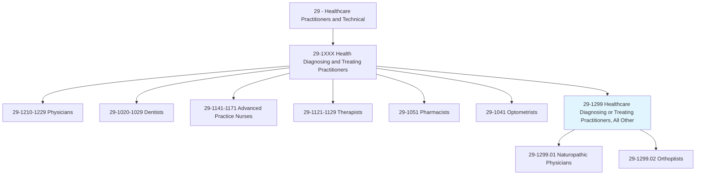
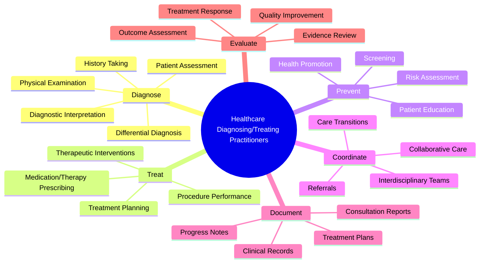
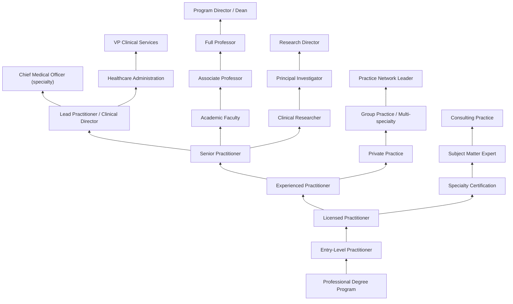
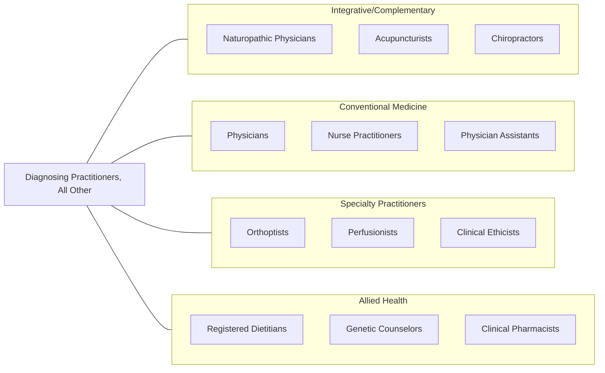

# Healthcare Diagnosing or Treating Practitioners, All Other

> All healthcare diagnosing or treating practitioners not listed separately.

## Overview

Healthcare Diagnosing or Treating Practitioners, All Other is a residual category that encompasses licensed healthcare practitioners who diagnose and/or treat patients but are not separately classified in the Standard Occupational Classification system. This includes practitioners in emerging or niche specialties such as naturopathic physicians, orthoptists, perfusionists, clinical ethicists, integrative medicine practitioners, clinical perfusionists, lactation consultants with advanced clinical roles, genetic counselors with prescriptive authority, clinical audiologists in advanced practice roles, and other licensed professionals with diagnostic or prescriptive authority.

These practitioners typically hold doctoral or master's-level degrees, maintain professional licensure in their jurisdiction, and practice within defined scopes that include patient assessment, diagnosis, and treatment planning. They may work independently or collaboratively with other healthcare professionals depending on state licensing laws, institutional credentialing requirements, and the nature of their specialty. Many represent emerging fields where professional recognition and regulatory frameworks are still evolving.

The category reflects the growing diversification of healthcare specialties driven by integrative medicine approaches, personalized healthcare models, advances in medical technology, and the recognition of complementary and alternative health disciplines within regulated healthcare frameworks. As healthcare delivery becomes more specialized and patient-centered, new practitioner roles continue to emerge to address specific population needs, treatment modalities, and care coordination requirements.

## Classification Hierarchy

## Key Statistics

| Metric | Value |
|--------|-------|
| SOC Code | 29-1299.00 |
| Median Annual Salary | $76,000 |
| Employment | ~35,000 |
| Projected Growth | 8% (2022-2032) |
| Job Zone | 5 (Extensive Preparation) |
| Category | [Healthcare Practitioners](/occupations/HealthcarePractitioners) |
| Source | O*NET |

## Sub-Occupations

### Classified Sub-Occupations

| Occupation | SOC Code | Description | Link |
|-----------|----------|-------------|------|
| Naturopathic Physicians | 29-1299.01 | Diagnose, treat, and help prevent diseases using natural healing methods, botanical medicine, clinical nutrition, and physical medicine | [View Details](/occupations/HealthcarePractitioners/NaturopathicPhysicians) |
| Orthoptists | 29-1299.02 | Diagnose and treat visual system disorders such as binocular vision and eye movement impairments | [View Details](/occupations/HealthcarePractitioners/Orthoptists) |

### Additional Practitioners in This Category

| Specialty | Description | Practice Focus |
|-----------|-------------|----------------|
| Perfusionists | Operate extracorporeal circulation and autotransfusion equipment during surgical procedures | Cardiovascular surgery, organ transplantation |
| Clinical Ethicists | Provide ethics consultation and guidance on complex medical decisions | End-of-life care, research ethics, policy |
| Integrative Medicine Practitioners | Combine conventional and complementary approaches to patient care | Whole-person wellness, prevention |
| Functional Medicine Practitioners | Address root causes of disease through systems-based approaches | Chronic disease, metabolic health |
| Environmental Medicine Specialists | Diagnose and treat conditions caused by environmental factors | Toxicology, occupational health |
| Sleep Medicine Specialists (non-MD) | Assess and manage sleep disorders through behavioral interventions | Sleep hygiene, CPAP management |
| Clinical Pharmacogenomics Specialists | Optimize medication therapy based on genetic testing | Personalized medicine |
| Advanced Practice Lactation Consultants | Provide clinical management of complex breastfeeding issues | Maternal-infant health |
| Cardiovascular Perfusion Technologists | Manage cardiopulmonary bypass during cardiac procedures | Open-heart surgery support |
| Clinical Genetics Associates | Support genetic testing and counseling in clinical settings | Genetic risk assessment |

## Core Tasks

### diagnose.PatientConditions

Practitioners in this category conduct comprehensive assessments to identify health conditions.

**Actions:**
- `diagnose.PatientConditions.using.PhysicalExamination` - Clinical evaluation
- `assess.PatientHistory.for.DiagnosticClues` - History taking
- `interpret.DiagnosticTests.for.ClinicalDecisionMaking` - Test interpretation
- `formulate.DifferentialDiagnosis.based.on.ClinicalFindings` - Diagnostic reasoning
- `evaluate.FunctionalStatus.using.SpecializedAssessments` - Functional evaluation

### treat.PatientConditions

Practitioners implement therapeutic interventions within their scope of practice.

**Actions:**
- `develop.TreatmentPlans.for.IdentifiedConditions` - Treatment planning
- `prescribe.Therapies.within.ScopeOfPractice` - Therapeutic prescribing
- `perform.Procedures.per.ProfessionalStandards` - Procedural interventions
- `monitor.TreatmentResponse.for.OutcomeOptimization` - Response monitoring
- `adjust.Interventions.based.on.PatientProgress` - Treatment modification

### prevent.HealthConditions

Practitioners engage in health promotion and disease prevention activities.

**Actions:**
- `assess.RiskFactors.for.DiseasePrevention` - Risk assessment
- `counsel.Patients.on.LifestyleModifications` - Health counseling
- `recommend.Screening.for.EarlyDetection` - Preventive screening
- `educate.Patients.on.HealthMaintenance` - Patient education

## Common Skills Across the Group

### Clinical Skills

| Skill | Proficiency Level | Description |
|-------|-------------------|-------------|
| Clinical Assessment | Expert | Comprehensive patient evaluation and examination |
| Diagnostic Reasoning | Expert | Synthesizing clinical data to reach diagnoses |
| Treatment Planning | Expert | Developing evidence-based therapeutic approaches |
| Patient Communication | Expert | Explaining conditions and treatment options |
| Medical Decision-Making | Advanced-Expert | Applying clinical judgment to complex cases |
| Procedural Skills | Variable by specialty | Performing specialty-specific procedures |
| Clinical Documentation | Advanced | Maintaining comprehensive medical records |
| Evidence-Based Practice | Advanced | Applying research to clinical decisions |

### Specialized Skills by Practitioner Type

| Practitioner | Key Specialized Skills |
|--------------|----------------------|
| Naturopathic Physicians | Botanical medicine, clinical nutrition, homeopathy, physical medicine |
| Orthoptists | Binocular vision assessment, eye movement analysis, vision therapy |
| Perfusionists | Cardiopulmonary bypass management, blood gas analysis, anticoagulation |
| Integrative Practitioners | Whole-person assessment, complementary therapies, lifestyle medicine |
| Clinical Ethicists | Ethics consultation, moral reasoning, policy development |

### Soft Skills

| Skill | Importance | Application |
|-------|------------|-------------|
| Critical Thinking | Critical | Clinical decision-making and problem-solving |
| Empathy | Essential | Patient-centered care and communication |
| Communication | Critical | Patient education and interdisciplinary collaboration |
| Professionalism | Essential | Ethical practice and professional boundaries |
| Adaptability | Essential | Responding to diverse patient needs and evolving evidence |
| Collaboration | Essential | Working with healthcare teams and referring appropriately |
| Cultural Competence | Essential | Providing care across diverse populations |
| Lifelong Learning | Essential | Staying current with advances in specialty |

## Education & Training

| Requirement | Details |
|-------------|---------|
| Undergraduate | Bachelor's degree with prerequisite sciences |
| Graduate/Professional | Doctoral degree (ND, OD, PharmD equivalent) or Master's degree (MS, MA) |
| Clinical Training | 1,000-4,000+ hours supervised clinical experience |
| Licensure | State-specific professional license |
| Board Certification | National certification in specialty |
| Continuing Education | Ongoing CE requirements for license maintenance |

### Education Pathways by Practitioner Type

| Practitioner | Degree | Program Duration | Key Training |
|--------------|--------|-----------------|--------------|
| Naturopathic Physicians | ND (Doctor of Naturopathic Medicine) | 4 years post-bachelor's | Clinical rotations, natural therapeutics |
| Orthoptists | Certificate/Master's | 2-3 years post-bachelor's | Clinical practicum in eye care |
| Perfusionists | Bachelor's/Master's | 2-4 years | Clinical perfusion training |
| Clinical Ethicists | PhD/Master's in Bioethics | 2-5 years | Ethics consultation training |
| Integrative Medicine | Fellowship/Certificate | 1-2 years post-medical degree | Integrative approaches |

## Certifications

| Certification | Specialty | Certifying Body | Requirements |
|---------------|-----------|-----------------|--------------|
| NPLEX | Naturopathic Medicine | NABNE | ND degree from accredited school + exam |
| CO | Orthoptics | American Orthoptic Council | Accredited program + exam |
| CCP | Perfusion | ABCP | Bachelor's + accredited program + exam |
| HEC-C | Healthcare Ethics | ASBH | Master's + training + portfolio |
| FAARM/DAARM | Anti-Aging Medicine | A4M | Medical degree + fellowship |
| IFMCP | Functional Medicine | IFM | Licensed healthcare provider + training |
| DACM | Acupuncture/Oriental Medicine | NCCAOM | Accredited program + exam |

## Career Progression

### Career Pathways

| Pathway | Typical Timeline | Key Milestones |
|---------|-----------------|----------------|
| Clinical Practice | 0-20+ years | Licensure > Experience > Senior > Clinical Director |
| Private Practice | 2-15 years | Associate > Solo practice > Group practice > Network |
| Academic | 5-20 years | Adjunct > Assistant > Associate > Full Professor |
| Administration | 10-20 years | Clinical > Supervisor > Director > VP/CMO |
| Research | 5-15 years | Clinical + Research > PI > Program Director |
| Consulting | 5-15 years | Expertise > Thought leadership > Consulting practice |

## Practice Settings

| Setting | Description | Common Practitioner Types |
|---------|-------------|--------------------------|
| Ambulatory Clinics | Outpatient specialty care | Naturopathic physicians, orthoptists |
| Integrative Medicine Centers | Multi-disciplinary wellness | Naturopathic, integrative practitioners |
| Hospital-Based Practice | Inpatient specialty services | Perfusionists, clinical ethicists |
| Academic Medical Centers | Teaching and clinical care | All specialties |
| Private Practice | Independent specialty practice | Most practitioner types |
| Community Health Centers | Underserved population care | Naturopathic physicians |
| Corporate Wellness | Employer-sponsored health programs | Integrative practitioners |
| Telehealth | Virtual specialty care | Most practitioner types |
| Research Institutions | Clinical trials and research | Specialized researchers |

## Industry Context

### Healthcare Settings Employment Distribution

| Industry | % of Employment | Key Characteristics |
|----------|----------------|---------------------|
| Ambulatory Care/Private Practice | 40% | Independent practice, specialty clinics |
| Hospitals | 20% | Perfusionists, ethicists, specialty consultants |
| Integrative Medicine Centers | 15% | Multi-disciplinary wellness settings |
| Academic Medical Centers | 10% | Teaching, research, clinical care |
| Government/Military/VA | 5% | Federal healthcare settings |
| Corporate/Occupational | 5% | Workplace health programs |
| Research/Pharmaceutical | 5% | Clinical research, drug development |

### Regulatory Landscape

| Aspect | Description |
|--------|-------------|
| Licensure | Variable by state; some specialties licensed in limited jurisdictions |
| Scope of Practice | Defined by state law; may include prescriptive authority |
| Insurance Coverage | Variable; often limited for integrative/complementary practitioners |
| Credentialing | Institutional privileging for hospital-based practice |
| Accreditation | Professional program accreditation by specialty bodies |

### Workforce Trends

- **Integrative Medicine Growth**: Increasing demand for whole-person, prevention-focused care
- **Technology Integration**: Telehealth, digital diagnostics, and AI-assisted practice
- **Personalized Medicine**: Genomic and biomarker-based treatment approaches
- **Regulatory Evolution**: Expanding licensure and scope for complementary practitioners
- **Team-Based Care**: Integration into interdisciplinary healthcare teams
- **Research Validation**: Growing evidence base for complementary approaches
- **Consumer Demand**: Patient-driven interest in natural and integrative options

## Related Occupations

### Related Occupation Links

| Occupation | Relationship | Link |
|------------|--------------|------|
| Naturopathic Physicians | Sub-occupation | [View](/occupations/HealthcarePractitioners/NaturopathicPhysicians) |
| Orthoptists | Sub-occupation | [View](/occupations/HealthcarePractitioners/Orthoptists) |
| Acupuncturists | Related complementary medicine | [View](/occupations/HealthcarePractitioners/Acupuncturists) |
| Chiropractors | Related complementary medicine | [View](/occupations/HealthcarePractitioners/Chiropractors) |
| Physicians | Related conventional practice | [View](/occupations/HealthcarePractitioners/Physicians) |
| Nurse Practitioners | Related primary care | [View](/occupations/HealthcarePractitioners/NursePractitioners) |
| Physician Assistants | Related primary care | [View](/occupations/HealthcarePractitioners/PhysicianAssistants) |
| Dietitians and Nutritionists | Related nutrition expertise | [View](/occupations/HealthcarePractitioners/DietitiansAndNutritionists) |
| Genetic Counselors | Related genetic expertise | [View](/occupations/HealthcarePractitioners/GeneticCounselors) |

## Industries

- [Ambulatory Healthcare](/industries/Healthcare/AmbulatoryHealthCare) - Outpatient practice and specialty clinics
- [Hospitals](/industries/Healthcare/Hospitals/index) - Inpatient specialty services
- [Integrative Medicine](/industries/Healthcare/AmbulatoryHealthCare) - Wellness-focused multi-disciplinary care
- [Academic](/industries/Education) - Teaching hospitals and research institutions
- [Government](/industries/PublicAdministration) - Federal healthcare programs (VA, Military)

## Departments

This occupation category typically works in:
- Integrative Medicine
- Specialty Services
- Primary Care (select practitioners)
- Surgical Services (perfusionists)
- Ethics Consultation
- Wellness Programs
- Vision Services (orthoptists)
- Research

## Technology & Tools

| Category | Examples | Purpose |
|----------|----------|---------|
| Diagnostic Equipment | Specialty assessment devices, imaging interpretation | Patient evaluation |
| Cardiopulmonary Bypass | Heart-lung machines, ECMO systems (perfusionists) | Surgical support |
| Vision Testing | Orthoptic assessment equipment, eye tracking | Binocular vision evaluation |
| Laboratory Testing | Standard and functional medicine panels | Diagnostic evaluation |
| Electronic Health Records | Epic, specialty-specific EHRs | Clinical documentation |
| Telehealth Platforms | Video consultation systems | Virtual patient care |
| Practice Management | Scheduling, billing systems | Administrative operations |
| Evidence Databases | Clinical research databases | Evidence-based practice |

## Professional Organizations

| Organization | Abbreviation | Focus |
|--------------|--------------|-------|
| American Association of Naturopathic Physicians | AANP | Naturopathic medicine |
| American Orthoptic Council | AOC | Orthoptics profession |
| American Society of Extracorporeal Technology | AmSECT | Perfusion technology |
| American Society for Bioethics and Humanities | ASBH | Healthcare ethics |
| Academy of Integrative Health & Medicine | AIHM | Integrative medicine |
| Institute for Functional Medicine | IFM | Functional medicine |
| American College of Lifestyle Medicine | ACLM | Lifestyle medicine |

## Emerging Roles

| Emerging Specialty | Description | Drivers |
|-------------------|-------------|---------|
| Digital Health Practitioners | Specialists in digital therapeutics and remote monitoring | Technology adoption |
| Precision Medicine Specialists | Genomic and biomarker-based treatment experts | Personalized medicine |
| Behavioral Health Integrators | Primary care behavioral health specialists | Integrated care models |
| Population Health Managers | Practitioners focused on community health outcomes | Value-based care |
| Health Coaching Clinicians | Evidence-based lifestyle change specialists | Chronic disease prevention |
| Telehealth Specialists | Practitioners skilled in virtual care delivery | Remote care expansion |

---

*Source: O*NET 29-1299.00 - ONETOccupation*
