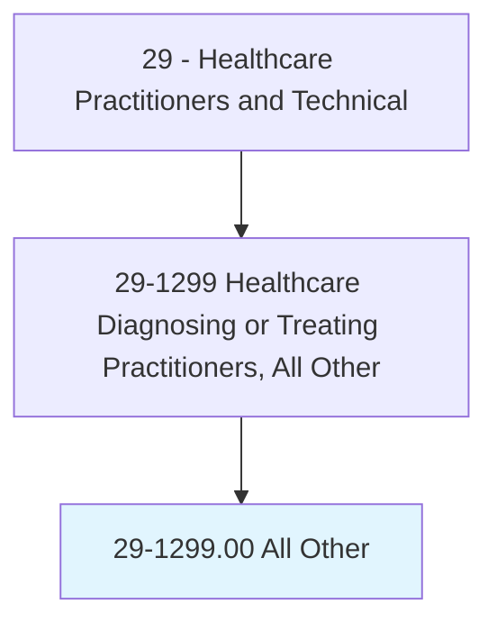
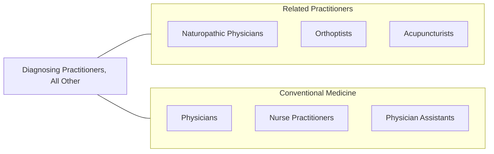

# Healthcare Diagnosing or Treating Practitioners, All Other

> All healthcare diagnosing or treating practitioners not listed separately.

## Overview

Healthcare Diagnosing or Treating Practitioners, All Other is a residual category that encompasses licensed healthcare practitioners who diagnose and/or treat patients but are not separately classified in the Standard Occupational Classification system. This includes practitioners in emerging or niche specialties such as naturopathic physicians, orthoptists, perfusionists, clinical ethicists, integrative medicine practitioners, and other licensed professionals with diagnostic or prescriptive authority.

These practitioners typically hold doctoral or master's-level degrees, maintain professional licensure, and practice within defined scopes that include patient assessment, diagnosis, and treatment planning. They may work independently or collaboratively with other healthcare professionals depending on state licensing laws and institutional credentialing requirements.

The category reflects the growing diversification of healthcare specialties driven by integrative medicine, personalized healthcare, and the recognition of complementary and alternative health disciplines within regulated healthcare frameworks.

## Classification Hierarchy

## Key Statistics

| Metric | Value |
|--------|-------|
| SOC Code | 29-1299.00 |
| Median Annual Salary | $76,000 |
| Employment | ~35,000 |
| Projected Growth | 8% (2022-2032) |
| Job Zone | 5 (Extensive Preparation) |
| Category | [Healthcare Practitioners](/occupations/HealthcarePractitioners) |
| Source | O*NET |

## Included Occupations

| Specialty | SOC Code |
|-----------|----------|
| [Naturopathic Physicians](/occupations/HealthcarePractitioners/NaturopathicPhysicians) | 29-1299.01 |
| [Orthoptists](/occupations/HealthcarePractitioners/Orthoptists) | 29-1299.02 |
| Perfusionists | 29-1299.XX |
| Other Diagnosing Practitioners | Various |

## Related Occupations

## Industries

- [Ambulatory Healthcare](/industries/Healthcare/AmbulatoryHealthCare) - Outpatient Practice
- [Hospitals](/industries/Healthcare/Hospitals/index) - Inpatient Services
- [Academic](/industries/Education) - Teaching and Research

## Departments

This occupation category typically works in:
- Various Clinical Departments
- Integrative Medicine
- Specialty Services

---

*Source: O*NET 29-1299.00 - ONETOccupation*
