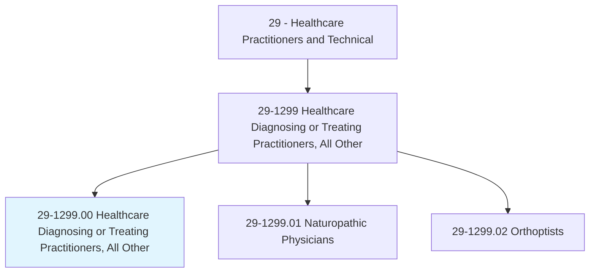
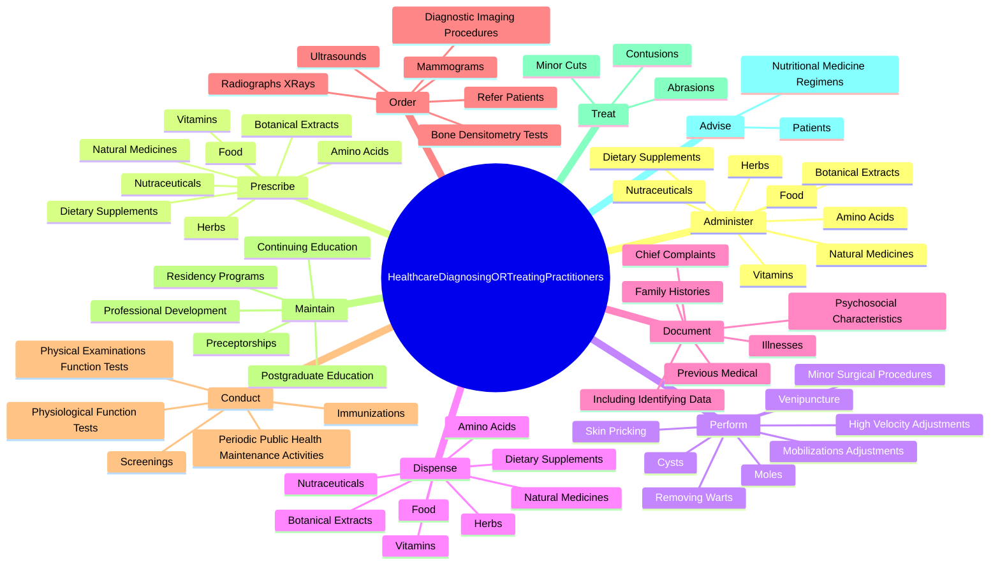
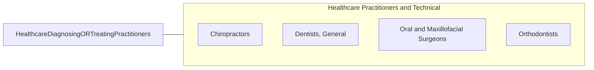

# Healthcare Diagnosing or Treating Practitioners, All Other

> All healthcare diagnosing or treating practitioners not listed separately.

## Overview

Healthcare Diagnosing or Treating Practitioners, All Other is classified under Healthcare Practitioners and Technical (SOC 29). All healthcare diagnosing or treating practitioners not listed separately.

## Classification Hierarchy

## Key Statistics

| Metric | Value |
|--------|-------|
| SOC Code | 29-1299.00 |
| Category | [Healthcare Practitioners and Technical](/occupations/HealthcarePractitioners) |
| Task Count | 126 |
| Source | O*NET |

## Core Tasks

### administer.NaturalMedicines

Healthcare Diagnosing or Treating Practitioners, All Other administer natural medicines as part of their core responsibilities.

**Actions:**
- `administer.NaturalMedicines`
- `administer.Food`
- `administer.BotanicalExtracts`
- `administer.Herbs`

### prescribe.NaturalMedicines

Healthcare Diagnosing or Treating Practitioners, All Other prescribe natural medicines as part of their core responsibilities.

**Actions:**
- `prescribe.NaturalMedicines`
- `prescribe.Food`
- `prescribe.BotanicalExtracts`
- `prescribe.Herbs`

### perform.Venipuncture

Healthcare Diagnosing or Treating Practitioners, All Other perform venipuncture as part of their core responsibilities.

**Actions:**
- `perform.Venipuncture.to.BloodSamples`
- `perform.SkinPricking.to.BloodSamples`
- `perform.MobilizationsAdjustments.to.JointsTissues`
- `perform.MobilizationsAdjustments.to.SoftTissues`

## Skills & Competencies

### Technical Skills
- **Clinical Skills** - Advanced
- **Diagnostic Procedures** - Advanced
- **Patient Care** - Advanced

### Soft Skills
- **Communication** - Essential
- **Problem Solving** - Essential
- **Critical Thinking** - Important
- **Teamwork** - Important
- **Adaptability** - Important

## Related Occupations

## Industries

This occupation is found across multiple industries. See [Industries](/industries) for sector-specific employment data.

## Career Progression

---

*Source: O*NET 29-1299.00 - ONETOccupation*
