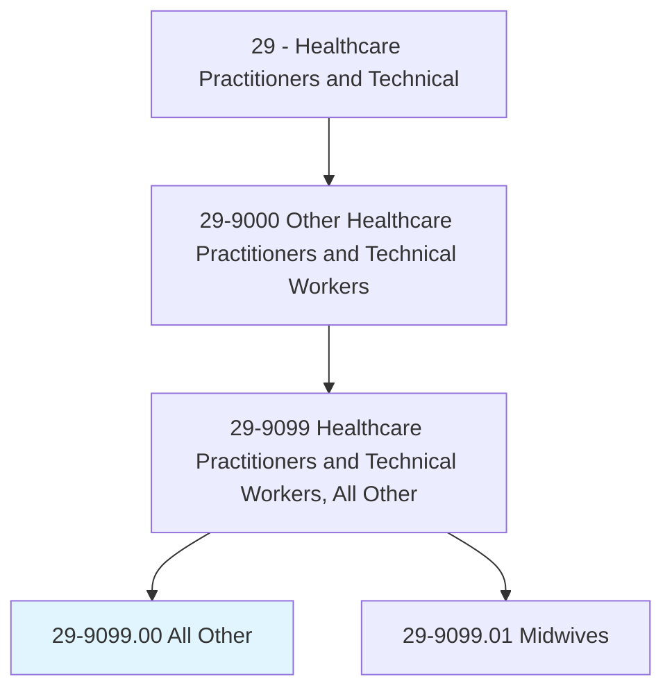
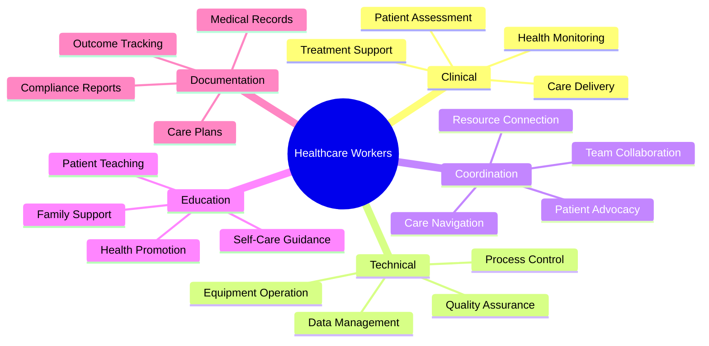
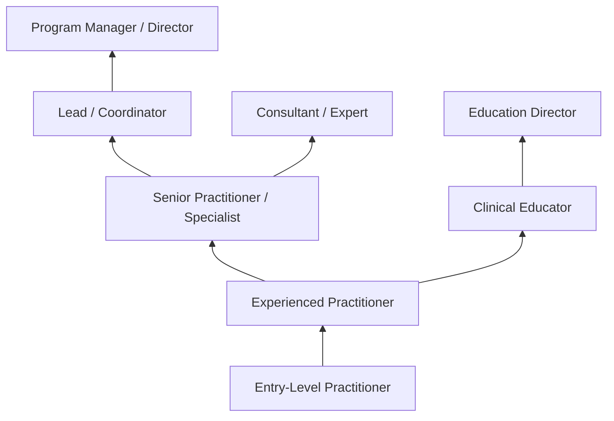
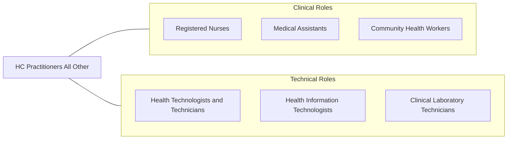

# Healthcare Practitioners and Technical Workers, All Other

> All healthcare practitioners and technical workers not listed separately.

## Overview

Healthcare Practitioners and Technical Workers, All Other is a residual classification encompassing healthcare professionals who require specialized training and clinical knowledge but are not separately categorized in the Standard Occupational Classification system. This category includes emerging and specialized roles such as direct-entry midwives, patient navigators with clinical functions, community health workers performing clinical assessments, clinical informaticists, genetic counselor assistants, sterile processing managers, lactation consultants, and other healthcare workers who fill critical gaps in the evolving healthcare delivery system.

These practitioners support the healthcare system through diverse roles spanning clinical care, patient advocacy, health technology, and specialized technical functions. They may hold various certifications and credentials, work under the supervision of licensed practitioners, or practice independently depending on their specific role, training, and state regulations. The category captures the expanding healthcare workforce that addresses emerging patient care needs and technological advances in medicine.

As healthcare delivery becomes more complex, patient-centered, and technology-driven, new roles continue to emerge at the intersection of clinical care, digital health, patient advocacy, and specialized technical expertise. This residual category grows as healthcare innovation creates positions that combine traditional clinical knowledge with new competencies in areas like health informatics, care coordination, and community-based health promotion.

## Classification Hierarchy



## Key Statistics

| Metric | Value |
|--------|-------|
| SOC Code | 29-9099.00 |
| Job Zone | 3-4 (Medium to Considerable Preparation) |
| Category | [Healthcare Practitioners](/occupations/HealthcarePractitioners/index) |
| Median Annual Salary | $47,000 |
| Salary Range | $32,000 - $75,000 |
| 10th Percentile | $32,500 |
| 90th Percentile | $74,800 |
| Employment | ~70,000 |
| Projected Growth | 10% (faster than average) |
| Annual Openings | ~8,000 |
| Core Tasks | Varies by specialty |
| Source | O*NET |

## Core Tasks



### provide.SpecializedClinicalCare

Healthcare practitioners deliver specialized clinical services.

**Actions:**
- `assess.Patients.for.HealthConditions`
- `deliver.Care.per.TrainingScope`
- `monitor.HealthStatus.for.Changes`
- `support.Treatment.plans.of.Providers`

### coordinate.PatientCareServices

Healthcare workers facilitate care coordination and navigation.

**Actions:**
- `navigate.Patients.through.HealthcareSystem`
- `connect.Patients.to.Resources`
- `coordinate.Services.across.Providers`
- `advocate.For.PatientNeeds`

## Skills & Competencies

### Technical Skills
- **Clinical Assessment** - Intermediate to Advanced (varies by role)
- **Medical Terminology** - Advanced (healthcare communication)
- **Patient Care Techniques** - Intermediate to Advanced (role-specific)
- **Health Information Systems** - Intermediate (EHR, documentation)
- **Equipment Operation** - Intermediate to Advanced (specialty equipment)
- **Quality Assurance** - Intermediate (compliance, standards)
- **Data Management** - Intermediate (tracking, reporting)
- **Infection Control** - Intermediate to Advanced (safety protocols)

### Soft Skills
- **Patient Communication** - Critical (explaining complex information)
- **Empathy and Compassion** - Critical (patient-centered care)
- **Problem Solving** - Essential (addressing patient needs)
- **Attention to Detail** - Essential (accuracy in care)
- **Teamwork** - Essential (multidisciplinary collaboration)
- **Adaptability** - Important (evolving healthcare landscape)
- **Cultural Competency** - Important (diverse patient populations)
- **Stress Management** - Important (healthcare environment demands)

## Education & Certifications

| Requirement | Details |
|-------------|---------|
| Typical Education | Varies widely (certificate to master's degree) |
| Specialized Training | Role-specific certification programs |
| Clinical Certification | Specialty-specific credentials |
| CPR/BLS Certification | Generally required for patient-facing roles |
| HIPAA Training | Required for all healthcare roles |
| State Licensure | May be required depending on role |
| Continuing Education | Ongoing professional development |

## Career Progression



### Career Pathway Details

| Level | Title | Years Experience | Key Responsibilities |
|-------|-------|------------------|----------------------|
| Entry | Entry-Level Practitioner | 0-2 years | Basic duties under supervision, learning protocols |
| Mid | Experienced Practitioner | 2-5 years | Independent work, complex cases, mentoring |
| Senior | Senior Practitioner / Specialist | 5-10 years | Expert practice, quality improvement, leadership |
| Lead | Lead / Coordinator | 10+ years | Program oversight, staff supervision, policy |
| Management | Program Manager / Director | 12+ years | Strategic leadership, budget, organizational impact |

### Included Specialty Areas

| Specialty | Description | Typical Requirements |
|-----------|-------------|---------------------|
| Patient Navigation | Guide patients through healthcare system | Bachelor's degree, navigation certification |
| Clinical Informatics | Bridge clinical practice and IT systems | Clinical background + informatics training |
| Community Health | Clinical services in community settings | Associate's/bachelor's + certifications |
| Sterile Processing | Surgical instrument sterilization management | Certification, hospital training |
| Lactation Support | Breastfeeding assistance and education | IBCLC or equivalent certification |
| Genetic Counseling Support | Assist genetic counselors | Bachelor's + specialized training |

## Industry Variations

| Setting | Focus | Unique Aspects |
|---------|-------|----------------|
| Hospitals | Acute care support | Shift work; multidisciplinary teams; acute patient needs; high-tech environment |
| Ambulatory Care | Outpatient services | Office hours; ongoing patient relationships; preventive focus |
| Community Health | Population health | Outreach; underserved populations; cultural competency; resource navigation |
| Home Health | Home-based care | Independent practice; patient home environment; family involvement |
| Research | Clinical research support | Protocol compliance; data collection; patient recruitment |
| Telehealth | Virtual care delivery | Technology proficiency; remote patient engagement; documentation |

### Hospital-Based Roles

Hospital-based healthcare practitioners work in acute care settings supporting surgical teams, intensive care units, emergency departments, and specialty services. Roles may include sterile processing technicians ensuring instrument safety, patient navigators coordinating complex care transitions, and clinical informaticists optimizing EHR workflows. Shift work and high-acuity patient populations characterize this environment.

### Community Health Roles

Community health practitioners work in federally qualified health centers, public health departments, and community organizations serving underserved populations. They emphasize health promotion, disease prevention, care coordination, and connecting patients with social services. Cultural competency and community engagement are essential competencies.

### Emerging Telehealth Roles

Telehealth has created new practitioner roles supporting virtual care delivery, remote patient monitoring, and digital health engagement. These positions combine clinical knowledge with technology proficiency, managing patient interactions through digital platforms and ensuring documentation meets regulatory requirements.

## Technology & Tools

### Clinical Systems
- **Electronic Health Records** - Epic, Cerner, Meditech, Athenahealth
- **Practice Management** - Scheduling, billing, documentation
- **Patient Portals** - Patient communication and engagement
- **Telehealth Platforms** - Virtual visit technology

### Specialty Equipment
- **Diagnostic Devices** - Specialty-specific instruments
- **Monitoring Equipment** - Patient monitoring systems
- **Processing Equipment** - Sterilization, laboratory, imaging
- **Assistive Technology** - Patient care devices

### Communication and Documentation
- **Clinical Documentation** - Standardized forms, templates
- **Care Coordination** - Referral and tracking systems
- **Communication Platforms** - Secure messaging, team collaboration
- **Patient Education** - Teaching materials, digital resources

## Related Occupations



### Related Occupation Comparison

| Occupation | Similarity | Key Difference |
|------------|------------|----------------|
| Registered Nurses | Medium | Licensed nursing practice vs varied roles |
| Medical Assistants | Medium | Administrative/clinical support vs specialized functions |
| Community Health Workers | High | Overlapping scope, different emphasis |
| Health Technologists | High | Established vs emerging technical roles |

## Industries

- [Hospitals](/industries/Healthcare/Hospitals/index) - High Employment
- [Ambulatory Healthcare Services](/industries/Healthcare/AmbulatoryHealthCare) - High Employment
- [Community Health Centers](/industries/Healthcare/AmbulatoryHealthCare) - Moderate Employment
- [Home Health Services](/industries/Healthcare/AmbulatoryHealthCare) - Moderate Employment
- [Research Institutions](/industries/Healthcare) - Low Employment

## Departments

This occupation category typically works in:
- Various Clinical Departments - Specialty-specific placement
- Patient Experience - Navigation and advocacy
- Community Health - Outreach and population health
- Quality/Informatics - Process improvement and technology
- Education - Patient and staff education

## Work Environment

### Physical Setting
- Hospitals and clinical facilities
- Community health centers
- Patient homes (home health)
- Office settings (administrative roles)
- Remote/telehealth positions

### Work Schedule
- Variable depending on role (8-hour, 12-hour, or flexible schedules)
- May include evenings, weekends, holidays (hospital settings)
- On-call availability for some positions
- Standard business hours for outpatient/office roles

### Work Characteristics
- Patient interaction throughout shift
- Multidisciplinary team collaboration
- Documentation requirements
- Physical demands vary by role
- Emotional demands of patient care

## Performance Metrics

### Key Performance Indicators

| Metric | Description | Typical Target |
|--------|-------------|----------------|
| Patient Satisfaction | Feedback on care experience | High ratings |
| Quality Measures | Clinical quality metrics | Meet standards |
| Documentation | Complete, timely records | 100% compliance |
| Coordination | Care transition effectiveness | Reduced gaps |
| Efficiency | Productivity measures | Meet benchmarks |

### Regulatory Compliance
- HIPAA privacy and security
- Scope of practice limitations
- State licensing requirements
- Institutional policies
- Professional standards

## GraphDL Semantic Structure

```graphdl
Healthcare Practitioners and Technical Workers perform:
- assess.Patients.for.HealthConditions
- deliver.Care.per.TrainingScope
- coordinate.Services.across.Providers
- navigate.Patients.through.HealthcareSystem
- document.Care.in.MedicalRecords
- educate.Patients.about.Health
- collaborate.With.CareTeams
- ensure.Compliance.with.Standards
```

---

*Source: O*NET 29-9099.00 - ONETOccupation*
