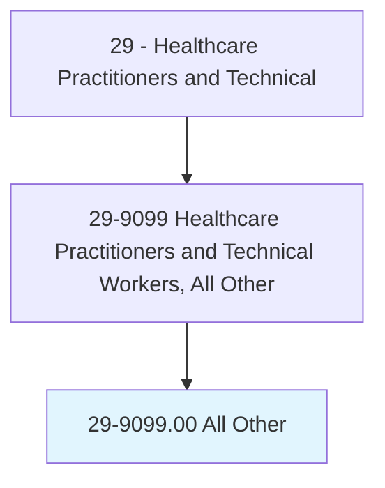
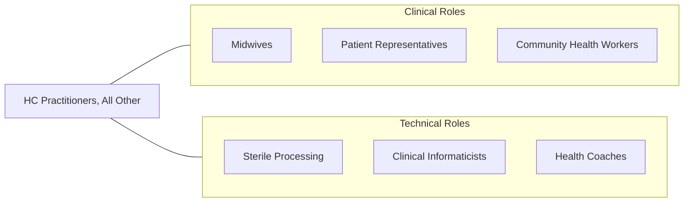

# Healthcare Practitioners and Technical Workers, All Other

> All healthcare practitioners and technical workers not listed separately.

## Overview

Healthcare Practitioners and Technical Workers, All Other is a residual classification that includes healthcare professionals not separately categorized in the SOC system. This encompasses emerging and specialized roles such as midwives (non-nurse), patient navigators, community health workers with clinical functions, clinical informaticists, sterile processing managers, and other healthcare workers who require specialized training and clinical knowledge.

These practitioners support the healthcare system through diverse roles that span clinical, technical, and patient-facing functions. They may hold various certifications and credentials, work under the supervision of licensed practitioners, or practice independently depending on their specific role and state regulations. The category captures the expanding healthcare workforce that fills critical gaps in patient care delivery.

As healthcare becomes more complex and patient-centered, new roles continue to emerge at the intersection of clinical care, technology, and patient advocacy, contributing to the growth of this category.

## Classification Hierarchy

## Key Statistics

| Metric | Value |
|--------|-------|
| SOC Code | 29-9099.00 |
| Median Annual Salary | $47,000 |
| Employment | ~70,000 |
| Projected Growth | 10% (2022-2032) |
| Job Zone | 3-4 (Medium to Considerable Preparation) |
| Category | [Healthcare Practitioners](/occupations/HealthcarePractitioners) |
| Source | O*NET |

## Included Occupations

| Specialty | SOC Code |
|-----------|----------|
| [Midwives](/occupations/HealthcarePractitioners/Midwives) | 29-9099.01 |
| [Patient Representatives](/occupations/HealthcarePractitioners/PatientRepresentatives) | 29-2099.08 |
| Other Healthcare Workers | Various |

## Related Occupations

## Industries

- [Hospitals](/industries/Healthcare/Hospitals/index) - Various Departments
- [Ambulatory Healthcare](/industries/Healthcare/AmbulatoryHealthCare) - Outpatient Services
- [Community Health](/industries/Healthcare/AmbulatoryHealthCare) - Community Programs

## Departments

This occupation category typically works in:
- [Various Clinical Departments](/departments/ClinicalServices)
- [Patient Experience](/departments/PatientExperience)
- [Community Health](/departments/CommunityHealth)

---

*Source: O*NET 29-9099.00 - ONETOccupation*
