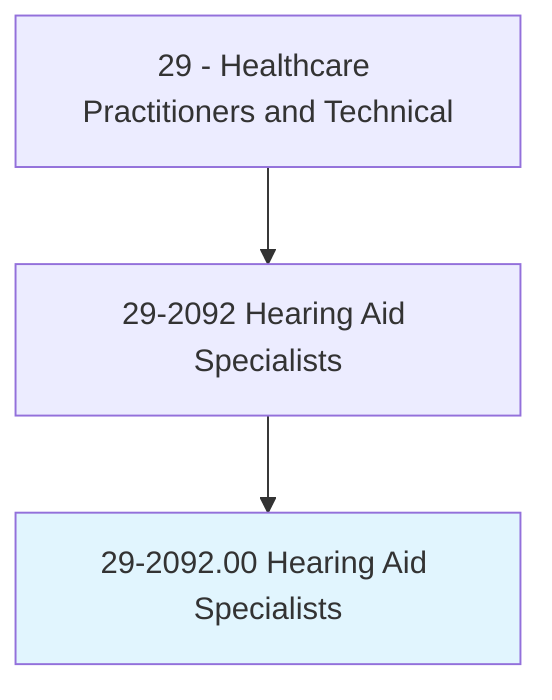
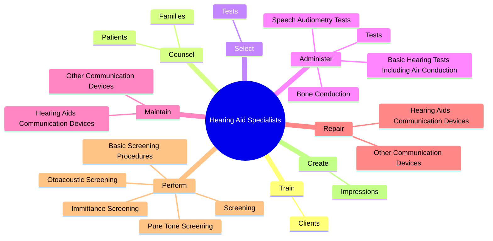
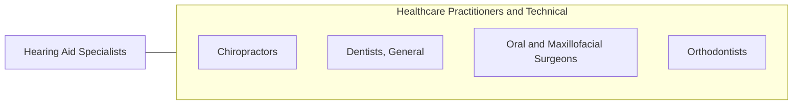

# Hearing Aid Specialists

> Select and fit hearing aids for customers. Administer and interpret tests of hearing. Assess hearing instrument efficacy. Take ear impressions and prepare, design, and modify ear molds.

## Overview

Hearing Aid Specialists is an occupation within the Healthcare Practitioners and Technical category. Select and fit hearing aids for customers. Administer and interpret tests of hearing.

## Classification Hierarchy

## Key Statistics

| Metric | Value |
|--------|-------|
| SOC Code | 29-2092.00 |
| Category | [Healthcare Practitioners and Technical](/occupations/HealthcarePractitioners) |
| Task Count | 39 |
| Source | O*NET |

## Core Tasks

### train.Clients

Hearing Aid Specialists train clients as part of their core responsibilities.

**Actions:**
- `train.Clients.to.use.HearingAidsAugmentativeCommunicationDevices`
- `train.Clients.to.OtherAugmentativeCommunicationDevices`

### counsel.Patients

Hearing Aid Specialists counsel patients as part of their core responsibilities.

**Actions:**
- `counsel.Patients.on.CommunicationStrategies`
- `counsel.Patients.on.Effects.of.HearingLoss`
- `counsel.Families.on.CommunicationStrategies`
- `counsel.Families.on.Effects.of.HearingLoss`

### select.Tests

Hearing Aid Specialists select tests as part of their core responsibilities.

**Actions:**
- `select.Tests.to.evaluate.Hearing`
- `select.Tests.to.related.Disabilities`

## Skills & Competencies

### Technical Skills
- **Clinical Skills** - Advanced
- **Diagnostic Procedures** - Advanced
- **Patient Care** - Advanced

### Soft Skills
- **Communication** - Essential
- **Problem Solving** - Essential
- **Critical Thinking** - Important
- **Teamwork** - Important
- **Adaptability** - Important

## Related Occupations

## Industries

This occupation is found across multiple industries. See [Industries](/industries) for sector-specific employment data.

## Career Progression

---

*Source: O*NET 29-2092.00 - ONETOccupation*
