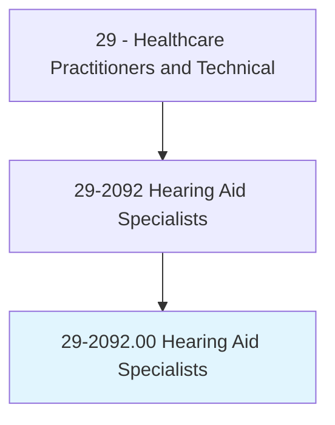
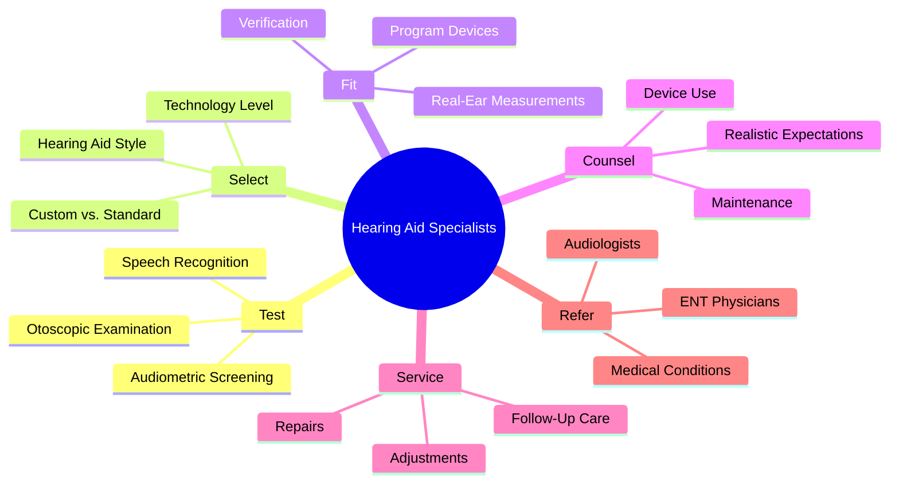
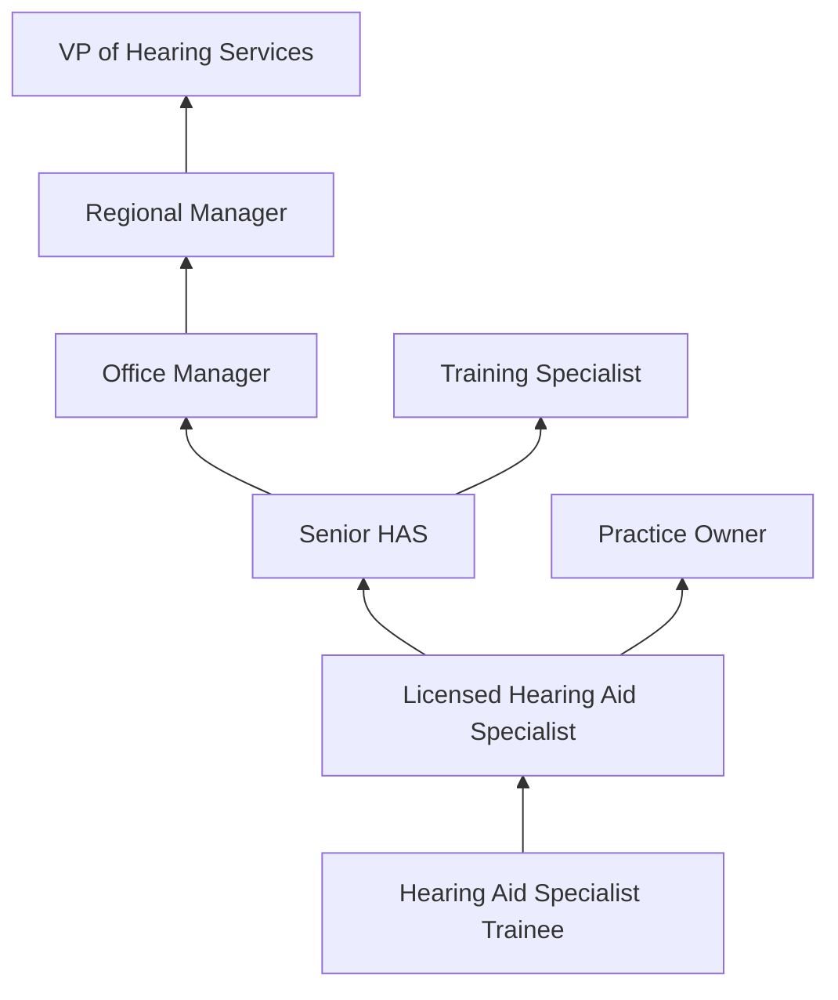
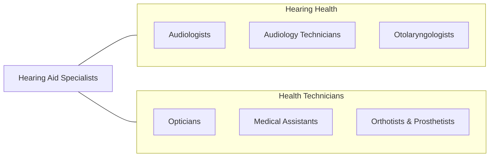

# Hearing Aid Specialists

> Select and fit hearing aids for customers. Administer and interpret tests of hearing. Assess hearing instrument efficacy. Take ear impressions and prepare, design, and modify ear molds.

## Overview

Hearing Aid Specialists are licensed professionals who test hearing, select and fit hearing aids, and provide follow-up care to individuals with hearing loss. They administer audiometric screening tests, interpret results to determine hearing aid candidacy, recommend appropriate hearing aid technology, take ear impressions for custom devices, program digital hearing aids, verify fitting accuracy using real-ear measurements, and counsel patients on hearing aid use and maintenance.

The role requires expertise in hearing aid technology, ear anatomy, psychoacoustics, and patient counseling. Hearing Aid Specialists conduct otoscopic examinations, perform pure-tone and speech audiometry within their scope of practice, demonstrate hearing aid features, troubleshoot device issues, and provide ongoing aural rehabilitation support. They distinguish between conditions requiring hearing amplification and those requiring medical referral to otolaryngologists or audiologists.

Modern hearing aid technology has evolved rapidly with Bluetooth connectivity, rechargeable batteries, artificial intelligence-driven sound processing, over-the-counter (OTC) hearing aids, teleaudiology, and smartphone-controlled devices. Hearing Aid Specialists must stay current with rapidly changing technology while providing personalized care to an aging population with increasing hearing healthcare needs.

## Classification Hierarchy

## Key Statistics

| Metric | Value |
|--------|-------|
| SOC Code | 29-2092.00 |
| Median Annual Salary | $59,020 |
| Employment | ~10,000 |
| Projected Growth | 15% (2022-2032, much faster than average) |
| Job Zone | 3 (Medium Preparation) |
| Category | [Healthcare Practitioners](/occupations/HealthcarePractitioners) |
| Core Tasks | 25+ |
| Source | O*NET |

## Core Tasks

### test.HearingFunction

Hearing Aid Specialists assess hearing ability.

**Actions:**
- `perform.AudiometricScreening.for.HearingLossDetection` - Hearing testing
- `perform.OtoscopicExamination.for.EarCanalAssessment` - Ear inspection
- `evaluate.SpeechRecognition.for.HearingAidCandidacy` - Speech testing
- `determine.HearingAidCandidacy.based.on.TestResults` - Candidacy assessment

### fit.HearingAids

Hearing Aid Specialists select and fit hearing devices.

**Actions:**
- `select.HearingAids.based.on.HearingLossAndLifestyle` - Device selection
- `program.DigitalHearingAids.using.FittingSoftware` - Programming
- `verify.FittingAccuracy.using.RealEarMeasurements` - Verification
- `take.EarImpressions.for.CustomMolds` - Impression taking

## Practice Settings

| Setting | Description |
|---------|-------------|
| Hearing Aid Retail Stores | Retail hearing aid dispensing |
| ENT Physician Offices | Medical practice-based hearing aid services |
| Audiology Practices | Collaborative hearing care |
| Big-Box Retail (Costco) | High-volume hearing aid dispensing |
| Private Practice | Independent hearing aid practice |
| Veterans Affairs | VA hearing aid services |

## Skills & Competencies

### Technical Skills
- **Audiometric Testing** - Expert
- **Hearing Aid Fitting** - Expert
- **Real-Ear Measurement** - Advanced
- **Hearing Aid Programming** - Expert
- **Ear Impression Taking** - Expert
- **Device Troubleshooting** - Advanced
- **Otoscopy** - Advanced

### Soft Skills
- **Patient Communication** - Critical
- **Sales/Consultation** - Essential
- **Empathy** - Essential
- **Patience** - Essential
- **Business Acumen** - Important

## Education & Training

| Requirement | Details |
|-------------|---------|
| Education | High school diploma (minimum); associate/bachelor's preferred |
| Training | State-approved training program or apprenticeship |
| Licensure | State license required in most states |
| Practical Training | Supervised dispensing experience |
| Continuing Education | Per state requirements |

## Certifications

| Certification | Description |
|---------------|-------------|
| State HAS License | State-specific hearing aid specialist license |
| NBC-HIS | National Board Certified in Hearing Instrument Sciences |
| IHS Certification | International Hearing Society certification |
| ACA Certification | American Conference of Audioprosthology |

## Career Progression

## Specializations

| Focus Area | Description |
|------------|-------------|
| Pediatric Hearing Aids | Children's amplification |
| Geriatric Hearing Care | Elderly hearing needs |
| Tinnitus Management | Tinnitus masking and treatment |
| Custom Hearing Protection | Noise protection devices |
| Cochlear Implant Support | CI mapping support |
| OTC Hearing Aid Consultation | Over-the-counter device guidance |

## Technology & Tools

| Technology | Purpose |
|------------|---------|
| Audiometers | Hearing testing |
| Real-Ear Measurement Systems (Verifit) | Fitting verification |
| Hearing Aid Programming Software | Device programming |
| Otoscopes (Video and Standard) | Ear canal examination |
| Impression Materials and Equipment | Custom mold creation |
| Hearing Aid Analyzers | Device quality testing |
| Practice Management Software | Scheduling and records |

## Related Occupations

## Industries

- [Hearing Aid Retail](/industries/Healthcare/AmbulatoryHealthCare) - Retail Dispensing
- [Physician Offices](/industries/Healthcare/PhysicianOffices) - Medical Practice
- [Retail Stores](/industries/Retail) - Big-Box Retailers
- [Veterans Affairs](/industries/PublicAdministration) - VA Healthcare

## Departments

This occupation typically works in:
- Audiology/Hearing Services
- ENT Department
- Hearing Aid Dispensing

---

*Source: O*NET 29-2092.00 - ONETOccupation*
