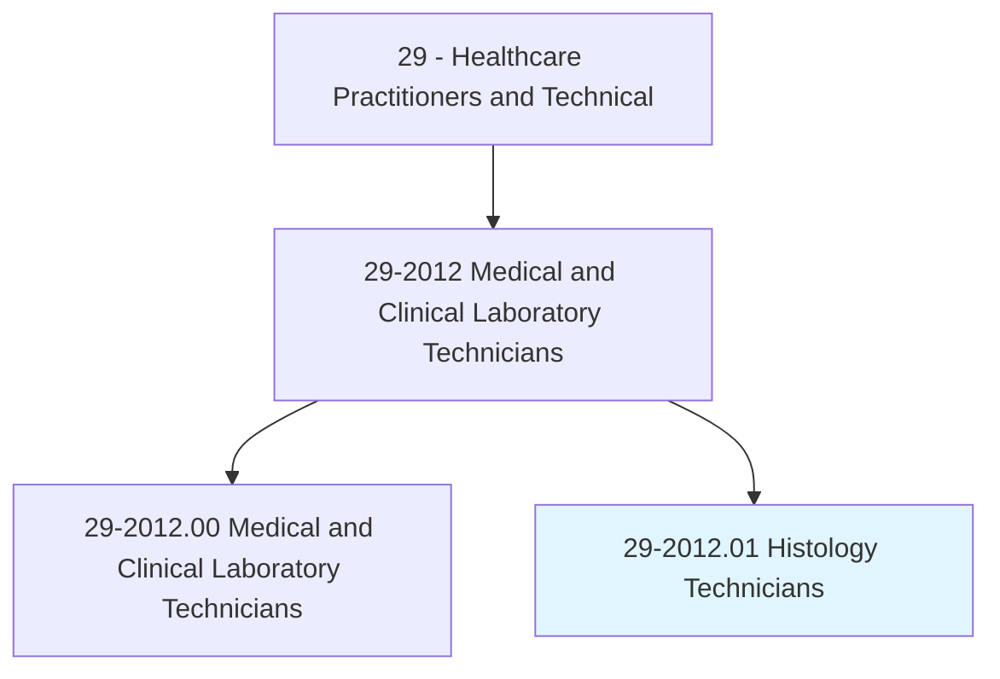
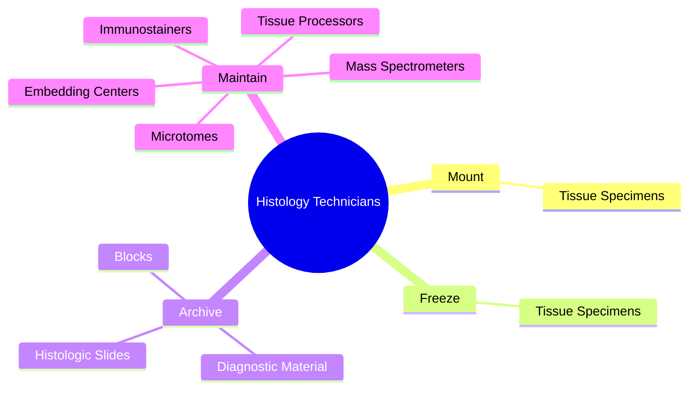
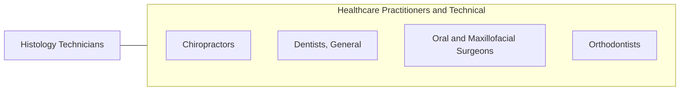

# Histology Technicians

> Prepare histological slides from tissue sections for microscopic examination and diagnosis by pathologists. May assist with research studies.

## Overview

Histology Technicians is a specialized variant within the Healthcare Practitioners and Technical category. Prepare histological slides from tissue sections for microscopic examination and diagnosis by pathologists. 

## Classification Hierarchy

## Key Statistics

| Metric | Value |
|--------|-------|
| SOC Code | 29-2012.01 |
| Category | [Healthcare Practitioners and Technical](/occupations/HealthcarePractitioners) |
| Task Count | 11 |
| Source | O*NET |

## Core Tasks

### mount.TissueSpecimens

Histology Technicians mount tissue specimens as part of their core responsibilities.

**Actions:**
- `mount.TissueSpecimens.on.GlassSlides`

### freeze.TissueSpecimens

Histology Technicians freeze tissue specimens as part of their core responsibilities.

**Actions:**
- `freeze.TissueSpecimens`

### archive.DiagnosticMaterial

Histology Technicians archive diagnostic material as part of their core responsibilities.

**Actions:**
- `archive.DiagnosticMaterial`
- `archive.HistologicSlides`
- `archive.Blocks`

## Skills & Competencies

### Technical Skills
- **Clinical Skills** - Advanced
- **Diagnostic Procedures** - Advanced
- **Patient Care** - Advanced

### Soft Skills
- **Communication** - Essential
- **Problem Solving** - Essential
- **Critical Thinking** - Important
- **Teamwork** - Important
- **Adaptability** - Important

## Related Occupations

## Industries

This occupation is found across multiple industries. See [Industries](/industries) for sector-specific employment data.

## Career Progression

---

*Source: O*NET 29-2012.01 - ONETOccupation*
