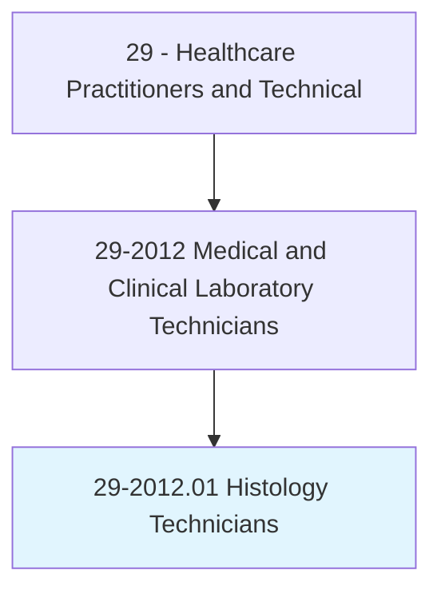
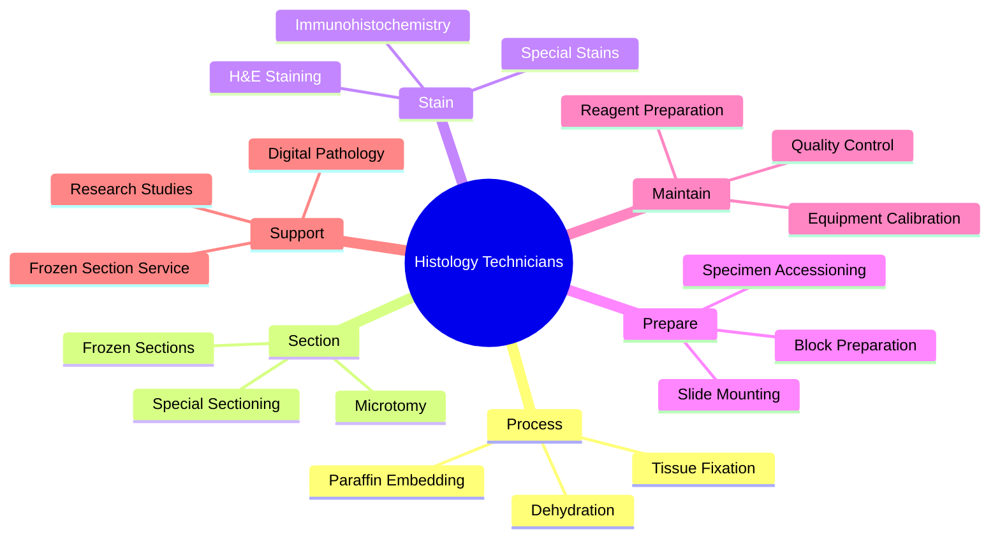
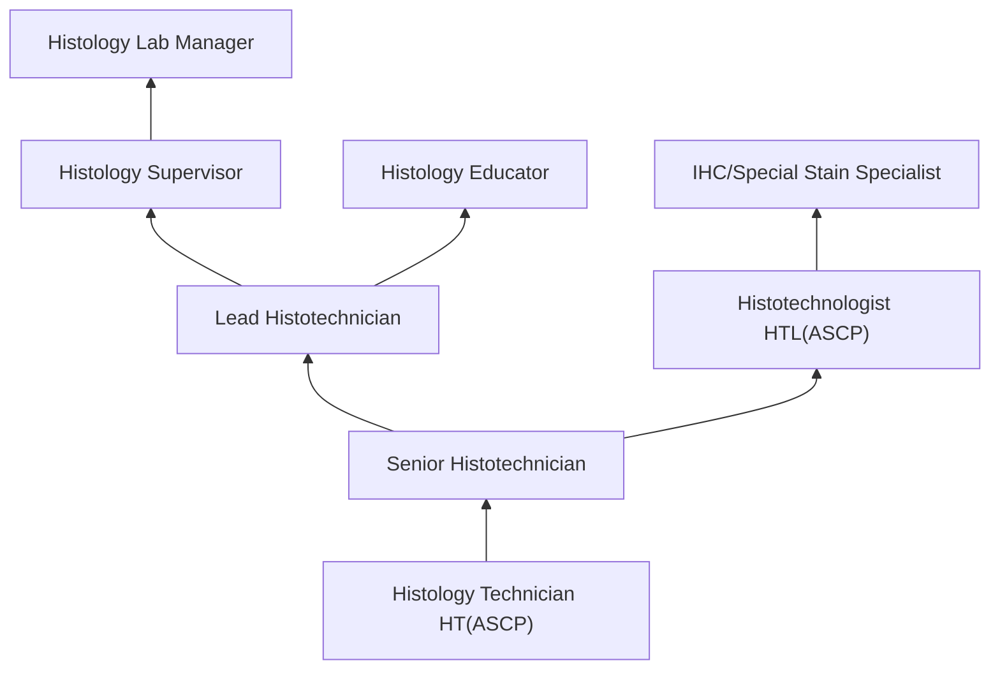
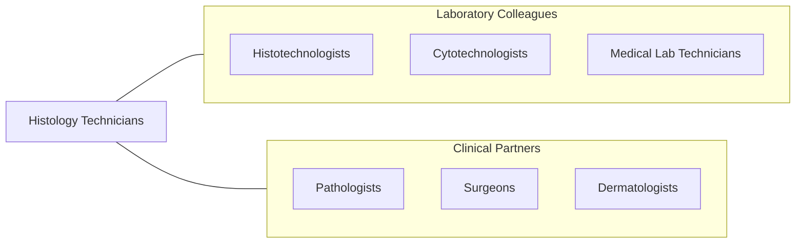

# Histology Technicians

> Prepare histologic slides from tissue sections for microscopic examination and diagnosis by pathologists. May assist in research studies.

## Overview

Histology Technicians (Histotechnicians) are laboratory professionals who prepare tissue samples for microscopic examination by pathologists. They process tissue specimens through fixation, embedding in paraffin, sectioning on microtomes, and staining with hematoxylin and eosin (H&E) and special stains to reveal cellular structures, enabling pathologists to diagnose diseases including cancer, infections, and autoimmune conditions.

The workflow encompasses receiving and accessioning surgical and biopsy specimens, processing tissue through graded alcohols and clearing agents, embedding specimens in paraffin blocks, cutting thin sections (3-5 microns) using rotary microtomes, mounting sections on glass slides, and performing routine and special staining procedures. Histology technicians also prepare frozen sections for rapid intraoperative diagnosis, perform immunohistochemistry (IHC), and operate automated staining instruments.

Modern histology has evolved with automated tissue processors, immunohistochemistry staining platforms, digital pathology whole-slide imaging, molecular pathology specimen preparation, and quality management systems. Histology technicians play a critical role in the accurate and timely diagnosis of disease, directly impacting patient care through the quality of tissue preparations they produce.

## Classification Hierarchy

## Key Statistics

| Metric | Value |
|--------|-------|
| SOC Code | 29-2012.01 |
| Median Annual Salary | $46,680 |
| Employment | ~18,000 |
| Projected Growth | 5% (2022-2032) |
| Job Zone | 3 (Medium Preparation) |
| Category | [Healthcare Practitioners](/occupations/HealthcarePractitioners) |
| Core Tasks | 25+ |
| Source | O*NET |

## Core Tasks

### process.TissueSpecimens

Histology Technicians prepare tissue for examination.

**Actions:**
- `process.TissueSpecimens.through.FixationAndDehydration` - Tissue processing
- `embed.Specimens.in.ParaffinBlocks` - Embedding
- `section.ParaffinBlocks.using.RotaryMicrotome` - Microtomy
- `prepare.FrozenSections.for.IntraoperativeDiagnosis` - Frozen sections

### stain.TissueSections

Histology Technicians perform staining procedures.

**Actions:**
- `stain.Sections.using.HematoxylinAndEosin` - H&E staining
- `perform.SpecialStains.for.TissueCharacterization` - Special stains
- `perform.Immunohistochemistry.for.AntigenDetection` - IHC
- `operate.AutomatedStainers.for.StandardizedStaining` - Automated staining

## Practice Settings

| Setting | Description |
|---------|-------------|
| Hospital Histology Labs | Clinical histology services |
| Reference Laboratories | High-volume histology processing |
| Academic Medical Centers | Research and teaching |
| Dermatopathology Labs | Skin biopsy processing |
| Veterinary Pathology Labs | Animal tissue processing |
| Research Institutions | Experimental histology |

## Skills & Competencies

### Technical Skills
- **Microtomy** - Expert
- **Tissue Processing** - Expert
- **H&E Staining** - Expert
- **Immunohistochemistry** - Advanced
- **Special Stains** - Advanced
- **Frozen Sections** - Advanced
- **Quality Control** - Advanced

### Soft Skills
- **Attention to Detail** - Critical
- **Manual Dexterity** - Essential
- **Organization** - Essential
- **Time Management** - Essential
- **Teamwork** - Essential

## Education & Training

| Requirement | Details |
|-------------|---------|
| Education | Associate degree or certificate in histotechnology |
| Clinical Training | Accredited histotechnology program |
| Certification | HT(ASCP) through ASCP Board of Certification |
| Continuing Education | Per certification requirements |

## Certifications

| Certification | Description |
|---------------|-------------|
| HT(ASCP) | Histotechnician (ASCP Board of Certification) |
| HTL(ASCP) | Histotechnologist (advanced certification) |
| QIHC | Qualification in Immunohistochemistry |

## Career Progression

## Specializations

| Focus Area | Description |
|------------|-------------|
| Immunohistochemistry | IHC staining specialist |
| Frozen Sections | Intraoperative histology |
| Mohs Surgery Histology | Dermatologic surgery support |
| Research Histology | Experimental tissue preparation |
| Digital Pathology | Whole-slide imaging |
| Electron Microscopy | Ultrastructural preparation |

## Technology & Tools

| Technology | Purpose |
|------------|---------|
| Rotary Microtomes (Leica, Thermo) | Tissue sectioning |
| Automated Tissue Processors | Tissue processing |
| Embedding Centers | Paraffin embedding |
| Automated Stainers (Ventana, Leica) | Staining automation |
| Cryostats | Frozen section preparation |
| Digital Slide Scanners | Whole-slide imaging |
| Laboratory Information Systems | Workflow management |

## Related Occupations

## Industries

- [Hospitals](/industries/Healthcare/Hospitals/index) - Clinical Histology
- [Reference Laboratories](/industries/Healthcare/MedicalLaboratories) - High-Volume Processing
- [Academic Medical Centers](/industries/Education) - Research and Teaching
- [Pharmaceutical](/industries/Manufacturing/ChemicalManufacturing/Pharmaceutical) - Drug Development

## Departments

This occupation typically works in:
- [Histology Laboratory](/departments/HistologyLab)
- [Pathology](/departments/Pathology)
- [Anatomic Pathology](/departments/AnatomicPathology)
- [Surgical Pathology](/departments/SurgicalPathology)

---

*Source: O*NET 29-2012.01 - ONETOccupation*
