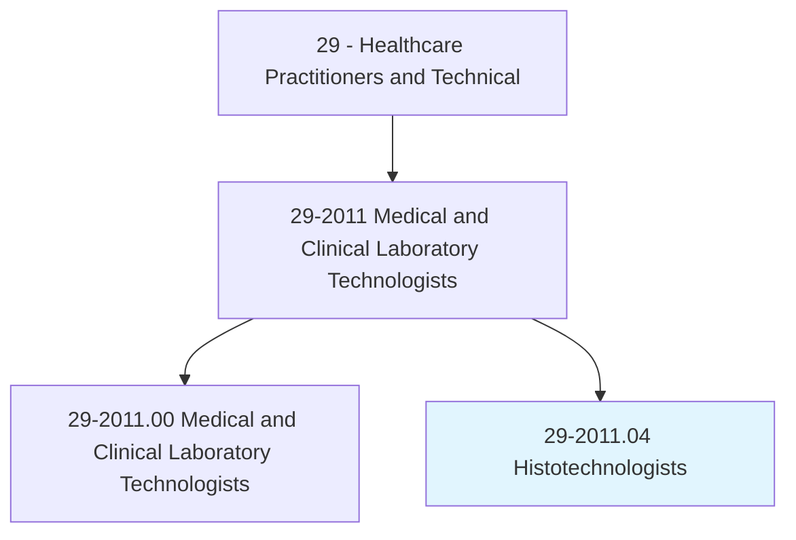
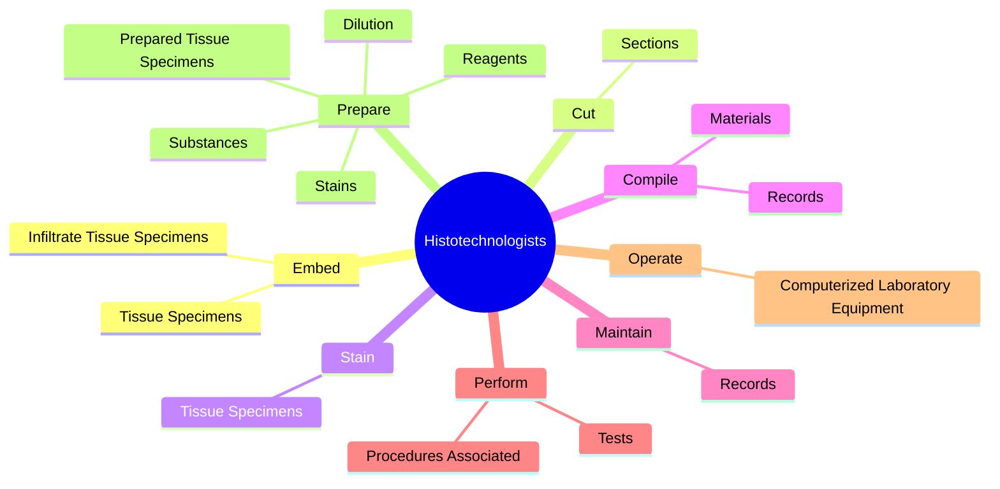
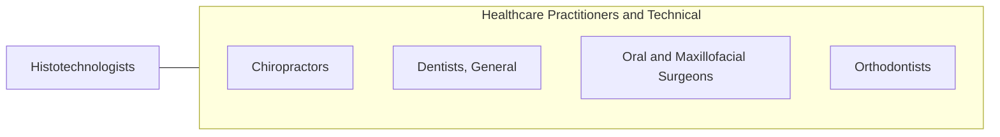

# Histotechnologists

> Apply knowledge of health and disease causes to evaluate new laboratory techniques and procedures to examine tissue samples. Process and prepare histological slides from tissue sections for microscopic examination and diagnosis by pathologists. May solve technical or instrument problems or assist with research studies.

## Overview

Histotechnologists is a specialized variant within the Healthcare Practitioners and Technical category. Apply knowledge of health and disease causes to evaluate new laboratory techniques and procedures to examine tissue samples. Process and prepare histological slides from tissue sections for microscopic examination and diagnosis by pathologists.

## Classification Hierarchy

## Key Statistics

| Metric | Value |
|--------|-------|
| SOC Code | 29-2011.04 |
| Category | [Healthcare Practitioners and Technical](/occupations/HealthcarePractitioners) |
| Task Count | 51 |
| Source | O*NET |

## Core Tasks

### embed.TissueSpecimens

Histotechnologists embed tissue specimens as part of their core responsibilities.

**Actions:**
- `embed.TissueSpecimens.into.ParaffinWaxBlocks.with.Wax`
- `embed.InfiltrateTissueSpecimens.with.Wax`

### cut.Sections

Histotechnologists cut sections as part of their core responsibilities.

**Actions:**
- `cut.Sections.of.BodyTissues.for.MicroscopicExamination`
- `cut.Sections.of.UsingMicrotomes`

### stain.TissueSpecimens

Histotechnologists stain tissue specimens as part of their core responsibilities.

**Actions:**
- `stain.TissueSpecimens.with.DyesChemicals.to.make.CellDetailsVisibleUnderMicroscopes`
- `stain.TissueSpecimens.with.OtherChemicals.to.make.CellDetailsVisibleUnderMicroscopes`

## Skills & Competencies

### Technical Skills
- **Clinical Skills** - Advanced
- **Diagnostic Procedures** - Advanced
- **Patient Care** - Advanced

### Soft Skills
- **Communication** - Essential
- **Problem Solving** - Essential
- **Critical Thinking** - Important
- **Teamwork** - Important
- **Adaptability** - Important

## Related Occupations

## Industries

This occupation is found across multiple industries. See [Industries](/industries) for sector-specific employment data.

## Career Progression

---

*Source: O*NET 29-2011.04 - ONETOccupation*
