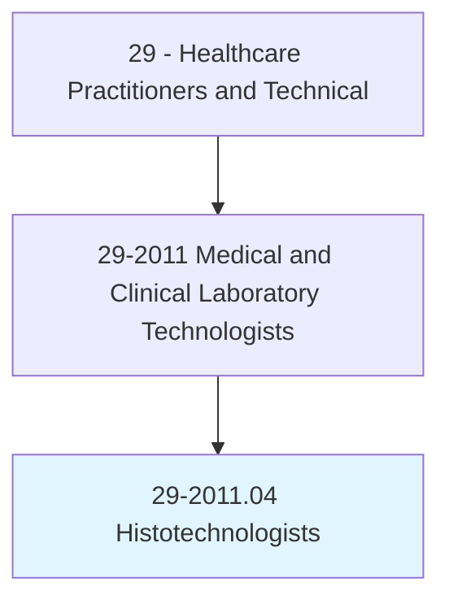
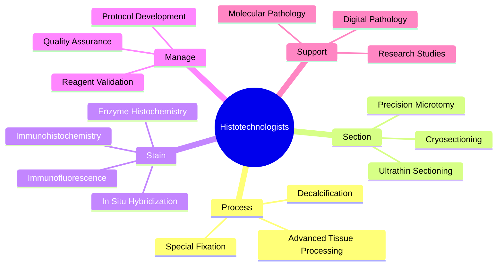
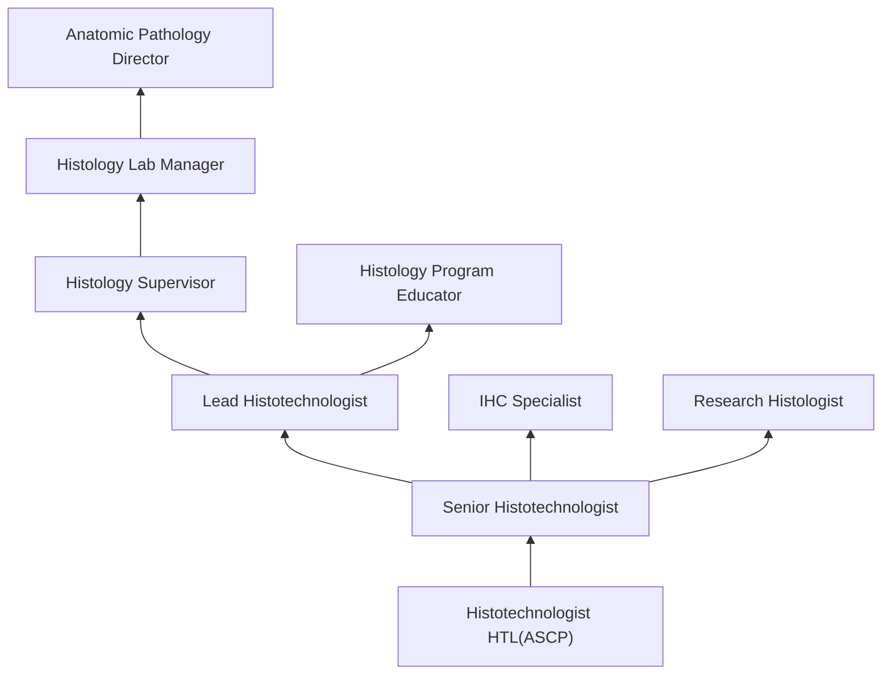
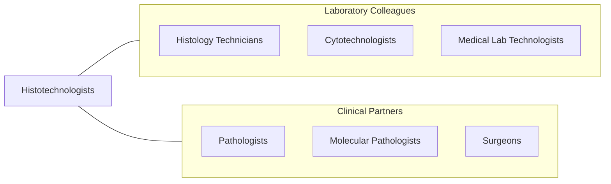

# Histotechnologists

> Prepare histologic slides from tissue sections for microscopic examination and diagnosis by pathologists. Apply knowledge of advanced techniques for processing, cutting, staining, and mounting biological specimens.

## Overview

Histotechnologists are advanced-level laboratory professionals who prepare and analyze tissue specimens using complex histologic techniques for microscopic examination by pathologists. They perform all histology technician functions plus advanced procedures including enzyme histochemistry, immunohistochemistry (IHC), in situ hybridization (ISH), immunofluorescence, electron microscopy preparation, and quality management of histology laboratory operations.

Distinguished from histology technicians by their bachelor's-level education and broader scope, histotechnologists troubleshoot technical problems, develop new staining protocols, validate new antibodies and reagents, manage quality assurance programs, and correlate tissue morphology with clinical diagnoses. They apply knowledge of chemistry, biology, and anatomy to optimize tissue preparation for increasingly complex diagnostic and research applications.

The field continues to advance with multiplex immunohistochemistry, digital pathology integration, molecular pathology specimen preparation, companion diagnostic testing, and laboratory automation. Histotechnologists are increasingly involved in precision medicine workflows, preparing tissues for genomic testing and targeted therapy selection.

## Classification Hierarchy

## Key Statistics

| Metric | Value |
|--------|-------|
| SOC Code | 29-2011.04 |
| Median Annual Salary | $62,610 |
| Employment | ~22,000 |
| Projected Growth | 5% (2022-2032) |
| Job Zone | 4 (Considerable Preparation) |
| Category | [Healthcare Practitioners](/occupations/HealthcarePractitioners) |
| Core Tasks | 30+ |
| Source | O*NET |

## Core Tasks

### perform.AdvancedHistologicTechniques

Histotechnologists apply complex laboratory methods.

**Actions:**
- `perform.Immunohistochemistry.for.DiagnosticMarkerDetection` - IHC staining
- `perform.InSituHybridization.for.GeneDetection` - ISH procedures
- `perform.Immunofluorescence.for.AntibodyDetection` - IF staining
- `validate.NewAntibodiesAndReagents.for.ClinicalUse` - Reagent validation

### manage.HistologyQuality

Histotechnologists oversee quality programs.

**Actions:**
- `manage.QualityAssurance.for.HistologyLaboratory` - QA management
- `develop.StainingProtocols.for.NewProcedures` - Protocol development
- `troubleshoot.TechnicalProblems.in.TissuePreparation` - Problem solving
- `train.HistologyTechnicians.in.AdvancedTechniques` - Staff training

## Practice Settings

| Setting | Description |
|---------|-------------|
| Hospital Pathology Labs | Advanced clinical histology |
| Reference Laboratories | High-complexity testing |
| Academic Medical Centers | Research and teaching |
| Cancer Centers | Oncology histopathology |
| Research Institutions | Experimental histology |
| Pharmaceutical Companies | Drug development pathology |

## Skills & Competencies

### Technical Skills
- **Advanced Microtomy** - Expert
- **Immunohistochemistry** - Expert
- **In Situ Hybridization** - Advanced
- **Quality Management** - Expert
- **Protocol Development** - Advanced
- **Troubleshooting** - Expert
- **Digital Pathology** - Advanced

### Soft Skills
- **Attention to Detail** - Critical
- **Problem Solving** - Essential
- **Leadership** - Important
- **Communication** - Essential
- **Organization** - Essential

## Education & Training

| Requirement | Details |
|-------------|---------|
| Education | Bachelor's degree in histotechnology or biological science |
| Clinical Training | Accredited histotechnology program |
| Certification | HTL(ASCP) through ASCP Board of Certification |
| Continuing Education | Per certification requirements |

## Certifications

| Certification | Description |
|---------------|-------------|
| HTL(ASCP) | Histotechnologist (ASCP Board of Certification) |
| QIHC | Qualification in Immunohistochemistry |
| HT(ASCP) | Histotechnician (entry-level) |

## Career Progression

## Specializations

| Focus Area | Description |
|------------|-------------|
| Immunohistochemistry | Advanced IHC and companion diagnostics |
| Molecular Pathology Support | Tissue preparation for genomic testing |
| Mohs Surgery | Dermatologic surgery histology |
| Electron Microscopy | Ultrastructural preparation |
| Research Histology | Experimental tissue studies |
| Digital Pathology | Whole-slide imaging and analysis |

## Technology & Tools

| Technology | Purpose |
|------------|---------|
| Advanced Microtomes (Leica RM2255) | Precision sectioning |
| IHC Staining Platforms (Ventana BenchMark, Leica BOND) | Automated IHC |
| ISH Systems (Ventana INFORM) | In situ hybridization |
| Automated Tissue Processors | Tissue processing |
| Digital Slide Scanners (Aperio, Hamamatsu) | Whole-slide imaging |
| Cryostats | Frozen section preparation |

## Related Occupations

## Industries

- [Hospitals](/industries/Healthcare/Hospitals/index) - Clinical Histology
- [Reference Laboratories](/industries/Healthcare/MedicalLaboratories) - High-Volume Testing
- [Academic Medical Centers](/industries/Education) - Research and Teaching
- [Pharmaceutical](/industries/Manufacturing/ChemicalManufacturing/Pharmaceutical) - Drug Development

## Departments

This occupation typically works in:
- Histology Laboratory
- Anatomic Pathology
- Immunohistochemistry Lab
- Surgical Pathology

---

*Source: O*NET 29-2011.04 - ONETOccupation*
