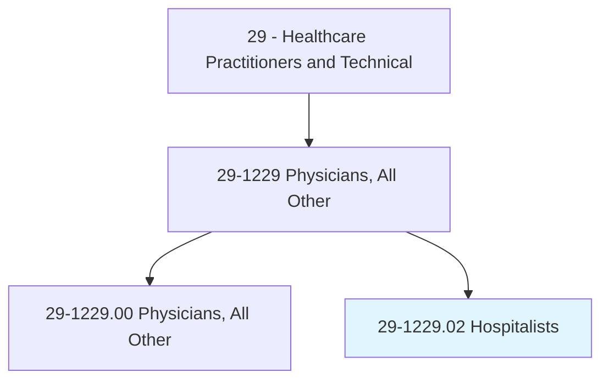
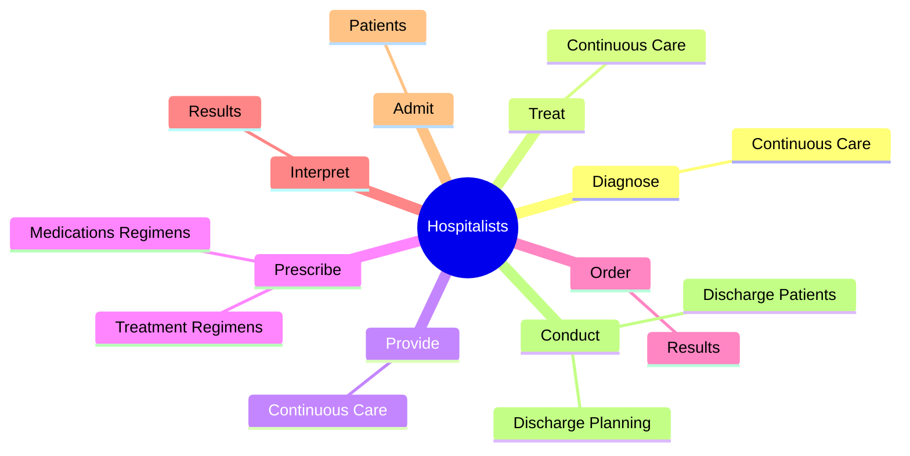
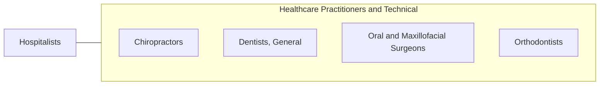

# Hospitalists

> Provide inpatient care predominantly in settings such as medical wards, acute care units, intensive care units, rehabilitation centers, or emergency rooms. Manage and coordinate patient care throughout treatment.

## Overview

Hospitalists is a specialized variant within the Healthcare Practitioners and Technical category. Provide inpatient care predominantly in settings such as medical wards, acute care units, intensive care units, rehabilitation centers, or emergency rooms. 

## Classification Hierarchy

## Key Statistics

| Metric | Value |
|--------|-------|
| SOC Code | 29-1229.02 |
| Category | [Healthcare Practitioners and Technical](/occupations/HealthcarePractitioners) |
| Task Count | 33 |
| Source | O*NET |

## Core Tasks

### diagnose.ContinuousCare

Hospitalists diagnose continuous care as part of their core responsibilities.

**Actions:**
- `diagnose.ContinuousCare.to.HospitalInpatients`

### treat.ContinuousCare

Hospitalists treat continuous care as part of their core responsibilities.

**Actions:**
- `treat.ContinuousCare.to.HospitalInpatients`

### provide.ContinuousCare

Hospitalists provide continuous care as part of their core responsibilities.

**Actions:**
- `provide.ContinuousCare.to.HospitalInpatients`

## Skills & Competencies

### Technical Skills
- **Clinical Skills** - Advanced
- **Diagnostic Procedures** - Advanced
- **Patient Care** - Advanced

### Soft Skills
- **Communication** - Essential
- **Problem Solving** - Essential
- **Critical Thinking** - Important
- **Teamwork** - Important
- **Adaptability** - Important

## Related Occupations

## Industries

This occupation is found across multiple industries. See [Industries](/industries) for sector-specific employment data.

## Career Progression

---

*Source: O*NET 29-1229.02 - ONETOccupation*
