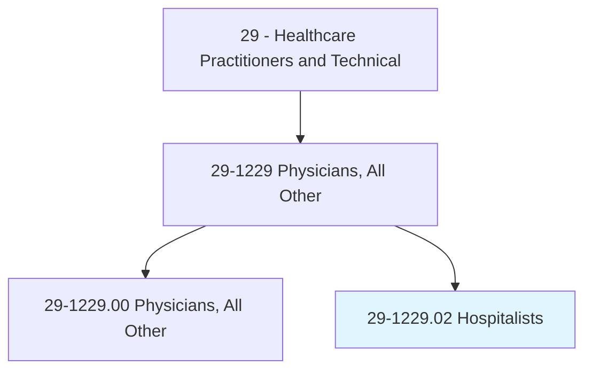
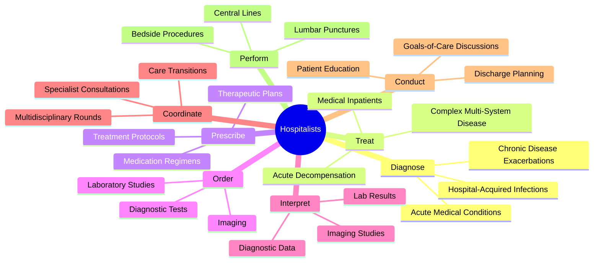
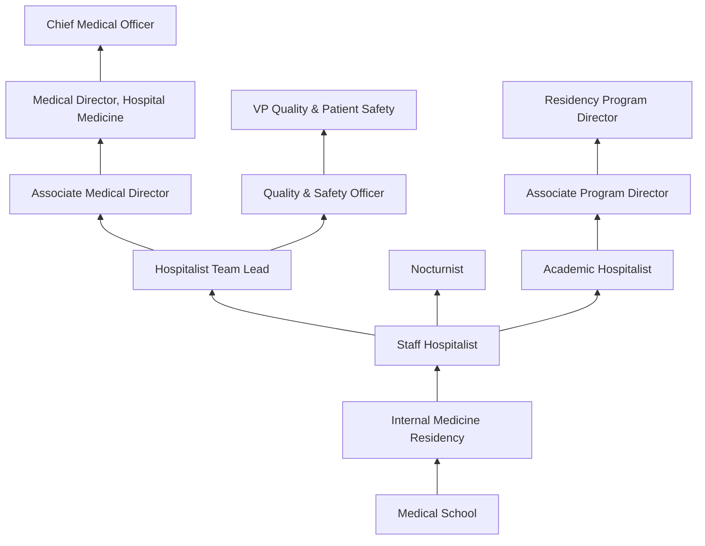
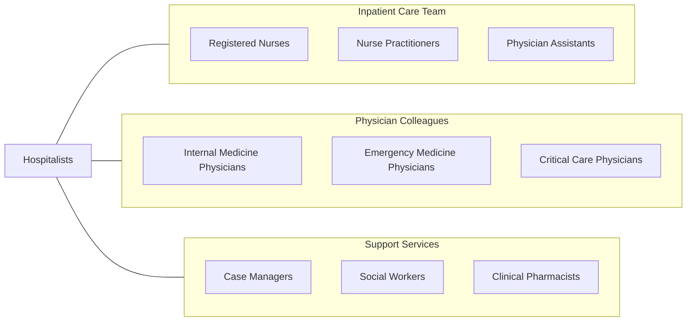

# Hospitalists

> Provide inpatient care predominantly in settings such as medical wards, acute care units, intensive care units, rehabilitation centers, or emergency rooms. Manage and coordinate patient care throughout treatment.

## Overview

Hospitalists are physicians who specialize in the care of hospitalized patients. As the primary attending physicians for inpatients, they manage the full spectrum of medical conditions encountered in the hospital setting, from admission through discharge. Hospitalists coordinate care among specialists, nursing staff, and allied health professionals, serving as the central point of communication for complex medical decision-making.

The hospitalist model has transformed inpatient medicine by providing dedicated, on-site physician coverage that improves efficiency, reduces length of stay, and enhances quality metrics. Hospitalists manage patients on medical wards, step-down units, and often in intensive care settings. They are skilled in procedures such as central line placement, lumbar punctures, paracentesis, and thoracentesis, and they lead rapid response and code teams.

Beyond direct patient care, hospitalists play critical roles in hospital operations, quality improvement, patient safety initiatives, and transitions of care. They serve as physician leaders in hospital committees, develop clinical protocols, mentor medical residents, and drive systemic improvements in healthcare delivery. The specialty has grown rapidly since its inception in the mid-1990s and is now one of the largest medical specialties in the United States.

## Classification Hierarchy

## Key Statistics

| Metric | Value |
|--------|-------|
| SOC Code | 29-1229.02 |
| Median Annual Salary | $223,940 |
| Employment | ~55,000 |
| Projected Growth | 5% (2022-2032) |
| Job Zone | 5 (Extensive Preparation) |
| Category | [Healthcare Practitioners](/occupations/HealthcarePractitioners) |
| Core Tasks | 33 |
| Source | O*NET |

## Core Tasks

### diagnose.AcuteMedicalConditions

Hospitalists diagnose and evaluate a wide range of inpatient medical conditions.

**Actions:**
- `diagnose.AcuteMedicalConditions.in.HospitalInpatients` - Admission workups
- `diagnose.ChronicDiseaseExacerbations.using.ClinicalAssessment` - Flare evaluation
- `diagnose.HospitalAcquiredInfections.through.Surveillance` - Nosocomial screening
- `diagnose.UnexplainedSymptoms.using.SystematicWorkup` - Diagnostic reasoning

### treat.MedicalInpatients

Hospitalists provide comprehensive treatment for admitted patients.

**Actions:**
- `treat.MedicalInpatients.using.EvidenceBasedProtocols` - Guideline-driven care
- `treat.ComplexMultiSystemDisease.with.MultidisciplinaryApproach` - Team-based treatment
- `treat.AcuteDecompensation.through.RapidIntervention` - Urgent stabilization
- `prescribe.MedicationRegimens.for.InpatientCare` - Pharmacotherapy management

### coordinate.CareTransitions

Hospitalists manage smooth transitions across care settings.

**Actions:**
- `coordinate.SpecialistConsultations.for.ComplexCases` - Consult management
- `coordinate.MultidisciplinaryRounds.with.CareTeam` - Team communication
- `conduct.DischargePlanning.with.PatientsAndFamilies` - Safe discharge
- `coordinate.PostDischargeFollowUp.with.PrimaryCare` - Continuity planning

## Practice Settings

| Setting | Description |
|---------|-------------|
| Medical Wards | General inpatient medicine floors |
| Acute Care Units | Step-down and telemetry units |
| Intensive Care Units | Medical ICU coverage |
| Emergency Department | Admission and observation management |
| Rehabilitation Centers | Post-acute care oversight |
| Observation Units | Short-stay medical management |
| Long-Term Acute Care | Complex chronic care hospitals |

## Skills & Competencies

### Technical Skills
- **Internal Medicine** - Expert
- **Diagnostic Reasoning** - Expert
- **Inpatient Pharmacotherapy** - Expert
- **Bedside Procedures** - Advanced
- **Critical Care Triage** - Advanced
- **Quality Improvement Methods** - Advanced
- **Ultrasound (Point-of-Care)** - Advanced
- **Palliative Care Principles** - Advanced

### Soft Skills
- **Communication** - Critical
- **Care Coordination** - Critical
- **Efficiency & Time Management** - Essential
- **Leadership** - Essential
- **Conflict Resolution** - Essential
- **Empathy & Patient Rapport** - Essential
- **Adaptability** - Important

## Education & Training

| Requirement | Details |
|-------------|---------|
| Undergraduate | 4-year bachelor's degree (pre-med) |
| Medical School | 4-year MD or DO program |
| Residency | 3 years Internal Medicine or Family Medicine |
| Fellowship | Optional (Hospital Medicine not yet ABMS-recognized) |
| Total Training | 11 years post-high school |
| Licensure | State medical license required |
| Board Certification | ABIM Internal Medicine or ABFM Family Medicine |
| Continuing Education | MOC requirements per certifying board |

## Certifications

| Certification | Description |
|---------------|-------------|
| ABIM Internal Medicine | American Board of Internal Medicine certification |
| ABFM Family Medicine | American Board of Family Medicine (alternative pathway) |
| Focused Practice in Hospital Medicine | ABIM recognition of hospitalist practice |
| ACLS | Advanced Cardiovascular Life Support |
| BLS | Basic Life Support |
| FCCP | Fellow of the American College of Chest Physicians |
| FHM | Fellow in Hospital Medicine (SHM) |
| SFHM | Senior Fellow in Hospital Medicine |

## Career Progression

## Specializations

| Focus Area | Description |
|------------|-------------|
| Perioperative Medicine | Surgical co-management and preoperative optimization |
| Neurology Hospitalist | Stroke and neurological inpatient care |
| Oncology Hospitalist | Cancer-related inpatient management |
| Observation Medicine | Short-stay and clinical decision unit management |
| Palliative Care | Goals-of-care and end-of-life inpatient care |
| Quality & Patient Safety | Hospital-wide quality improvement initiatives |
| Pediatric Hospital Medicine | Inpatient pediatric care (board-certified subspecialty) |
| Proceduralist | Advanced bedside procedures focus |

## Technology & Tools

| Technology | Purpose |
|------------|---------|
| Electronic Health Records (Epic, Cerner) | Documentation and order entry |
| Clinical Decision Support Systems | Evidence-based alerting |
| Secure Messaging (TigerConnect) | Team communication |
| Point-of-Care Ultrasound | Bedside diagnostic imaging |
| Discharge Planning Software | Care transition management |
| Quality Dashboards | Performance metrics tracking |
| Telemedicine Platforms | Remote consultation and follow-up |
| Handoff Tools (I-PASS) | Standardized care transitions |

## Related Occupations

## Industries

- [Hospitals](/industries/Healthcare/Hospitals/index) - Primary Employment
- [Academic Medical Centers](/industries/Healthcare/Hospitals/Teaching) - Teaching Hospitals
- [Community Hospitals](/industries/Healthcare/Hospitals/Community) - Community Practice
- [Veterans Affairs](/industries/Government/Federal) - VA Hospitalist Programs
- [Long-Term Acute Care](/industries/Healthcare/LongTermCare) - Post-Acute Facilities
- [Locum Tenens Agencies](/industries/Healthcare/StaffingAgencies) - Temporary Coverage

## Departments

This occupation typically works in:
- Hospital Medicine
- Internal Medicine
- Quality & Patient Safety
- Medical Staff Office
- Utilization Management

---

*Source: O*NET 29-1229.02 - ONETOccupation*
