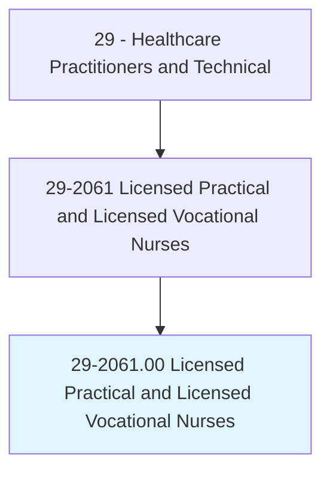
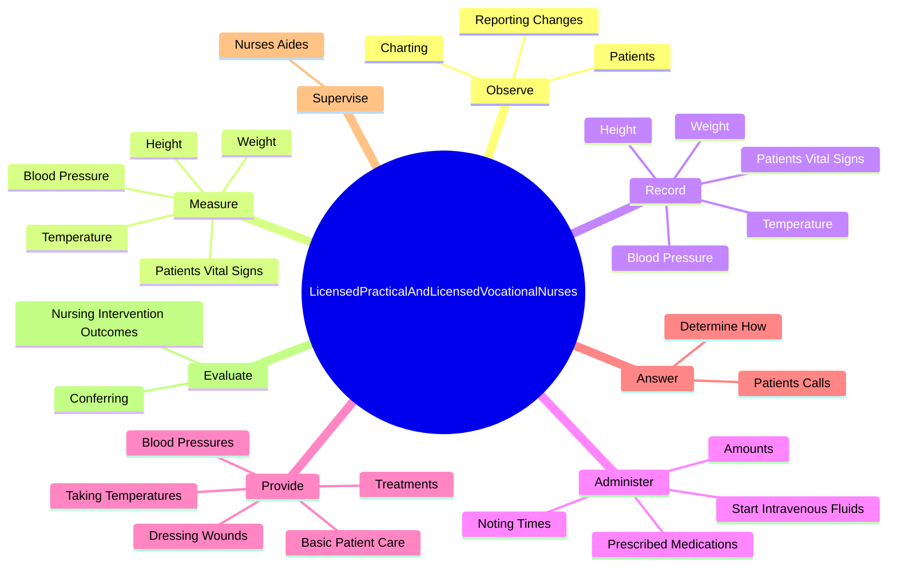
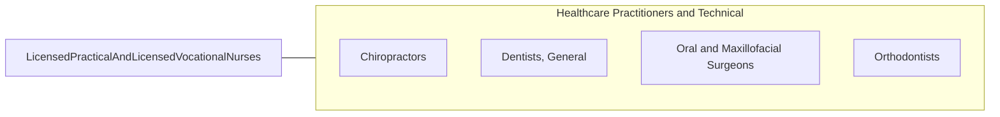

# Licensed Practical and Licensed Vocational Nurses

> Care for ill, injured, or convalescing patients or persons with disabilities in hospitals, nursing homes, clinics, private homes, group homes, and similar institutions. May work under the supervision of a registered nurse. Licensing required.

## Overview

Licensed Practical and Licensed Vocational Nurses is an occupation within the Healthcare Practitioners and Technical category. Care for ill, injured, or convalescing patients or persons with disabilities in hospitals, nursing homes, clinics, private homes, group homes, and similar institutions. May work under the supervision of a registered nurse.

## Classification Hierarchy

## Key Statistics

| Metric | Value |
|--------|-------|
| SOC Code | 29-2061.00 |
| Category | [Healthcare Practitioners and Technical](/occupations/HealthcarePractitioners) |
| Task Count | 126 |
| Source | O*NET |

## Core Tasks

### observe.Patients

Licensed Practical and Licensed Vocational Nurses observe patients as part of their core responsibilities.

**Actions:**
- `observe.Patients.in.PatientsConditions`
- `observe.Patients.in.AdverseReactions.to.Medication`
- `observe.Patients.in.Treatment`
- `observe.Patients.in.TakingNecessaryAction`

### measure.PatientsVitalSigns

Licensed Practical and Licensed Vocational Nurses measure patients vital signs as part of their core responsibilities.

**Actions:**
- `measure.PatientsVitalSigns`
- `measure.Height`
- `measure.Weight`
- `measure.Temperature`

### record.PatientsVitalSigns

Licensed Practical and Licensed Vocational Nurses record patients vital signs as part of their core responsibilities.

**Actions:**
- `record.PatientsVitalSigns`
- `record.Height`
- `record.Weight`
- `record.Temperature`

## Skills & Competencies

### Technical Skills
- **Clinical Skills** - Advanced
- **Diagnostic Procedures** - Advanced
- **Patient Care** - Advanced

### Soft Skills
- **Communication** - Essential
- **Problem Solving** - Essential
- **Critical Thinking** - Important
- **Teamwork** - Important
- **Adaptability** - Important

## Related Occupations

## Industries

This occupation is found across multiple industries. See [Industries](/industries) for sector-specific employment data.

## Career Progression

---

*Source: O*NET 29-2061.00 - ONETOccupation*
