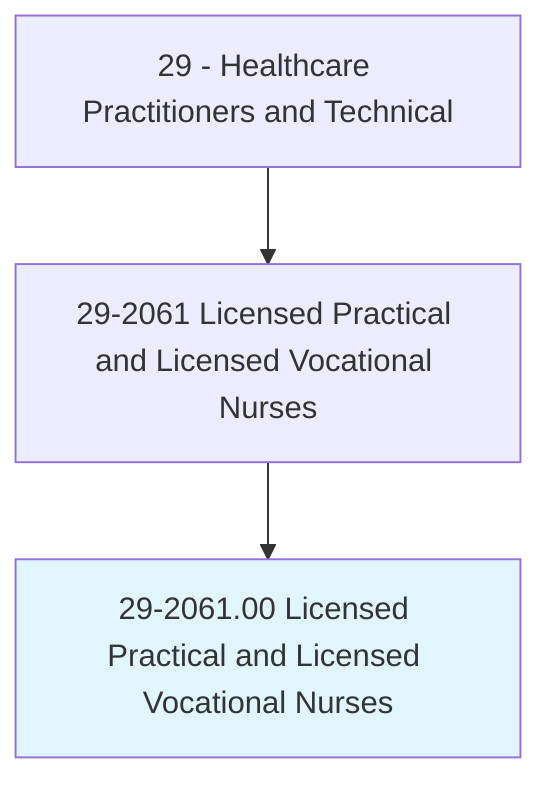
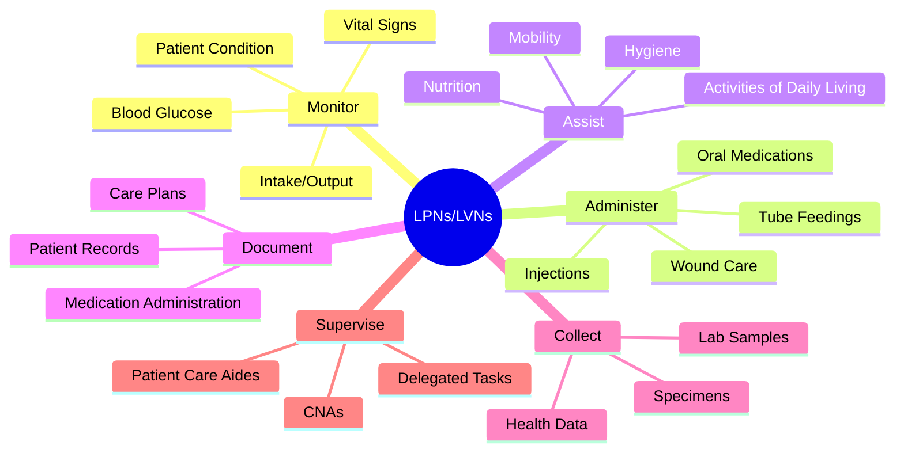
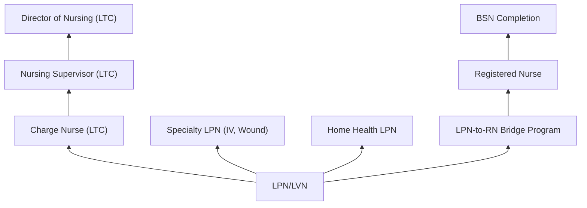
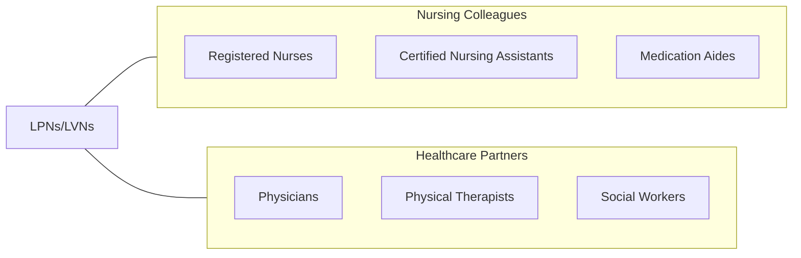

# Licensed Practical and Licensed Vocational Nurses

> Care for ill, injured, or convalescing patients or persons with disabilities in hospitals, nursing homes, clinics, private homes, group homes, and similar institutions. May work under the supervision of a registered nurse.

## Overview

Licensed Practical Nurses (LPNs) and Licensed Vocational Nurses (LVNs) provide basic nursing care under the direction of registered nurses and physicians. They monitor patient vital signs, administer medications, apply wound dressings, insert catheters, collect specimens, assist with activities of daily living, and observe and report changes in patient condition. LPNs/LVNs serve as essential members of the nursing care team across acute care, long-term care, and community health settings.

The scope of LPN/LVN practice varies by state but typically includes medication administration (oral, intramuscular, subcutaneous), wound care and dressing changes, vital sign monitoring, specimen collection, catheter care, IV therapy monitoring (in some states with additional training), patient education on basic self-care, and documentation in electronic health records. In long-term care settings, LPNs often serve as charge nurses supervising certified nursing assistants.

The profession continues to evolve with expanded roles in home health, ambulatory care, and specialty settings. LPNs increasingly use electronic health records, participate in care coordination, provide chronic disease management support, and serve in supervisory roles in skilled nursing facilities. The demand remains strong driven by aging populations and the need for cost-effective nursing care delivery.

## Classification Hierarchy

## Key Statistics

| Metric | Value |
|--------|-------|
| SOC Code | 29-2061.00 |
| Median Annual Salary | $54,620 |
| Employment | ~658,000 |
| Projected Growth | 5% (2022-2032) |
| Job Zone | 3 (Medium Preparation) |
| Category | [Healthcare Practitioners](/occupations/HealthcarePractitioners) |
| Core Tasks | 35+ |
| Source | O*NET |

## Core Tasks

### monitor.PatientStatus

LPNs/LVNs assess and monitor patient conditions.

**Actions:**
- `monitor.VitalSigns.including.BloodPressureAndTemperature` - Vital monitoring
- `observe.PatientCondition.for.ChangesInStatus` - Patient observation
- `monitor.IntakeAndOutput.for.FluidBalance` - I&O monitoring
- `report.AbnormalFindings.to.RegisteredNurses` - Clinical reporting

### administer.NursingCare

LPNs/LVNs provide direct patient care.

**Actions:**
- `administer.Medications.per.PhysicianOrders` - Medication administration
- `perform.WoundCare.using.AsepticTechnique` - Wound management
- `insert.FoleyCatheters.per.NursingProtocol` - Catheterization
- `assist.Patients.with.ActivitiesOfDailyLiving` - ADL support

## Practice Settings

| Setting | Description |
|---------|-------------|
| Nursing Homes/SNFs | Long-term care nursing |
| Hospitals | Acute care nursing support |
| Home Health | Home-based nursing care |
| Physician Offices | Ambulatory care nursing |
| Rehabilitation Centers | Recovery and rehabilitation |
| Community Health Centers | Outpatient nursing |
| Assisted Living | Residential care |
| Correctional Facilities | Inmate healthcare |

## Skills & Competencies

### Technical Skills
- **Medication Administration** - Expert
- **Vital Signs Monitoring** - Expert
- **Wound Care** - Advanced
- **Catheter Care** - Advanced
- **Specimen Collection** - Advanced
- **Electronic Health Records** - Advanced
- **Patient Assessment (Basic)** - Advanced

### Soft Skills
- **Compassion** - Critical
- **Communication** - Essential
- **Patience** - Essential
- **Teamwork** - Essential
- **Observation** - Essential
- **Reliability** - Critical

## Education & Training

| Requirement | Details |
|-------------|---------|
| Education | Certificate or diploma from LPN/LVN program (12-18 months) |
| Prerequisite | High school diploma or GED |
| Licensure | Must pass NCLEX-PN exam |
| State License | Required in all states |
| Continuing Education | Per state board of nursing requirements |

## Certifications

| Certification | Description |
|---------------|-------------|
| LPN/LVN License | State nursing license via NCLEX-PN |
| IV Therapy Certification | IV skills (state-specific) |
| Gerontological Nursing | Long-term care specialty |
| Wound Care Certification | Advanced wound management |
| CPR/BLS | Basic Life Support |
| Medication Aide | Expanded medication authority |

## Career Progression

## Specializations

| Focus Area | Description |
|------------|-------------|
| Long-Term Care | Geriatric nursing in SNFs |
| Home Health | Home-based nursing |
| IV Therapy | Intravenous administration |
| Wound Care | Advanced wound management |
| Pediatrics | Children's nursing care |
| Corrections | Correctional health nursing |
| Dialysis | Renal dialysis nursing |

## Technology & Tools

| Technology | Purpose |
|------------|---------|
| Electronic Health Records (PointClickCare, Epic) | Documentation |
| Medication Administration Systems (eMAR) | Med administration tracking |
| Vital Sign Monitors | Patient monitoring |
| Glucometers | Blood glucose testing |
| Wound Care Supplies | Dressing and wound management |
| IV Pumps (where authorized) | Infusion therapy |
| Point-of-Care Testing Devices | Bedside diagnostics |

## Related Occupations

## Industries

- [Nursing Facilities](/industries/Healthcare/NursingCare) - Primary Employment
- [Hospitals](/industries/Healthcare/Hospitals/index) - Acute Care
- [Home Health](/industries/Healthcare/HomeHealth) - Home Nursing
- [Physician Offices](/industries/Healthcare/PhysicianOffices) - Ambulatory Care
- [Community Health](/industries/Healthcare/AmbulatoryHealthCare) - Outpatient Nursing

## Departments

This occupation typically works in:
- [Nursing Services](/departments/NursingServices)
- [Medical-Surgical Unit](/departments/MedSurg)
- [Long-Term Care](/departments/LongTermCare)
- [Home Health](/departments/HomeHealth)
- [Ambulatory Care](/departments/AmbulatoryCare)

---

*Source: O*NET 29-2061.00 - ONETOccupation*
