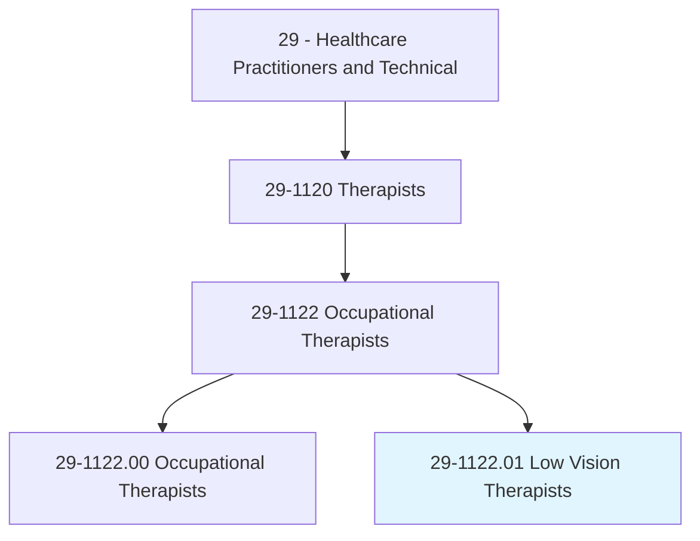
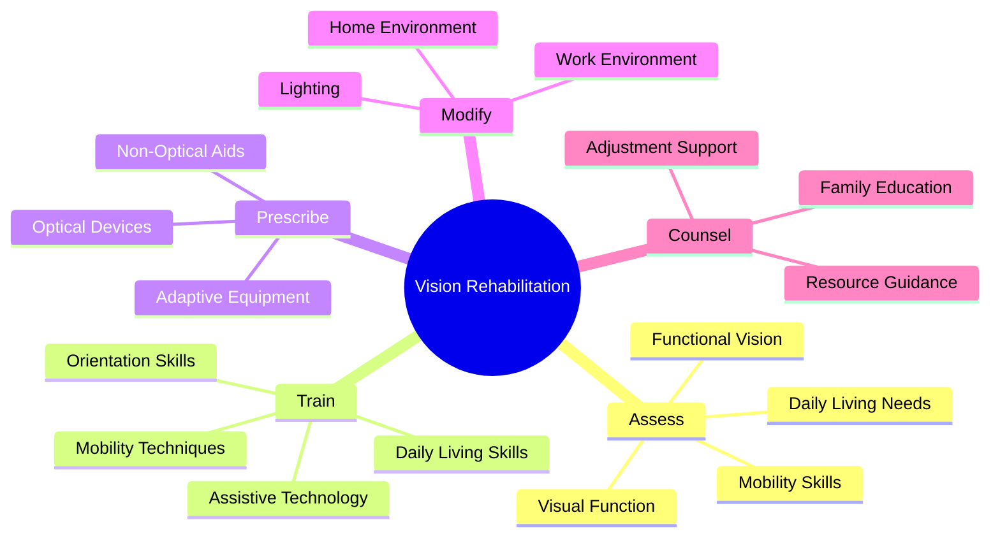
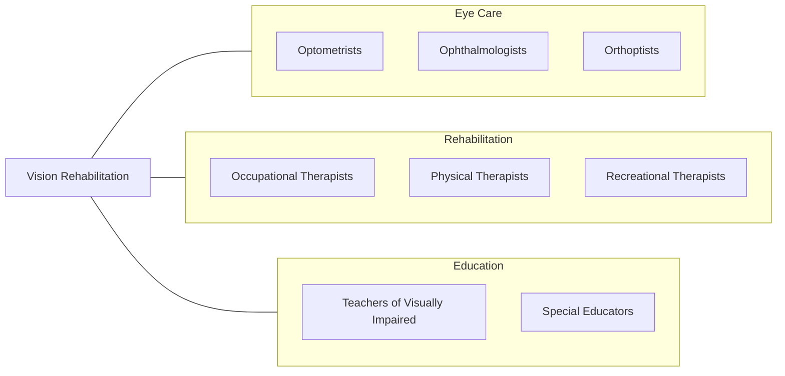
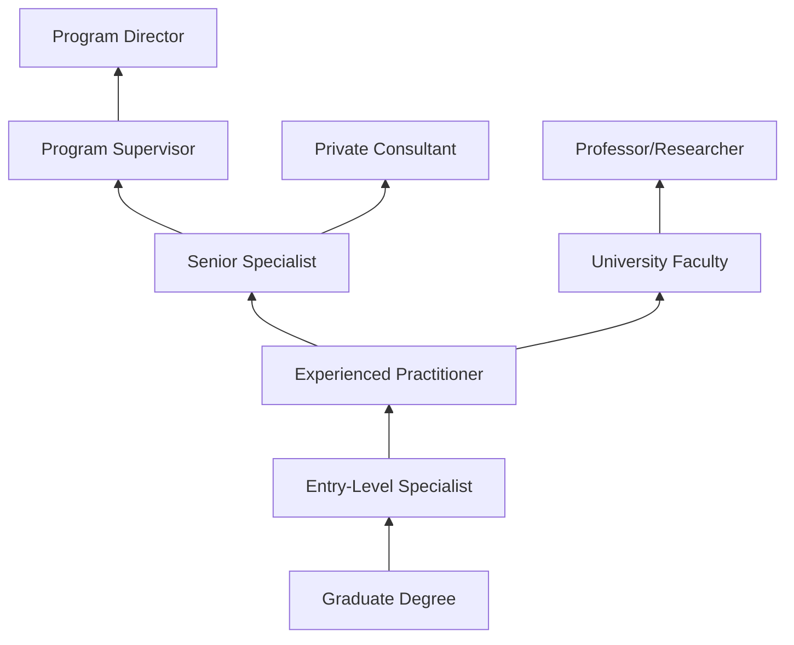

# Low Vision Therapists, Orientation and Mobility Specialists, and Vision Rehabilitation Therapists

> Provide therapy to patients with visual impairments to improve their functioning in daily life activities. May train patients in activities such as computer use, communication skills, or home management skills.

## Overview

These professionals help individuals with visual impairments maximize their remaining vision and develop skills to live independently. Low Vision Therapists teach patients to use optical and non-optical devices. Orientation and Mobility Specialists teach safe travel techniques, including the use of a white cane or guide dog. Vision Rehabilitation Therapists instruct in daily living skills and adaptive techniques for home, work, and community activities.

## Classification Hierarchy

## Key Statistics

| Metric | Value |
|--------|-------|
| SOC Code | 29-1122.01 |
| Job Zone | 5 (Extensive Preparation) |
| Category | [Healthcare Practitioners](/occupations/HealthcarePractitioners) |
| Specializations | 3 (Low Vision, O&M, VRT) |
| Source | O*NET |

## Professional Roles

### Low Vision Therapists
Teach patients to use residual vision effectively with optical devices, lighting modifications, and eccentric viewing techniques.

### Orientation and Mobility Specialists (O&M)
Train individuals to travel safely and independently using canes, guide dogs, and environmental awareness techniques.

### Vision Rehabilitation Therapists (VRT)
Instruct in adaptive daily living skills including cooking, personal care, organization, and communication.

## Core Tasks

### assess.VisualFunction

Evaluate how patients use their remaining vision.

**Actions:**
- `assess.FunctionalVision` - Evaluate practical vision use
- `assess.MobilitySkills` - Test travel abilities
- `assess.DailyLivingSkills` - Evaluate ADL performance
- `assess.TechnologyNeeds` - Determine assistive tech requirements

### train.MobilitySkills

Teach safe and independent travel.

**Actions:**
- `train.CaneSkills` - White cane techniques
- `train.OrientationTechniques` - Spatial awareness
- `train.PublicTransportation` - Travel training
- `train.EnvironmentalAwareness` - Sensory cue use

### instruct.DailyLiving

Teach adaptive techniques for independence.

**Actions:**
- `instruct.CookingSkills` - Adaptive cooking
- `instruct.OrganizationSystems` - Labeling, marking
- `instruct.PersonalCare` - Grooming, medication
- `instruct.CommunicationSkills` - Writing, technology

### prescribe.Devices

Recommend and train on assistive technology.

**Actions:**
- `prescribe.OpticalDevices` - Magnifiers, telescopes
- `prescribe.NonOpticalDevices` - Large print, lighting
- `prescribe.ScreenReaders` - Computer access
- `train.DeviceUse` - Technology training

## Skills & Competencies

### Technical Skills
- **Functional Vision Assessment** - Expert
- **O&M Instruction** - Expert
- **Adaptive Daily Living** - Expert
- **Assistive Technology** - Expert
- **Environmental Modification** - Advanced

### Soft Skills
- **Patient Teaching** - Critical
- **Creativity** - Essential
- **Patience** - Critical
- **Empathy** - Essential
- **Communication** - Critical

## Related Occupations

## Industries

- [Vision Rehabilitation Centers](/industries/VisionRehab) - Specialty Settings
- [State Agencies for the Blind](/industries/StateAgencies) - Government Services
- [Veterans Affairs](/industries/VA) - VA Blind Rehabilitation
- [Hospitals](/industries/Hospitals) - Low Vision Clinics
- [Schools for the Blind](/industries/SpecializedSchools) - Educational Settings
- [Nonprofit Organizations](/industries/Nonprofit) - Service Agencies

## Career Progression

## Education & Training

| Requirement | Details |
|-------------|---------|
| Low Vision Therapy | Master's degree; often OT or specialized program |
| O&M | Master's degree in O&M or related field |
| VRT | Bachelor's or Master's in rehabilitation |
| Certification | ACVREP certification recommended |
| Practicum | Supervised fieldwork required |

## Certifications

| Certification | Description |
|---------------|-------------|
| COMS | Certified Orientation and Mobility Specialist |
| CLVT | Certified Low Vision Therapist |
| CVRT | Certified Vision Rehabilitation Therapist |
| CATIS | Certified Assistive Technology Instructional Specialist |

## Client Populations

| Population | Common Needs |
|------------|--------------|
| Elderly (AMD, Glaucoma) | ADL skills, magnification |
| Diabetic Retinopathy | Mobility, daily living |
| Congenital Visual Impairment | Comprehensive skills |
| Traumatic Injury | Rehabilitation, adjustment |
| Veterans | Comprehensive rehabilitation |
| Children | Education, development |

## Departments

This occupation typically works in:
- [Vision Rehabilitation](/departments/VisionRehabilitation)
- [Low Vision Clinic](/departments/LowVision)
- [Blind Rehabilitation](/departments/BlindRehab)
- [Rehabilitation Services](/departments/Rehabilitation)

---

*Source: O*NET 29-1122.01 - ONETOccupation*
