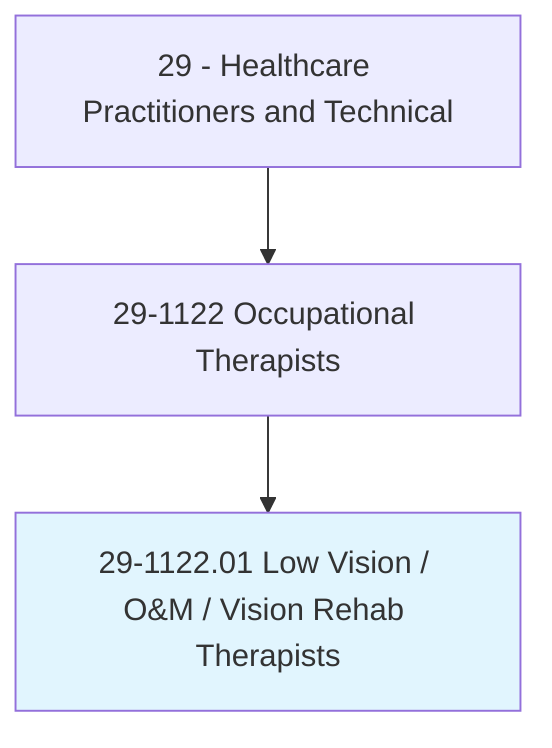
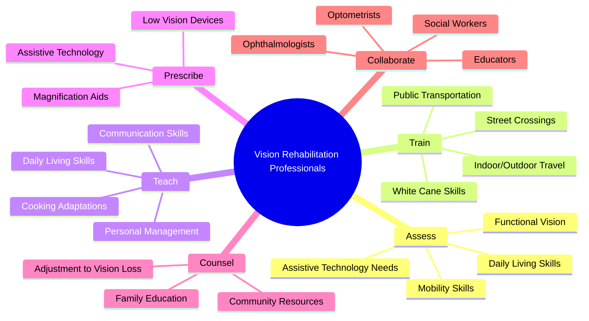
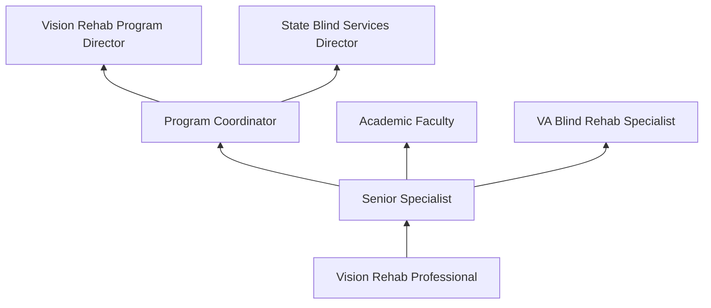
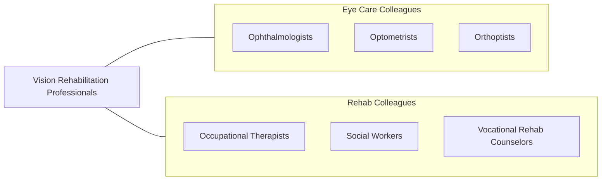

# Low Vision Therapists, Orientation and Mobility Specialists, and Vision Rehabilitation Therapists

> Provide therapy to patients with visual impairments to improve their functioning in daily life activities. May train patients in activities such as orientation and mobility, communication skills, or daily living skills.

## Overview

Low Vision Therapists, Orientation and Mobility (O&M) Specialists, and Vision Rehabilitation Therapists are professionals who help individuals with visual impairments achieve maximum independence in daily life. They assess functional vision, teach adaptive techniques for daily living activities, train clients in safe independent travel using white canes and other mobility aids, prescribe and train in the use of low vision devices and assistive technology, and facilitate adjustment to vision loss.

Orientation and Mobility Specialists teach individuals who are blind or visually impaired to travel safely and independently in their environments using systematic techniques including human guide, self-protective methods, white cane skills, and environmental orientation. Low Vision Therapists prescribe optical and non-optical aids (magnifiers, telescopes, electronic magnification) and teach strategies to maximize remaining vision. Vision Rehabilitation Therapists teach compensatory skills for activities of daily living including cooking, personal management, home organization, and communication.

The field has expanded with assistive technology including smartphone accessibility features, GPS navigation apps for visually impaired users, electronic magnification devices, screen readers, and refreshable braille displays. These professionals serve individuals across the lifespan with conditions including macular degeneration, diabetic retinopathy, glaucoma, retinitis pigmentosa, and cortical visual impairment.

## Classification Hierarchy

## Key Statistics

| Metric | Value |
|--------|-------|
| SOC Code | 29-1122.01 |
| Median Annual Salary | $58,000 |
| Employment | ~8,000 |
| Projected Growth | 12% (2022-2032) |
| Job Zone | 5 (Extensive Preparation) |
| Category | [Healthcare Practitioners](/occupations/HealthcarePractitioners) |
| Core Tasks | 25+ |
| Source | O*NET |

## Core Tasks

### train.IndependentTravel

O&M Specialists teach safe mobility.

**Actions:**
- `train.WhiteCaneSkills.for.IndependentTravel` - Cane training
- `teach.EnvironmentalOrientation.for.SafeNavigation` - Orientation skills
- `train.PublicTransportationUse.for.CommunityAccess` - Transit training
- `assess.TravelEnvironments.for.SafetyAndAccessibility` - Route assessment

### teach.DailyLivingSkills

Vision Rehabilitation Therapists facilitate independence.

**Actions:**
- `teach.AdaptiveCookingTechniques.for.KitchenSafety` - Cooking skills
- `train.AssistiveTechnologyUse.for.Communication` - Technology training
- `prescribe.LowVisionDevices.for.MaximumVisionUse` - Device prescription
- `facilitate.AdjustmentToVisionLoss.through.Counseling` - Psychosocial support

## Practice Settings

| Setting | Description |
|---------|-------------|
| Rehabilitation Centers | Vision rehabilitation programs |
| Veteran Affairs | Blind rehabilitation centers |
| Schools for the Blind | Educational programs |
| Home-Based Services | In-home training |
| Low Vision Clinics | Outpatient vision rehab |
| Community Agencies | Nonprofit vision services |
| State Agencies | Vocational rehabilitation |

## Skills & Competencies

### Technical Skills
- **Orientation and Mobility Instruction** - Expert
- **Low Vision Assessment** - Expert
- **Assistive Technology** - Expert
- **Daily Living Skills Instruction** - Expert
- **Functional Vision Assessment** - Advanced
- **White Cane Instruction** - Expert
- **Braille** - Advanced

### Soft Skills
- **Patience** - Critical
- **Communication** - Essential
- **Empathy** - Essential
- **Creativity** - Essential
- **Problem Solving** - Essential
- **Cultural Sensitivity** - Important

## Education & Training

| Requirement | Details |
|-------------|---------|
| Education | Master's degree in vision rehabilitation, O&M, or related field |
| Clinical Training | Supervised practicum in vision rehabilitation |
| Certification | COMS, CLVT, or CVRT through ACVREP |
| Continuing Education | Per certification requirements |

## Certifications

| Certification | Description |
|---------------|-------------|
| COMS | Certified Orientation and Mobility Specialist (ACVREP) |
| CLVT | Certified Low Vision Therapist (ACVREP) |
| CVRT | Certified Vision Rehabilitation Therapist (ACVREP) |
| NOMC | National Orientation and Mobility Certification |

## Career Progression

## Specializations

| Focus Area | Description |
|------------|-------------|
| Pediatric Vision Rehabilitation | Children with visual impairments |
| Geriatric Low Vision | Age-related vision loss |
| Deaf-Blind Services | Dual sensory loss |
| Veterans Blind Rehabilitation | Military-related vision loss |
| Assistive Technology | High-tech vision aids |
| Cortical Visual Impairment | Neurological visual impairment |

## Technology & Tools

| Technology | Purpose |
|------------|---------|
| White Canes (various types) | Mobility aid |
| Low Vision Magnifiers (optical/electronic) | Vision enhancement |
| Screen Readers (JAWS, VoiceOver) | Computer access |
| GPS Navigation Apps (Seeing AI, BlindSquare) | Wayfinding |
| CCTVs/Video Magnifiers | Electronic magnification |
| Braille Displays and Writers | Tactile communication |
| Smartphone Accessibility Features | Daily living access |

## Related Occupations

## Industries

- [Hospitals](/industries/Healthcare/Hospitals/index) - Vision Rehabilitation
- [VA Medical Centers](/industries/Government) - Blind Rehabilitation
- [State Agencies](/industries/Government) - Blind Services
- [Nonprofit Organizations](/industries/Healthcare/AmbulatoryHealthCare) - Vision Services
- [Schools](/industries/Education/ElementarySecondary) - Special Education

## Departments

This occupation typically works in:
- [Vision Rehabilitation](/departments/VisionRehabilitation)
- [Low Vision Center](/departments/LowVisionCenter)
- [Blind Rehabilitation](/departments/BlindRehabilitation)
- [Occupational Therapy](/departments/OccupationalTherapy)

---

*Source: O*NET 29-1122.01 - ONETOccupation*
