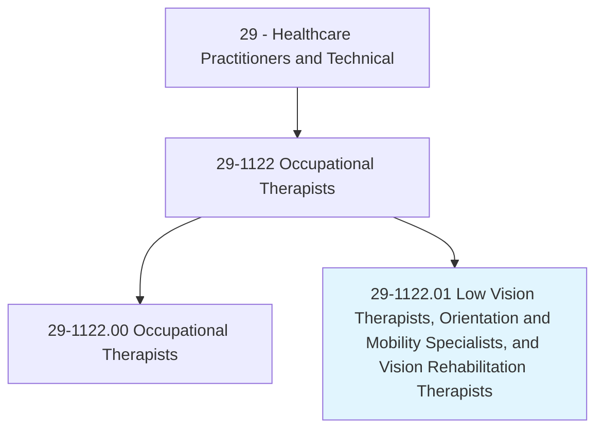
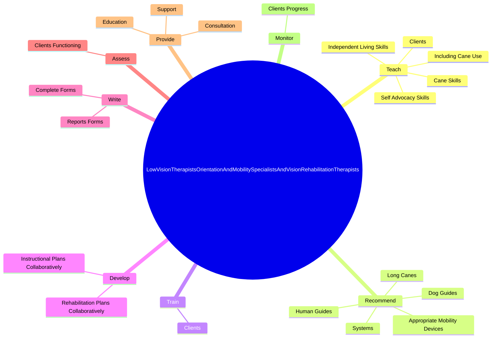

# Low Vision Therapists, Orientation and Mobility Specialists, and Vision Rehabilitation Therapists

> Provide therapy to patients with visual impairments to improve their functioning in daily life activities. May train patients in activities such as computer use, communication skills, or home management skills.

## Overview

Low Vision Therapists, Orientation and Mobility Specialists, and Vision Rehabilitation Therapists is a specialized variant within the Healthcare Practitioners and Technical category. Provide therapy to patients with visual impairments to improve their functioning in daily life activities. 

## Classification Hierarchy

## Key Statistics

| Metric | Value |
|--------|-------|
| SOC Code | 29-1122.01 |
| Category | [Healthcare Practitioners and Technical](/occupations/HealthcarePractitioners) |
| Task Count | 114 |
| Source | O*NET |

## Core Tasks

### teach.CaneSkills

Low Vision Therapists, Orientation and Mobility Specialists, and Vision Rehabilitation Therapists teach cane skills as part of their core responsibilities.

**Actions:**
- `teach.CaneSkills.with.Guide`
- `teach.CaneSkills.with.DiagonalTechniques`
- `teach.CaneSkills.with.TwoPointTouches`
- `teach.IncludingCaneUse.with.Guide`

### recommend.AppropriateMobilityDevices

Low Vision Therapists, Orientation and Mobility Specialists, and Vision Rehabilitation Therapists recommend appropriate mobility devices as part of their core responsibilities.

**Actions:**
- `recommend.AppropriateMobilityDevices`
- `recommend.Systems`
- `recommend.HumanGuides`
- `recommend.DogGuides`

### train.Clients

Low Vision Therapists, Orientation and Mobility Specialists, and Vision Rehabilitation Therapists train clients as part of their core responsibilities.

**Actions:**
- `train.Clients.with.VisualImpairments.to.use.MobilityDevices`
- `train.Clients.with.Systems`
- `train.Clients.with.HumanGuides`
- `train.Clients.with.DogGuides`

## Skills & Competencies

### Technical Skills
- **Clinical Skills** - Advanced
- **Diagnostic Procedures** - Advanced
- **Patient Care** - Advanced

### Soft Skills
- **Communication** - Essential
- **Problem Solving** - Essential
- **Critical Thinking** - Important
- **Teamwork** - Important
- **Adaptability** - Important

## Related Occupations

## Industries

This occupation is found across multiple industries. See [Industries](/industries) for sector-specific employment data.

## Career Progression

---

*Source: O*NET 29-1122.01 - ONETOccupation*
