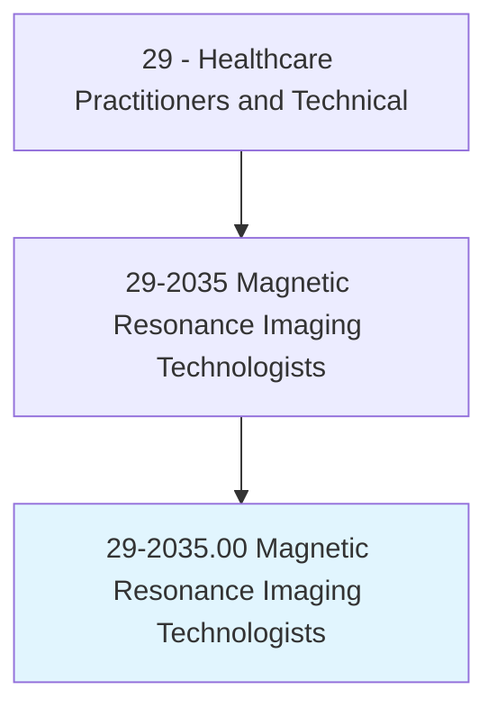
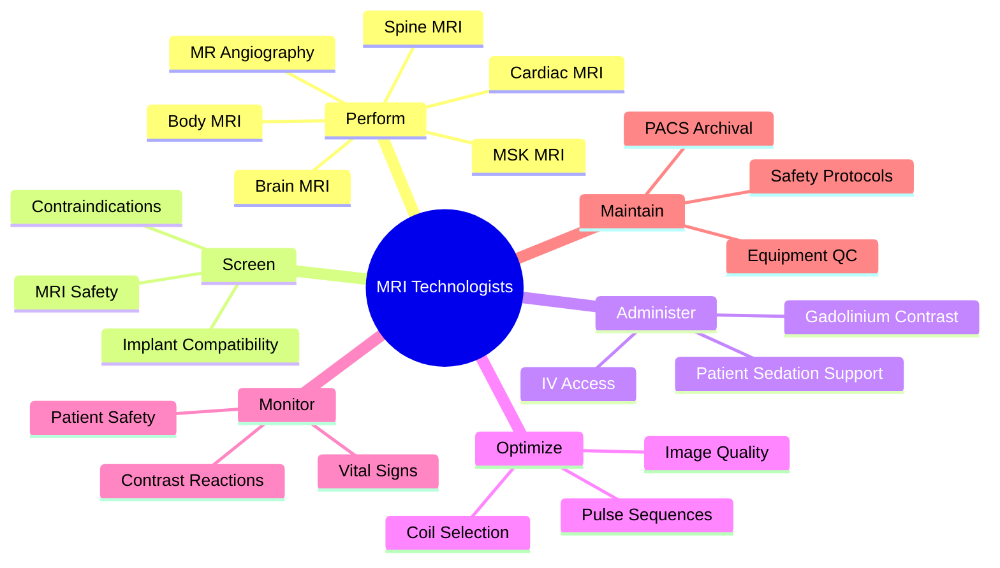
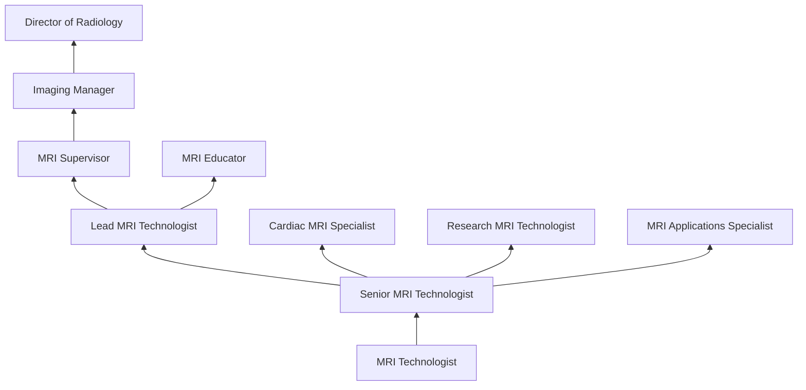
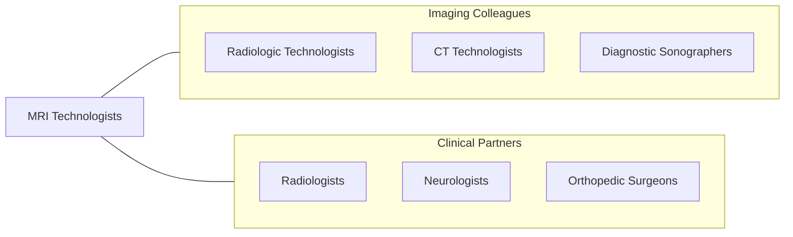

# Magnetic Resonance Imaging Technologists

> Operate Magnetic Resonance Imaging (MRI) scanners. Monitor patient safety and comfort, and view images of the area being scanned to ensure quality of the pictures. May administer gadolinium contrast.

## Overview

Magnetic Resonance Imaging (MRI) Technologists are specialized medical imaging professionals who operate MRI scanners to produce detailed cross-sectional images of the body's internal structures. They use powerful magnetic fields and radiofrequency pulses rather than ionizing radiation to generate high-resolution images of soft tissues, organs, joints, the brain, spine, and vascular structures for diagnostic interpretation by radiologists.

MRI technologists position patients, select appropriate imaging coils, program pulse sequences (T1, T2, FLAIR, DWI, MRA), administer gadolinium-based contrast agents, ensure MRI safety by screening for ferromagnetic implants and contraindications, monitor patients during scanning, and evaluate image quality. They must understand the physics of magnetic resonance, tissue contrast mechanisms, and artifact recognition to optimize diagnostic image quality.

The field has advanced with 3T and 7T high-field magnets, functional MRI (fMRI), cardiac MRI, breast MRI, MR-guided interventions, diffusion tensor imaging, spectroscopy, and artificial intelligence-assisted image reconstruction. MRI technologists work in an environment requiring meticulous attention to safety due to the strong magnetic field, with specialized knowledge of Zone IV access control, quench procedures, and screening protocols.

## Classification Hierarchy

## Key Statistics

| Metric | Value |
|--------|-------|
| SOC Code | 29-2035.00 |
| Median Annual Salary | $77,080 |
| Employment | ~46,000 |
| Projected Growth | 6% (2022-2032) |
| Job Zone | 3 (Medium Preparation) |
| Category | [Healthcare Practitioners](/occupations/HealthcarePractitioners) |
| Core Tasks | 30+ |
| Source | O*NET |

## Core Tasks

### perform.MRIExaminations

MRI Technologists conduct diagnostic imaging studies.

**Actions:**
- `perform.BrainMRI.using.OptimizedPulseSequences` - Neuro MRI
- `perform.SpineMRI.for.DegenerativeAndTraumaticConditions` - Spine imaging
- `perform.CardiacMRI.for.HeartFunctionAssessment` - Cardiac MRI
- `perform.MRAngiography.for.VascularEvaluation` - MRA studies

### ensure.MRISafety

MRI Technologists maintain a safe scanning environment.

**Actions:**
- `screen.Patients.for.MRIContraindications` - Safety screening
- `enforce.ZoneIVAccessControl.for.MagnetSafety` - Zone safety
- `monitor.Patients.during.MRIScanning` - Patient monitoring
- `administer.GadoliniumContrast.per.SafetyProtocols` - Contrast administration

## Practice Settings

| Setting | Description |
|---------|-------------|
| Hospital Radiology | Inpatient and outpatient MRI |
| Outpatient Imaging Centers | Ambulatory MRI services |
| Academic Medical Centers | Advanced MRI and research |
| Mobile MRI Services | Portable scanner operations |
| Orthopedic Clinics | MSK MRI specialty |
| Neurology Centers | Brain and spine MRI |

## Skills & Competencies

### Technical Skills
- **MRI Physics** - Expert
- **Pulse Sequence Programming** - Expert
- **MRI Safety** - Expert
- **Patient Positioning** - Expert
- **Contrast Administration** - Advanced
- **Image Quality Optimization** - Expert
- **PACS/Image Management** - Advanced

### Soft Skills
- **Patient Communication** - Critical
- **Attention to Detail** - Essential
- **Problem Solving** - Essential
- **Adaptability** - Essential
- **Teamwork** - Essential

## Education & Training

| Requirement | Details |
|-------------|---------|
| Education | Associate or bachelor's degree in MRI technology or radiologic technology |
| MRI Training | ARRT-approved MRI program or post-primary pathway |
| Certification | ARRT MR credential |
| BLS | CPR certification required |
| Continuing Education | 24 CE credits per 2-year cycle |

## Certifications

| Certification | Description |
|---------------|-------------|
| RT(MR)(ARRT) | Registered MRI Technologist |
| RT(R)(ARRT) | Radiologic Technologist (base credential) |
| ARMRIT | American Registry of MRI Technologists |
| IV Certification | Contrast injection authority |
| BLS/ACLS | Life support certifications |

## Career Progression

## Specializations

| Focus Area | Description |
|------------|-------------|
| Neuro MRI | Brain and spine imaging |
| Cardiac MRI | Heart imaging |
| Breast MRI | Breast cancer screening |
| MSK MRI | Orthopedic imaging |
| Pediatric MRI | Children's imaging |
| fMRI | Functional brain imaging |
| MRI-Guided Interventions | Procedural MRI support |

## Technology & Tools

| Technology | Purpose |
|------------|---------|
| MRI Scanners (GE, Siemens, Philips) | Diagnostic imaging |
| Surface/Body Coils | Signal reception |
| Power Injectors | Contrast administration |
| MRI-Compatible Monitoring Equipment | Patient monitoring |
| PACS Systems | Image storage and retrieval |
| Post-Processing Workstations | Image analysis |
| MRI Safety Screening Tools | Ferromagnetic detection |

## Related Occupations

## Industries

- [Hospitals](/industries/Healthcare/Hospitals/index) - Primary Employment
- [Outpatient Imaging](/industries/Healthcare/AmbulatoryHealthCare) - Imaging Centers
- [Physician Offices](/industries/Healthcare/PhysicianOffices) - Office-Based MRI
- [Mobile Imaging](/industries/Healthcare/AmbulatoryHealthCare) - Mobile Services
- [Academic](/industries/Education) - Research MRI

## Departments

This occupation typically works in:
- [Diagnostic Imaging / Radiology](/departments/DiagnosticImaging)
- [MRI Department](/departments/MRI)
- [Outpatient Imaging](/departments/OutpatientImaging)
- [Neuroscience Center](/departments/NeuroscienceCenter)

---

*Source: O*NET 29-2035.00 - ONETOccupation*
