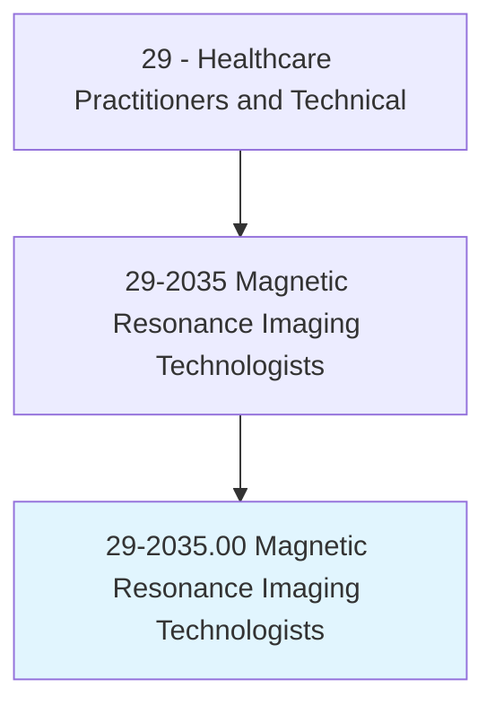
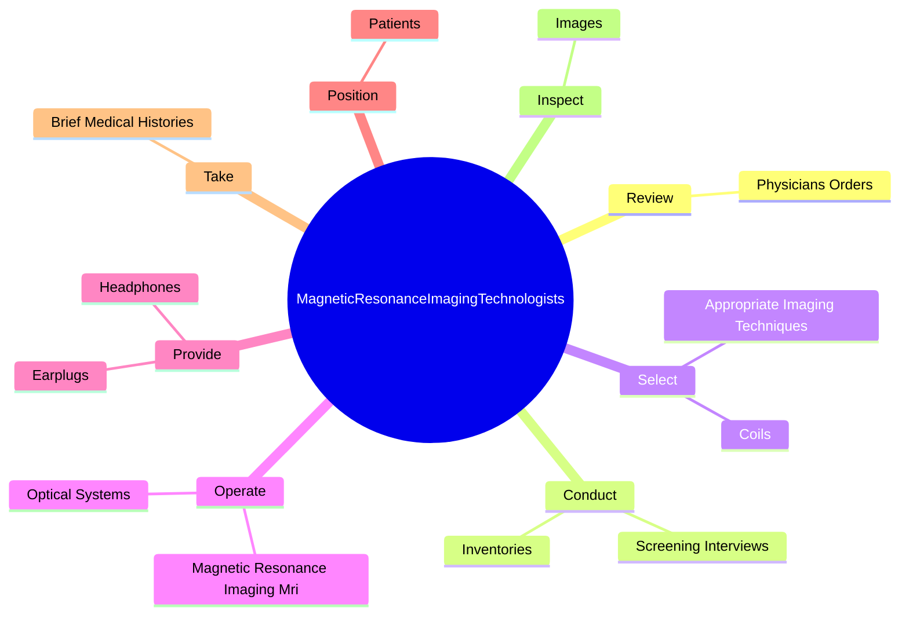
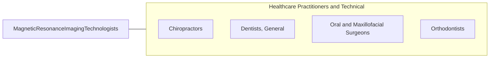

# Magnetic Resonance Imaging Technologists

> Operate Magnetic Resonance Imaging (MRI) scanners. Monitor patient safety and comfort, and view images of area being scanned to ensure quality of pictures. May administer gadolinium contrast dosage intravenously. May interview patient, explain MRI procedures, and position patient on examining table. May enter into the computer data such as patient history, anatomical area to be scanned, orientation specified, and position of entry.

## Overview

Magnetic Resonance Imaging Technologists is an occupation within the Healthcare Practitioners and Technical category. Operate Magnetic Resonance Imaging (MRI) scanners. Monitor patient safety and comfort, and view images of area being scanned to ensure quality of pictures.

## Classification Hierarchy

## Key Statistics

| Metric | Value |
|--------|-------|
| SOC Code | 29-2035.00 |
| Category | [Healthcare Practitioners and Technical](/occupations/HealthcarePractitioners) |
| Task Count | 73 |
| Source | O*NET |

## Core Tasks

### review.PhysiciansOrders

Magnetic Resonance Imaging Technologists review physicians orders as part of their core responsibilities.

**Actions:**
- `review.PhysiciansOrders.to.confirm.PrescribedExams`

### conduct.ScreeningInterviews

Magnetic Resonance Imaging Technologists conduct screening interviews as part of their core responsibilities.

**Actions:**
- `conduct.ScreeningInterviews.of.Patients.to.identify.Contraindications`
- `conduct.ScreeningInterviews.of.FerrousObjects`
- `conduct.ScreeningInterviews.of.Pregnancy`
- `conduct.ScreeningInterviews.of.ProstheticHeartValves`

### select.AppropriateImagingTechniques

Magnetic Resonance Imaging Technologists select appropriate imaging techniques as part of their core responsibilities.

**Actions:**
- `select.AppropriateImagingTechniques.to.produce.RequiredImages`
- `select.Coils.to.produce.RequiredImages`

## Skills & Competencies

### Technical Skills
- **Clinical Skills** - Advanced
- **Diagnostic Procedures** - Advanced
- **Patient Care** - Advanced

### Soft Skills
- **Communication** - Essential
- **Problem Solving** - Essential
- **Critical Thinking** - Important
- **Teamwork** - Important
- **Adaptability** - Important

## Related Occupations

## Industries

This occupation is found across multiple industries. See [Industries](/industries) for sector-specific employment data.

## Career Progression

---

*Source: O*NET 29-2035.00 - ONETOccupation*
