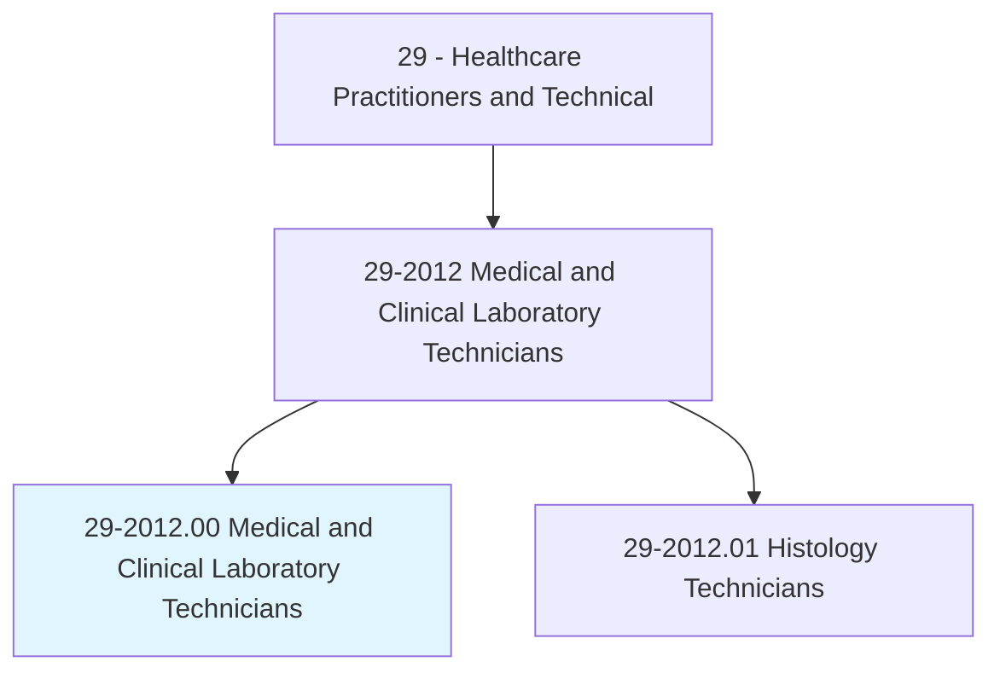
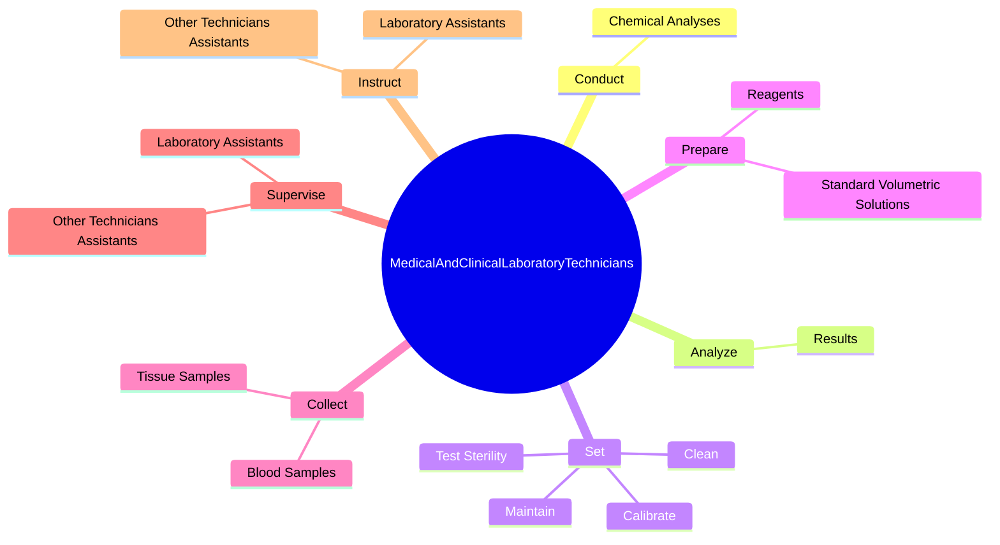
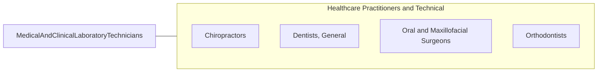

# Medical and Clinical Laboratory Technicians

> Perform routine medical laboratory tests for the diagnosis, treatment, and prevention of disease. May work under the supervision of a medical technologist.

## Overview

Medical and Clinical Laboratory Technicians is an occupation within the Healthcare Practitioners and Technical category. Perform routine medical laboratory tests for the diagnosis, treatment, and prevention of disease. 

## Classification Hierarchy

## Key Statistics

| Metric | Value |
|--------|-------|
| SOC Code | 29-2012.00 |
| Category | [Healthcare Practitioners and Technical](/occupations/HealthcarePractitioners) |
| Task Count | 50 |
| Source | O*NET |

## Core Tasks

### conduct.ChemicalAnalyses

Medical and Clinical Laboratory Technicians conduct chemical analyses as part of their core responsibilities.

**Actions:**
- `conduct.ChemicalAnalyses.of.BodyFluids`
- `conduct.ChemicalAnalyses.of.Blood`
- `conduct.ChemicalAnalyses.of.Urine`
- `conduct.ChemicalAnalyses.of.UsingMicroscope`

### analyze.Results

Medical and Clinical Laboratory Technicians analyze results as part of their core responsibilities.

**Actions:**
- `analyze.Results.of.Tests.to.ensure.ConformityToSpecifications`
- `analyze.Results.of.Experiments.to.ensure.ConformityToSpecifications`
- `analyze.Results.of.UsingSpecialMechanical`
- `analyze.Results.of.ElectricalDevices`

### set.Maintain

Medical and Clinical Laboratory Technicians set maintain as part of their core responsibilities.

**Actions:**
- `set.Maintain.of.MedicalLaboratoryEquipment`
- `set.Calibrate.of.MedicalLaboratoryEquipment`
- `set.Clean.of.MedicalLaboratoryEquipment`
- `set.TestSterility.of.MedicalLaboratoryEquipment`

## Skills & Competencies

### Technical Skills
- **Clinical Skills** - Advanced
- **Diagnostic Procedures** - Advanced
- **Patient Care** - Advanced

### Soft Skills
- **Communication** - Essential
- **Problem Solving** - Essential
- **Critical Thinking** - Important
- **Teamwork** - Important
- **Adaptability** - Important

## Related Occupations

## Industries

This occupation is found across multiple industries. See [Industries](/industries) for sector-specific employment data.

## Career Progression

---

*Source: O*NET 29-2012.00 - ONETOccupation*
