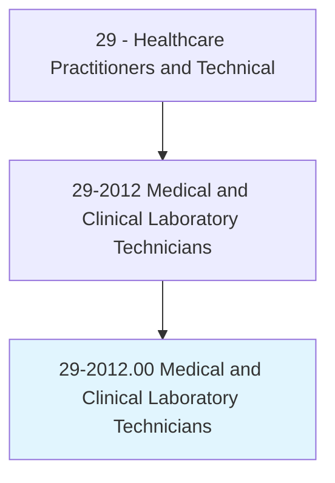
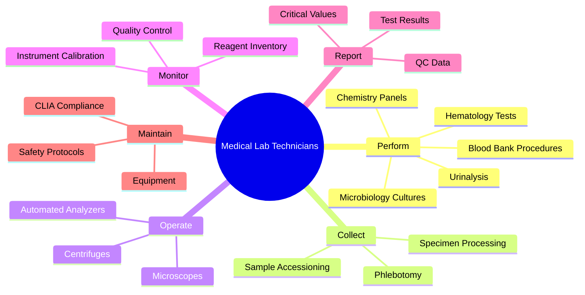
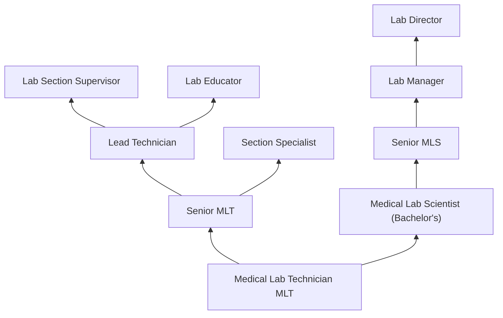
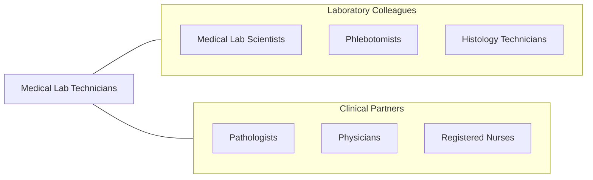

# Medical and Clinical Laboratory Technicians

> Perform routine medical laboratory tests for the diagnosis, treatment, and prevention of disease. May work under the supervision of a medical technologist.

## Overview

Medical and Clinical Laboratory Technicians (MLTs) perform routine laboratory tests that are essential for diagnosing disease, monitoring treatment, and screening for health conditions. They collect and process patient specimens (blood, urine, body fluids, tissue), operate automated analyzers, perform manual test procedures, and report results to physicians. MLTs work across laboratory disciplines including hematology, clinical chemistry, microbiology, urinalysis, immunology, and blood banking.

The role encompasses phlebotomy, specimen processing, quality control testing, instrument calibration, reagent preparation, and result verification. MLTs follow standardized operating procedures to ensure accuracy and reliability of test results. They troubleshoot instrument malfunctions, identify specimen integrity issues, recognize abnormal results requiring immediate notification (critical values), and maintain compliance with CLIA regulations and accreditation standards.

Modern laboratory medicine relies on sophisticated automation, molecular diagnostics, point-of-care testing, and laboratory information systems. MLTs operate high-throughput analyzers, perform rapid diagnostic tests, support molecular testing workflows, and contribute to laboratory quality improvement initiatives. The profession faces strong demand driven by aging populations, expanded diagnostic testing, and workforce shortages.

## Classification Hierarchy

## Key Statistics

| Metric | Value |
|--------|-------|
| SOC Code | 29-2012.00 |
| Median Annual Salary | $46,680 |
| Employment | ~171,000 |
| Projected Growth | 5% (2022-2032) |
| Job Zone | 3 (Medium Preparation) |
| Category | [Healthcare Practitioners](/occupations/HealthcarePractitioners) |
| Core Tasks | 35+ |
| Source | O*NET |

## Core Tasks

### perform.LaboratoryTests

MLTs conduct routine diagnostic testing.

**Actions:**
- `perform.CompletBloodCount.using.HematologyAnalyzer` - CBC testing
- `perform.ChemistryPanels.using.AutomatedAnalyzer` - Chemistry testing
- `perform.Urinalysis.using.DipstickAndMicroscopy` - UA testing
- `perform.BloodBankTesting.for.TransfusionCompatibility` - Blood bank

### collect.PatientSpecimens

MLTs obtain and process specimens.

**Actions:**
- `perform.Phlebotomy.for.BloodSpecimenCollection` - Blood draw
- `process.Specimens.for.AnalyticalTesting` - Specimen processing
- `verify.SpecimenIntegrity.for.AccurateResults` - Quality verification
- `report.CriticalValues.to.ClinicalStaff` - Critical value notification

## Practice Settings

| Setting | Description |
|---------|-------------|
| Hospital Laboratories | Full-service clinical labs |
| Reference Laboratories | High-volume testing |
| Physician Office Labs (POL) | Point-of-care testing |
| Blood Banks | Transfusion services |
| Public Health Labs | Disease surveillance |
| Veterinary Laboratories | Animal diagnostics |

## Skills & Competencies

### Technical Skills
- **Hematology Testing** - Advanced
- **Clinical Chemistry** - Advanced
- **Urinalysis** - Advanced
- **Blood Banking** - Advanced
- **Microbiology** - Advanced
- **Phlebotomy** - Expert
- **Quality Control** - Advanced

### Soft Skills
- **Attention to Detail** - Critical
- **Reliability** - Critical
- **Communication** - Essential
- **Teamwork** - Essential
- **Organization** - Essential

## Education & Training

| Requirement | Details |
|-------------|---------|
| Education | Associate degree in medical laboratory technology |
| Clinical Training | Clinical rotations in accredited program |
| Certification | MLT(ASCP) through ASCP Board of Certification |
| Continuing Education | Per certification requirements |

## Certifications

| Certification | Description |
|---------------|-------------|
| MLT(ASCP) | Medical Laboratory Technician (ASCP) |
| CLT(NCA) | Clinical Laboratory Technician |
| PBT(ASCP) | Phlebotomy Technician |
| State License | Required in some states |

## Career Progression

## Specializations

| Focus Area | Description |
|------------|-------------|
| Hematology | Blood cell analysis |
| Clinical Chemistry | Chemical analysis of body fluids |
| Microbiology | Bacterial and fungal identification |
| Blood Banking | Transfusion medicine |
| Immunology/Serology | Antibody testing |
| Phlebotomy | Specimen collection |
| Point-of-Care Testing | Bedside diagnostics |

## Technology & Tools

| Technology | Purpose |
|------------|---------|
| Hematology Analyzers (Sysmex, Beckman) | CBC analysis |
| Chemistry Analyzers (Roche, Abbott) | Metabolic panels |
| Blood Bank Analyzers (Ortho, Immucor) | Compatibility testing |
| Microscopes | Manual differentials and urinalysis |
| Centrifuges | Specimen processing |
| LIS (Laboratory Information Systems) | Result management |
| Point-of-Care Devices | Rapid testing |

## Related Occupations

## Industries

- [Hospitals](/industries/Healthcare/Hospitals/index) - Clinical Labs
- [Reference Laboratories](/industries/Healthcare/MedicalLaboratories) - High-Volume Testing
- [Physician Offices](/industries/Healthcare/PhysicianOffices) - POL Testing
- [Blood Banks](/industries/Healthcare/AmbulatoryHealthCare) - Transfusion Services
- [Government](/industries/PublicAdministration) - Public Health Labs

## Departments

This occupation typically works in:
- Clinical Laboratory
- Hematology
- Clinical Chemistry
- Blood Bank
- Microbiology

---

*Source: O*NET 29-2012.00 - ONETOccupation*
