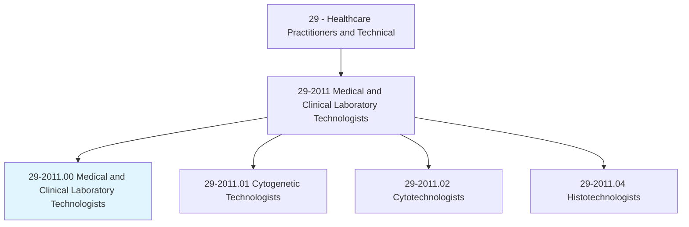
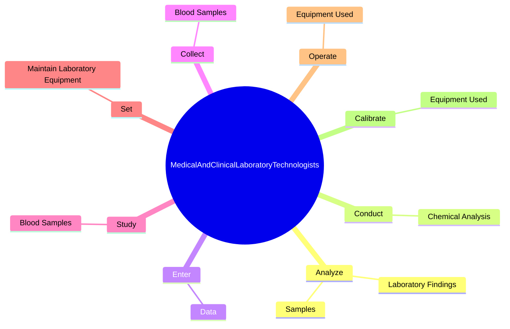
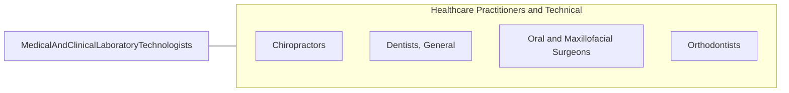

# Medical and Clinical Laboratory Technologists

> Perform complex medical laboratory tests for diagnosis, treatment, and prevention of disease. May train or supervise staff.

## Overview

Medical and Clinical Laboratory Technologists is an occupation within the Healthcare Practitioners and Technical category. Perform complex medical laboratory tests for diagnosis, treatment, and prevention of disease. 

## Classification Hierarchy

## Key Statistics

| Metric | Value |
|--------|-------|
| SOC Code | 29-2011.00 |
| Category | [Healthcare Practitioners and Technical](/occupations/HealthcarePractitioners) |
| Task Count | 118 |
| Source | O*NET |

## Core Tasks

### analyze.Samples

Medical and Clinical Laboratory Technologists analyze samples as part of their core responsibilities.

**Actions:**
- `analyze.Samples.of.BiologicalMaterial.for.ChemicalContent`
- `analyze.Samples.of.Reaction`
- `analyze.LaboratoryFindings.to.check.AccuracyOfResults`

### conduct.ChemicalAnalysis

Medical and Clinical Laboratory Technologists conduct chemical analysis as part of their core responsibilities.

**Actions:**
- `conduct.ChemicalAnalysis.of.BodyFluids`
- `conduct.ChemicalAnalysis.of.IncludingBlood`
- `conduct.ChemicalAnalysis.of.Urine`
- `conduct.ChemicalAnalysis.of.SpinalFluid`

### enter.Data

Medical and Clinical Laboratory Technologists enter data as part of their core responsibilities.

**Actions:**
- `enter.Data.from.Analysis.of.MedicalTestsResultsIntoComputerForStorage`
- `enter.Data.from.ClinicalResultsIntoComputer.for.Storage`

## Skills & Competencies

### Technical Skills
- **Clinical Skills** - Advanced
- **Diagnostic Procedures** - Advanced
- **Patient Care** - Advanced

### Soft Skills
- **Communication** - Essential
- **Problem Solving** - Essential
- **Critical Thinking** - Important
- **Teamwork** - Important
- **Adaptability** - Important

## Related Occupations

## Industries

This occupation is found across multiple industries. See [Industries](/industries) for sector-specific employment data.

## Career Progression

---

*Source: O*NET 29-2011.00 - ONETOccupation*
