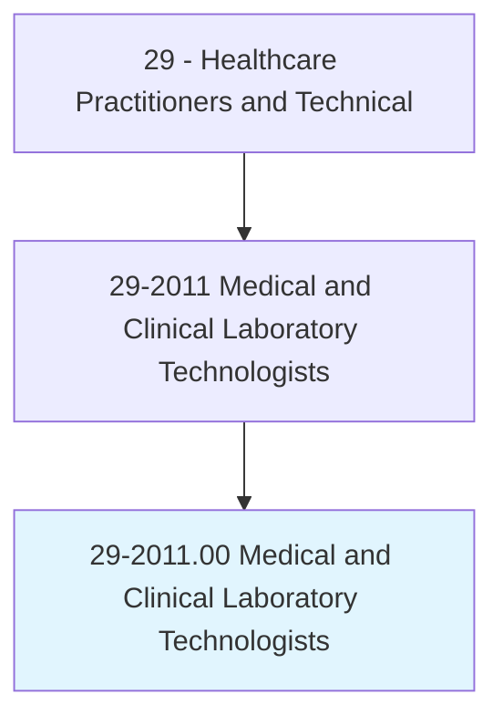
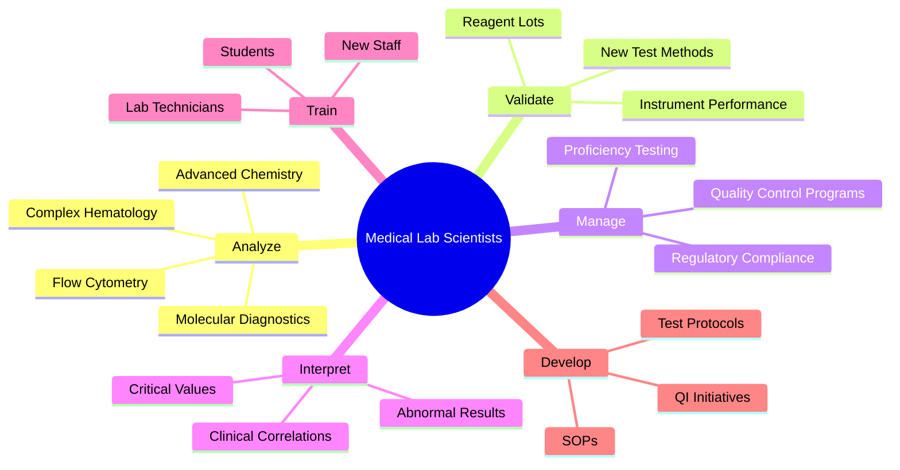
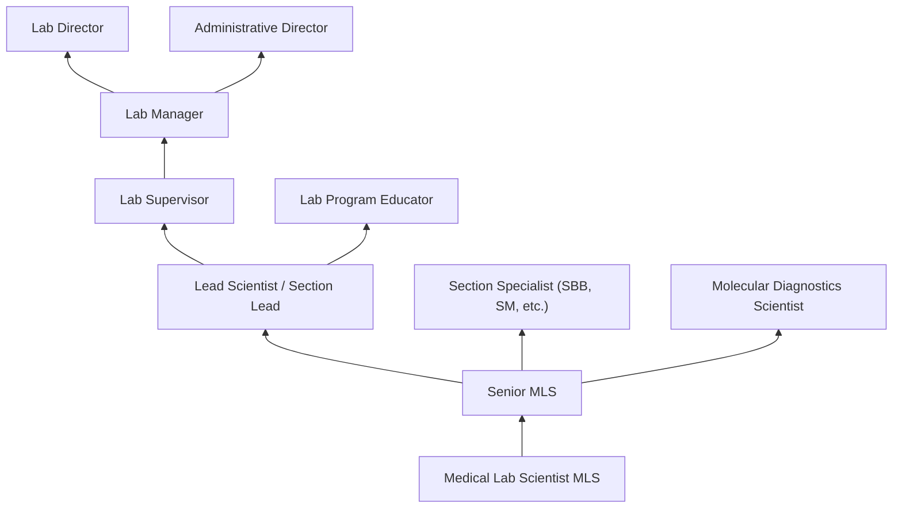
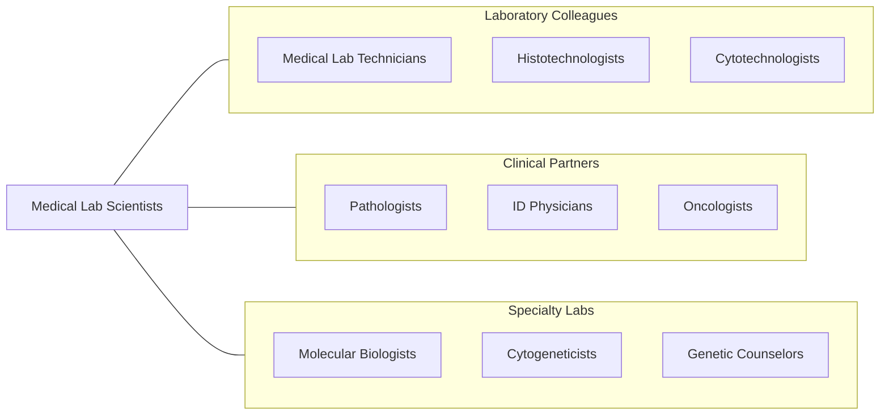

# Medical and Clinical Laboratory Technologists

> Perform complex medical laboratory tests for diagnosis, treatment, and prevention of disease. May train or supervise staff.

## Overview

Medical and Clinical Laboratory Technologists (MLS/MT) are bachelor's-level laboratory professionals who perform complex diagnostic testing, analyze results, correlate findings with disease states, and ensure the quality and accuracy of laboratory data used for patient care decisions. They work across all laboratory disciplines including hematology, clinical chemistry, microbiology, molecular diagnostics, immunology, blood banking/transfusion medicine, and urinalysis.

Distinguished from laboratory technicians by their advanced education and broader scope, medical laboratory scientists perform complex analyses, develop and validate new test methods, troubleshoot analytical problems, evaluate quality control data using statistical methods, train and supervise technical staff, and serve as laboratory consultants to clinical teams. They interpret abnormal results in clinical context, recognize interfering substances, and ensure compliance with CLIA, CAP, and Joint Commission regulations.

The profession has transformed with molecular diagnostics (PCR, NGS), mass spectrometry, flow cytometry, automation and middleware, laboratory informatics, and point-of-care testing management. Medical laboratory scientists are essential to precision medicine, infectious disease surveillance, pharmacogenomics, and the expanding scope of laboratory-generated health data.

## Classification Hierarchy

## Key Statistics

| Metric | Value |
|--------|-------|
| SOC Code | 29-2011.00 |
| Median Annual Salary | $57,800 |
| Employment | ~338,000 |
| Projected Growth | 5% (2022-2032) |
| Job Zone | 4 (Considerable Preparation) |
| Category | [Healthcare Practitioners](/occupations/HealthcarePractitioners) |
| Core Tasks | 40+ |
| Source | O*NET |

## Core Tasks

### analyze.ComplexDiagnosticTests

Medical Lab Scientists perform advanced testing.

**Actions:**
- `perform.MolecularDiagnostics.using.PCRAndSequencing` - Molecular testing
- `perform.FlowCytometry.for.CellPopulationAnalysis` - Flow cytometry
- `perform.AdvancedCoagulation.for.BleedingDisorderDiagnosis` - Coagulation
- `perform.MassSpectrometry.for.DrugAndToxicologyScreening` - Mass spec

### manage.LaboratoryQuality

Medical Lab Scientists oversee laboratory quality.

**Actions:**
- `manage.QualityControlPrograms.using.StatisticalMethods` - QC management
- `validate.NewTestMethods.per.CLIARequirements` - Method validation
- `investigate.QualityDeviations.for.RootCauseAnalysis` - QI investigation
- `maintain.RegulatoryCompliance.per.CAPAndCLIA` - Regulatory compliance

## Practice Settings

| Setting | Description |
|---------|-------------|
| Hospital Laboratories | Full-service clinical testing |
| Reference Laboratories | Specialized/esoteric testing |
| Academic Medical Centers | Research and complex diagnostics |
| Public Health Laboratories | Disease surveillance and outbreak |
| Blood Centers | Donor testing and transfusion |
| Forensic Laboratories | Forensic analysis |
| Pharmaceutical Companies | Drug development testing |

## Skills & Competencies

### Technical Skills
- **Advanced Hematology** - Expert
- **Clinical Chemistry** - Expert
- **Microbiology** - Expert
- **Molecular Diagnostics** - Advanced
- **Blood Banking** - Expert
- **Quality Management** - Expert
- **Method Validation** - Advanced
- **Flow Cytometry** - Advanced

### Soft Skills
- **Critical Thinking** - Critical
- **Attention to Detail** - Critical
- **Problem Solving** - Essential
- **Leadership** - Important
- **Communication** - Essential
- **Teaching** - Important

## Education & Training

| Requirement | Details |
|-------------|---------|
| Education | Bachelor's degree in medical laboratory science or clinical laboratory science |
| Clinical Training | Clinical rotations in NAACLS-accredited program |
| Certification | MLS(ASCP) through ASCP Board of Certification |
| State Licensure | Required in some states |
| Continuing Education | Per certification and state requirements |

## Certifications

| Certification | Description |
|---------------|-------------|
| MLS(ASCP) | Medical Laboratory Scientist (ASCP) |
| MT(ASCP) | Medical Technologist (legacy credential) |
| SBB(ASCP) | Specialist in Blood Banking |
| SM(ASCP) | Specialist in Microbiology |
| SC(ASCP) | Specialist in Chemistry |
| SH(ASCP) | Specialist in Hematology |
| MB(ASCP) | Specialist in Molecular Biology |

## Career Progression

## Specializations

| Focus Area | Description |
|------------|-------------|
| Molecular Diagnostics | PCR, NGS, genetic testing |
| Blood Banking/Transfusion | Immunohematology |
| Clinical Microbiology | Infectious disease diagnostics |
| Flow Cytometry | Cell analysis for heme-onc |
| Clinical Chemistry | Advanced metabolic testing |
| Hematology | Morphology and coagulation |
| HLA/Transplant | Histocompatibility testing |

## Technology & Tools

| Technology | Purpose |
|------------|---------|
| Automated Chemistry/Immunoassay Analyzers | High-throughput testing |
| Molecular Platforms (Cepheid, Hologic, Illumina) | PCR and sequencing |
| Flow Cytometers (BD, Beckman Coulter) | Cell analysis |
| Mass Spectrometers (MALDI-TOF, LC-MS/MS) | Identification and quantitation |
| Automated Microbiology (VITEK, BacT/Alert) | Culture and ID |
| Laboratory Information Systems | Data management |
| Middleware (Data Innovations) | Instrument integration |

## Related Occupations

## Industries

- [Hospitals](/industries/Healthcare/Hospitals/index) - Clinical Laboratories
- [Reference Laboratories](/industries/Healthcare/MedicalLaboratories) - Specialized Testing
- [Academic Medical Centers](/industries/Education) - Research and Teaching
- [Blood Centers](/industries/Healthcare/AmbulatoryHealthCare) - Transfusion Services
- [Government](/industries/Government) - Public Health Labs
- [Pharmaceutical](/industries/Manufacturing/ChemicalManufacturing/Pharmaceutical) - Drug Development

## Departments

This occupation typically works in:
- [Clinical Laboratory](/departments/ClinicalLaboratory)
- [Molecular Diagnostics](/departments/MolecularDiagnostics)
- [Microbiology](/departments/Microbiology)
- [Blood Bank / Transfusion Medicine](/departments/BloodBank)
- [Hematology](/departments/Hematology)

---

*Source: O*NET 29-2011.00 - ONETOccupation*
