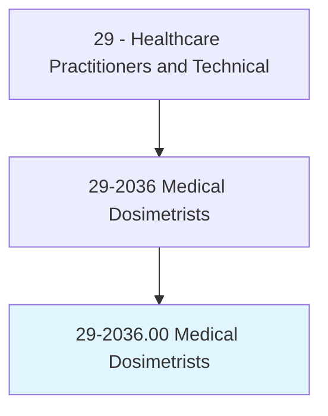
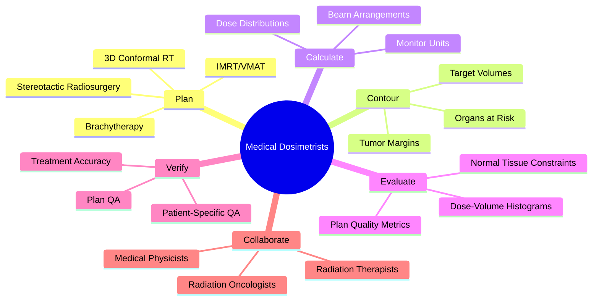
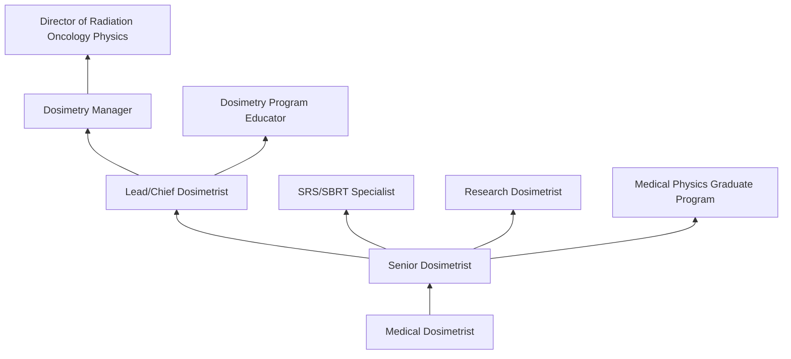
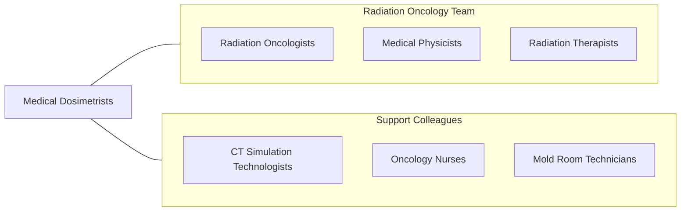

# Medical Dosimetrists

> Develop radiation treatment plans by calculating the dose of radiation to be applied and determining the best course of treatment as prescribed by an oncologist.

## Overview

Medical Dosimetrists are specialized radiation therapy professionals who design and calculate radiation treatment plans for cancer patients. Working under the direction of radiation oncologists and medical physicists, they use treatment planning software to determine the optimal arrangement of radiation beams, calculate dose distributions, evaluate plan quality, and ensure that prescribed doses are delivered to tumors while minimizing radiation exposure to surrounding healthy tissues and critical organs.

The role requires expertise in radiation physics, anatomy, oncology, and treatment planning technology. Medical dosimetrists contour target volumes and organs-at-risk on CT/MRI images, design beam arrangements for 3D conformal, intensity-modulated radiation therapy (IMRT), volumetric modulated arc therapy (VMAT), stereotactic radiosurgery (SRS), and brachytherapy. They generate dose-volume histograms, evaluate plan quality metrics, and verify treatment accuracy through quality assurance measurements.

Modern radiation oncology has advanced with adaptive radiation therapy, proton beam therapy, MR-guided radiation therapy, artificial intelligence in auto-contouring and plan optimization, and hypofractionated treatment regimens. Medical dosimetrists are essential to the safe and effective delivery of increasingly complex radiation treatments that improve cancer outcomes while reducing side effects.

## Classification Hierarchy

## Key Statistics

| Metric | Value |
|--------|-------|
| SOC Code | 29-2036.00 |
| Median Annual Salary | $77,560 |
| Employment | ~6,000 |
| Projected Growth | 6% (2022-2032) |
| Job Zone | 4 (Considerable Preparation) |
| Category | [Healthcare Practitioners](/occupations/HealthcarePractitioners) |
| Core Tasks | 25+ |
| Source | O*NET |

## Core Tasks

### plan.RadiationTreatment

Medical Dosimetrists design treatment plans.

**Actions:**
- `design.TreatmentPlans.using.IMRTOptimization` - IMRT planning
- `contour.TargetVolumes.on.CTAndMRIImages` - Volume delineation
- `calculate.DoseDistributions.for.TumorCoverage` - Dose calculation
- `evaluate.PlanQuality.using.DoseVolumeHistograms` - Plan evaluation

### verify.TreatmentAccuracy

Medical Dosimetrists ensure treatment safety.

**Actions:**
- `perform.PatientSpecificQA.using.PhantomMeasurements` - Plan verification
- `verify.MonitorUnitCalculations.for.TreatmentAccuracy` - MU verification
- `review.TreatmentParameters.before.FirstTreatment` - Chart check
- `document.TreatmentPlanDetails.in.OncologyInformationSystem` - Documentation

## Practice Settings

| Setting | Description |
|---------|-------------|
| Hospital Radiation Oncology | Inpatient and outpatient RT |
| Cancer Centers | Comprehensive cancer care |
| Academic Medical Centers | Research and complex planning |
| Freestanding RT Centers | Outpatient radiation therapy |
| Proton Therapy Centers | Particle therapy planning |

## Skills & Competencies

### Technical Skills
- **Treatment Planning Software** - Expert
- **Radiation Physics** - Advanced
- **Anatomy/Cross-Sectional Imaging** - Expert
- **IMRT/VMAT Optimization** - Expert
- **Stereotactic Planning** - Advanced
- **Brachytherapy Planning** - Advanced
- **Quality Assurance** - Expert

### Soft Skills
- **Attention to Detail** - Critical
- **Problem Solving** - Essential
- **Communication** - Essential
- **Teamwork** - Essential
- **Analytical Thinking** - Essential

## Education & Training

| Requirement | Details |
|-------------|---------|
| Education | Bachelor's degree in medical dosimetry or radiation therapy plus dosimetry certificate |
| Clinical Training | Accredited dosimetry program (12-24 months) |
| Certification | CMD (Certified Medical Dosimetrist) through MDCB |
| Continuing Education | Per MDCB requirements |

## Certifications

| Certification | Description |
|---------------|-------------|
| CMD | Certified Medical Dosimetrist (MDCB) |
| RTT | Radiation Therapy Technologist (base credential) |
| Medical Physics Residency | Advanced physics pathway |

## Career Progression

## Specializations

| Focus Area | Description |
|------------|-------------|
| IMRT/VMAT Planning | Intensity-modulated techniques |
| Stereotactic Radiosurgery (SRS/SBRT) | Precision radiation |
| Brachytherapy | Internal radiation planning |
| Proton Therapy | Particle beam planning |
| Pediatric Dosimetry | Children's cancer treatment |
| Adaptive Radiation Therapy | Image-guided replanning |

## Technology & Tools

| Technology | Purpose |
|------------|---------|
| Treatment Planning Systems (Eclipse, RayStation, Pinnacle) | Dose calculation and optimization |
| Contouring Software (MIM, Velocity) | Volume delineation |
| QA Systems (MapCHECK, ArcCHECK) | Patient-specific verification |
| Oncology Information Systems (ARIA, MOSAIQ) | Workflow management |
| CT/MRI Simulation | Image acquisition for planning |
| Monte Carlo Dose Engines | Advanced dose calculation |

## Related Occupations

## Industries

- [Hospitals](/industries/Healthcare/Hospitals/index) - Radiation Oncology
- [Cancer Centers](/industries/Healthcare/AmbulatoryHealthCare) - Comprehensive Cancer Care
- [Academic Medical Centers](/industries/Education) - Research and Teaching
- [Proton Centers](/industries/Healthcare/AmbulatoryHealthCare) - Particle Therapy

## Departments

This occupation typically works in:
- [Radiation Oncology](/departments/RadiationOncology)
- [Medical Physics](/departments/MedicalPhysics)
- [Cancer Center](/departments/CancerCenter)

---

*Source: O*NET 29-2036.00 - ONETOccupation*
