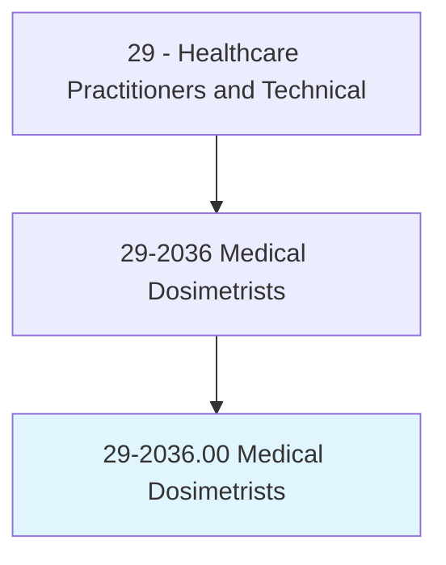
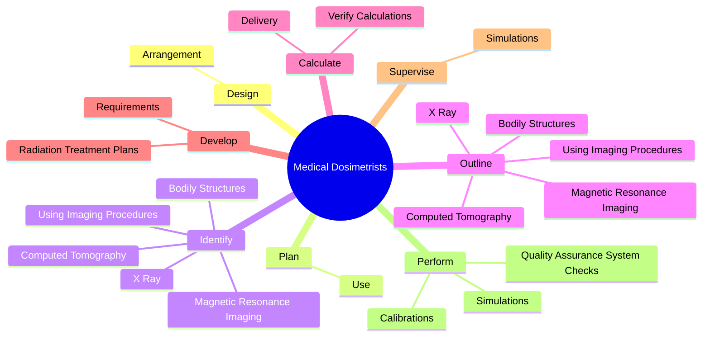
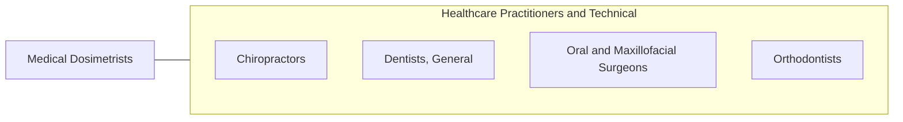

# Medical Dosimetrists

> Generate radiation treatment plans, develop radiation dose calculations, communicate and supervise the treatment plan implementation, and consult with members of radiation oncology team.

## Overview

Medical Dosimetrists is classified under Healthcare Practitioners and Technical (SOC 29). Generate radiation treatment plans, develop radiation dose calculations, communicate and supervise the treatment plan implementation, and consult with members of radiation oncology team.

## Classification Hierarchy

## Key Statistics

| Metric | Value |
|--------|-------|
| SOC Code | 29-2036.00 |
| Category | [Healthcare Practitioners and Technical](/occupations/HealthcarePractitioners) |
| Task Count | 83 |
| Source | O*NET |

## Core Tasks

### design.Arrangement

Medical Dosimetrists design arrangement as part of their core responsibilities.

**Actions:**
- `design.Arrangement.of.RadiationFields.to.reduce.ExposureToCriticalPatientStructures`
- `design.Arrangement.of.Organs`
- `design.Arrangement.of.UsingComputers`
- `design.Arrangement.of.Manuals`

### plan.Use

Medical Dosimetrists plan use as part of their core responsibilities.

**Actions:**
- `plan.Use.of.BeamModifyingDevices`
- `plan.Use.of.Compensators`
- `plan.Use.of.Shields`
- `plan.Use.of.WedgeFilters`

### identify.BodilyStructures

Medical Dosimetrists identify bodily structures as part of their core responsibilities.

**Actions:**
- `identify.BodilyStructures`
- `identify.UsingImagingProcedures`
- `identify.XRay`
- `identify.MagneticResonanceImaging`

## Skills & Competencies

### Technical Skills
- **Clinical Skills** - Advanced
- **Diagnostic Procedures** - Advanced
- **Patient Care** - Advanced

### Soft Skills
- **Communication** - Essential
- **Problem Solving** - Essential
- **Critical Thinking** - Important
- **Teamwork** - Important
- **Adaptability** - Important

## Related Occupations

## Industries

This occupation is found across multiple industries. See [Industries](/industries) for sector-specific employment data.

## Career Progression

---

*Source: O*NET 29-2036.00 - ONETOccupation*
