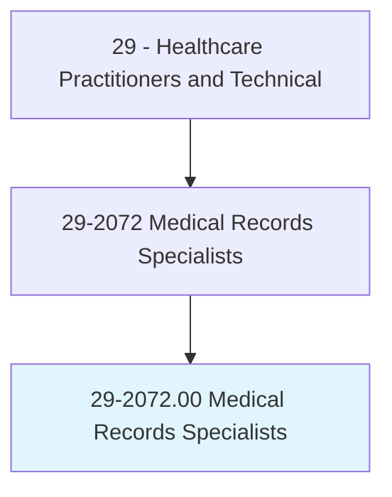
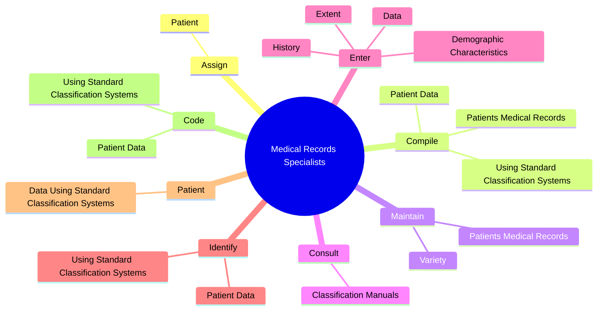

# Medical Records Specialists

> Compile, process, and maintain medical records of hospital and clinic patients in a manner consistent with medical, administrative, ethical, legal, and regulatory requirements of the healthcare system. Classify medical and healthcare concepts, including diagnosis, procedures, medical services, and equipment, into the healthcare industry's numerical coding system. Includes medical coders.

## Overview

Medical Records Specialists is an occupation within the Healthcare Practitioners and Technical category. Compile, process, and maintain medical records of hospital and clinic patients in a manner consistent with medical, administrative, ethical, legal, and regulatory requirements of the healthcare system. Classify medical and healthcare concepts, including diagnosis, procedures, medical services, and equipment, into the healthcare industry's numerical coding system.

## Classification Hierarchy

## Key Statistics

| Metric | Value |
|--------|-------|
| SOC Code | 29-2072.00 |
| Category | [Healthcare Practitioners and Technical](/occupations/HealthcarePractitioners) |
| Task Count | 71 |
| Source | O*NET |

## Core Tasks

### assign.Patient

Medical Records Specialists assign patient as part of their core responsibilities.

**Actions:**
- `assign.Patient.to.DiagnosisRelatedGroupsDrgs`
- `assign.Patient.to.UsingAppropriateComputerSoftware`

### compile.PatientsMedicalRecords

Medical Records Specialists compile patients medical records as part of their core responsibilities.

**Actions:**
- `compile.PatientsMedicalRecords.to.document.ConditionToProvideDataForResearchCostControlCareImprovementEfforts`
- `compile.PatientsMedicalRecords.to.TreatmentToProvideDataForResearchCostControlCareImprovementEfforts`
- `compile.PatientData`
- `compile.UsingStandardClassificationSystems`

### maintain.PatientsMedicalRecords

Medical Records Specialists maintain patients medical records as part of their core responsibilities.

**Actions:**
- `maintain.PatientsMedicalRecords.to.document.ConditionToProvideDataForResearchCostControlCareImprovementEfforts`
- `maintain.PatientsMedicalRecords.to.TreatmentToProvideDataForResearchCostControlCareImprovementEfforts`
- `maintain.Variety.of.HealthRecordIndexesRetrievalSystems.to.Collect`
- `maintain.Variety.of.StorageRetrievalSystems.to.Collect`

## Skills & Competencies

### Technical Skills
- **Clinical Skills** - Advanced
- **Diagnostic Procedures** - Advanced
- **Patient Care** - Advanced

### Soft Skills
- **Communication** - Essential
- **Problem Solving** - Essential
- **Critical Thinking** - Important
- **Teamwork** - Important
- **Adaptability** - Important

## Related Occupations

## Industries

This occupation is found across multiple industries. See [Industries](/industries) for sector-specific employment data.

## Career Progression

---

*Source: O*NET 29-2072.00 - ONETOccupation*
