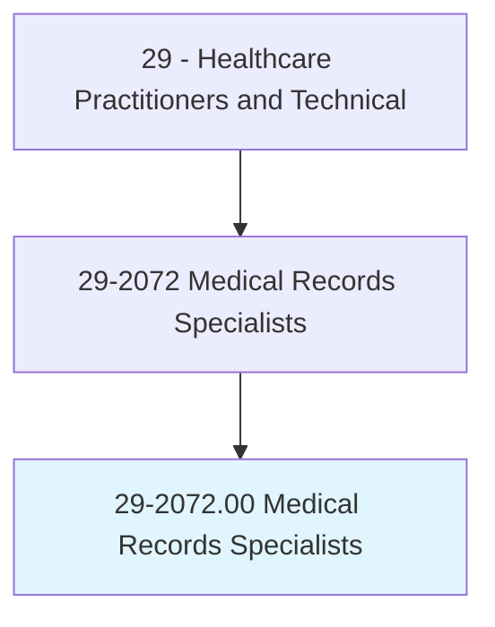
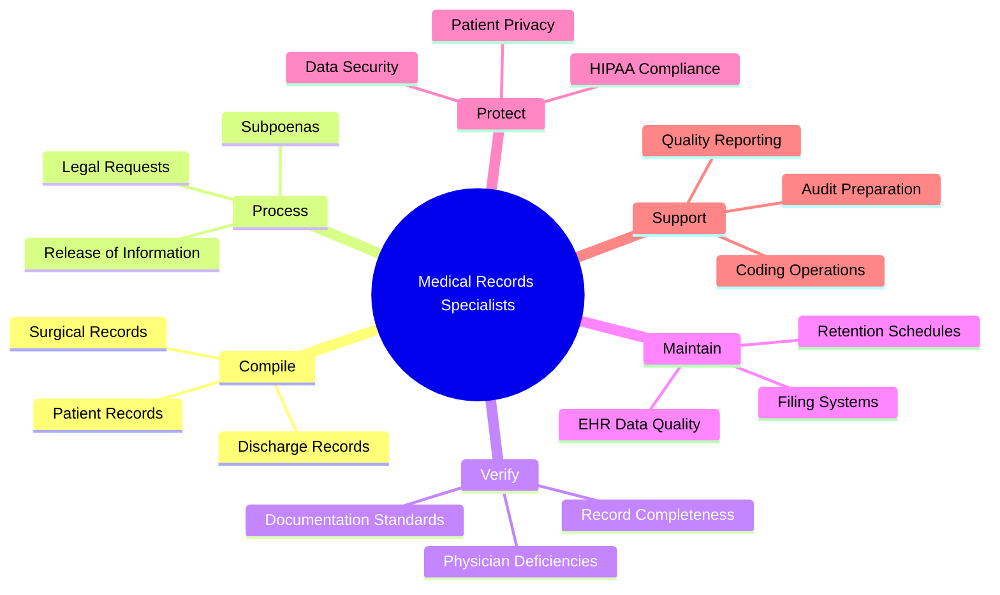
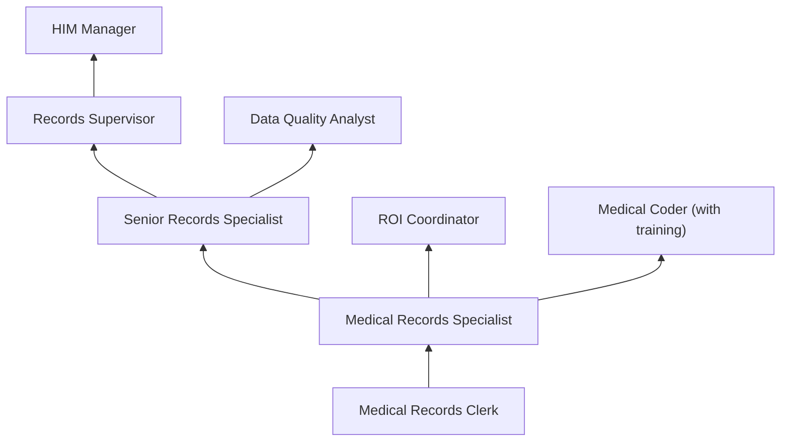
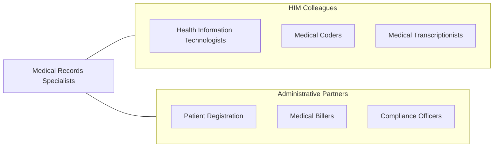

# Medical Records Specialists

> Compile, process, and maintain medical records of hospital and clinic patients in a manner consistent with medical, administrative, ethical, legal, and regulatory requirements.

## Overview

Medical Records Specialists compile, process, and maintain patient health records ensuring accuracy, accessibility, and compliance with medical, legal, and regulatory requirements. They organize patient information, verify record completeness, manage electronic health record systems, process release of information requests, maintain filing and retrieval systems, and ensure compliance with HIPAA privacy and security regulations.

The role bridges clinical documentation and administrative operations. Medical Records Specialists verify that medical records contain all required documentation (history and physicals, operative reports, discharge summaries, consent forms), process deficiency notifications to physicians, manage record retention and destruction schedules, handle subpoenas and legal requests for medical records, and support clinical coding and billing operations with accurate documentation.

Healthcare's digital transformation has shifted the profession from paper-based filing to electronic health record management, health information exchange, patient portal administration, and data quality assurance. Medical records specialists increasingly work with interoperability standards, document imaging systems, and automated workflow tools while maintaining the fundamental requirement of accurate, secure, and accessible patient health information.

## Classification Hierarchy

## Key Statistics

| Metric | Value |
|--------|-------|
| SOC Code | 29-2072.00 |
| Median Annual Salary | $46,660 |
| Employment | ~180,000 |
| Projected Growth | 8% (2022-2032) |
| Job Zone | 2 (Some Preparation) |
| Category | [Healthcare Practitioners](/occupations/HealthcarePractitioners) |
| Core Tasks | 30+ |
| Source | O*NET |

## Core Tasks

### manage.PatientRecords

Medical Records Specialists maintain health information.

**Actions:**
- `compile.PatientRecords.for.CompletenessVerification` - Record assembly
- `process.ReleaseOfInformation.per.HIPAARegulations` - ROI processing
- `verify.RecordCompleteness.for.RegulatoryCompliance` - Deficiency tracking
- `maintain.RetentionSchedules.per.StateAndFederalLaw` - Record retention

### protect.HealthInformation

Medical Records Specialists ensure privacy and security.

**Actions:**
- `ensure.HIPAACompliance.for.PatientPrivacy` - Privacy compliance
- `process.LegalRequests.for.MedicalRecords` - Legal processing
- `manage.PatientPortalAccess.for.RecordAvailability` - Portal management
- `audit.RecordAccess.for.SecurityCompliance` - Access auditing

## Practice Settings

| Setting | Description |
|---------|-------------|
| Hospitals | Inpatient health information |
| Physician Offices | Outpatient records |
| Nursing Facilities | Long-term care records |
| Insurance Companies | Claims documentation |
| Government Agencies | Public health records |
| Legal/Law Firms | Medical-legal records |

## Skills & Competencies

### Technical Skills
- **Electronic Health Records** - Advanced
- **HIPAA Regulations** - Expert
- **Release of Information** - Expert
- **Record Completeness Review** - Advanced
- **Document Imaging** - Advanced
- **Medical Terminology** - Advanced
- **Filing and Retrieval Systems** - Advanced

### Soft Skills
- **Attention to Detail** - Critical
- **Organization** - Essential
- **Communication** - Essential
- **Integrity/Ethics** - Critical
- **Customer Service** - Essential

## Education & Training

| Requirement | Details |
|-------------|---------|
| Education | High school diploma (minimum); associate degree preferred |
| Training | Medical records or health information program |
| Certification | CEHRS or similar credential preferred |
| Continuing Education | Per employer requirements |

## Certifications

| Certification | Description |
|---------------|-------------|
| CEHRS | Certified Electronic Health Records Specialist |
| RHIT | Registered Health Information Technician (advancement) |
| CHAA | Certified Healthcare Access Associate |
| HIPAA Certification | Privacy and security training |

## Career Progression

## Specializations

| Focus Area | Description |
|------------|-------------|
| Release of Information | ROI processing |
| Record Completeness/Deficiency | Physician documentation tracking |
| Document Imaging | Scanning and indexing |
| Legal/Compliance | Medical-legal records |
| EHR Administration | System management |
| Birth/Death Registration | Vital statistics |

## Technology & Tools

| Technology | Purpose |
|------------|---------|
| EHR Systems (Epic, Cerner, Meditech) | Record management |
| Document Imaging Systems | Scanning and retrieval |
| ROI Platforms (MRO, Ciox/Datavant) | Release of information |
| Deficiency Tracking Software | Physician notification |
| Record Destruction Services | Compliant destruction |
| Patient Portal Systems | Patient access |

## Related Occupations

## Industries

- [Hospitals](/industries/Healthcare/Hospitals/index) - Inpatient Records
- [Physician Offices](/industries/Healthcare/PhysicianOffices) - Outpatient Records
- [Nursing Facilities](/industries/Healthcare/NursingCare) - LTC Records
- [Insurance](/industries/Insurance) - Claims Documentation
- [Government](/industries/PublicAdministration) - Public Health Records

## Departments

This occupation typically works in:
- Health Information Management
- Medical Records
- Release of Information
- Patient Access

---

*Source: O*NET 29-2072.00 - ONETOccupation*
