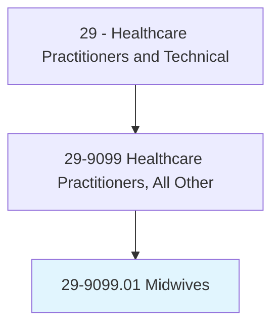
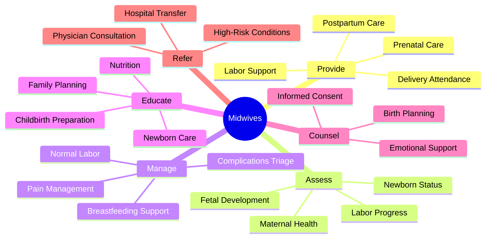
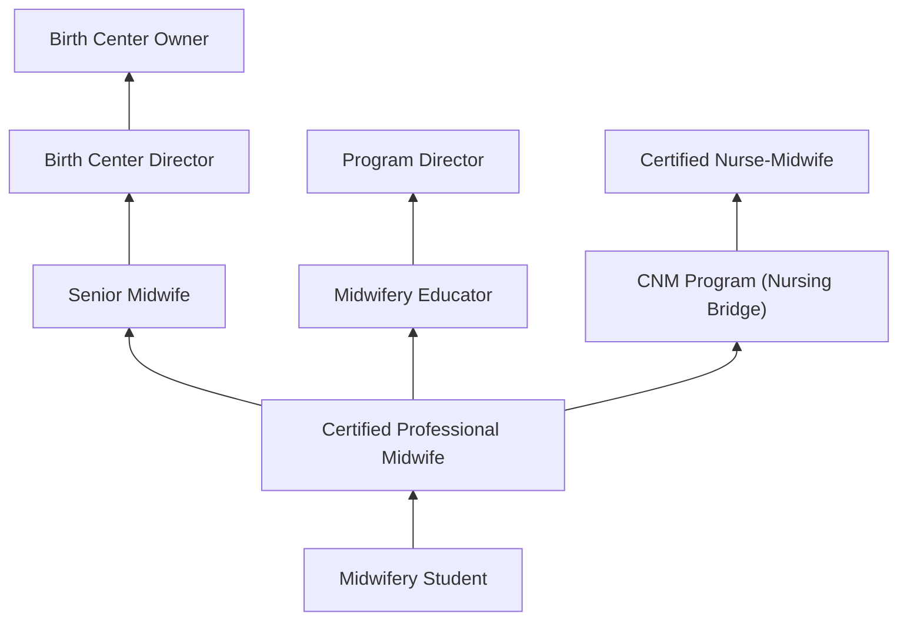
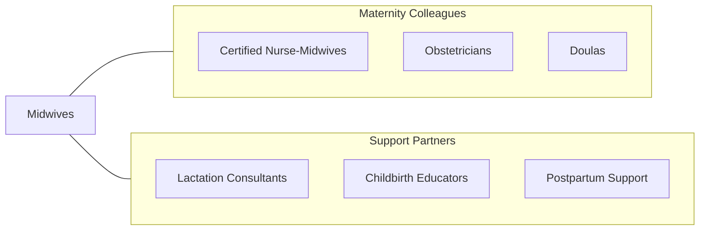

# Midwives

> Provide prenatal care, labor and delivery support, and postpartum care to women. May provide well-woman gynecological care, family planning services, and newborn care.

## Overview

Midwives are healthcare practitioners who provide comprehensive reproductive and maternal healthcare including prenatal care, labor and delivery management, postpartum care, newborn assessment, well-woman gynecological care, and family planning services. This category includes Certified Professional Midwives (CPMs) and Licensed Midwives (LMs) who practice outside the nurse-midwifery model, often attending births in homes and freestanding birth centers.

Midwives emphasize physiologic birth, informed consent, shared decision-making, and holistic care that addresses the physical, emotional, and social aspects of pregnancy and childbirth. They perform prenatal assessments, monitor fetal development, manage normal labor and delivery, provide pain management including non-pharmacological techniques, perform neonatal resuscitation when needed, and identify complications requiring physician consultation or transfer to hospital care.

The midwifery profession continues to grow with increasing demand for personalized maternity care, out-of-hospital birth options, and the demonstrated association between midwifery care and lower intervention rates, higher patient satisfaction, and equivalent safety outcomes for low-risk pregnancies. Midwives integrate evidence-based practice with individualized care that respects patient autonomy and cultural preferences.

## Classification Hierarchy

## Key Statistics

| Metric | Value |
|--------|-------|
| SOC Code | 29-9099.01 |
| Median Annual Salary | $60,000 |
| Employment | ~7,000 |
| Projected Growth | 12% (2022-2032) |
| Job Zone | 4 (Considerable Preparation) |
| Category | [Healthcare Practitioners](/occupations/HealthcarePractitioners) |
| Core Tasks | 30+ |
| Source | O*NET |

## Core Tasks

### provide.MaternityCare

Midwives deliver comprehensive pregnancy and birth care.

**Actions:**
- `provide.PrenatalCare.including.AssessmentAndMonitoring` - Prenatal visits
- `manage.NormalLaborAndDelivery.using.PhysiologicApproach` - Birth attendance
- `provide.PostpartumCare.for.MotherAndNewborn` - Postpartum support
- `perform.NewbornAssessment.for.ImmediateHealthEvaluation` - Neonatal assessment

### manage.LaborAndBirth

Midwives support physiologic birth processes.

**Actions:**
- `monitor.FetalHeartRate.during.LaborAndDelivery` - Fetal monitoring
- `manage.PainRelief.using.NonPharmacologicalTechniques` - Pain management
- `perform.NeonatalResuscitation.when.Required` - Emergency neonatal care
- `identify.Complications.for.TimelyTransferOrConsultation` - Risk management

## Practice Settings

| Setting | Description |
|---------|-------------|
| Birth Centers | Freestanding birth center care |
| Home Birth | Home-based maternity care |
| Hospitals (Collaborative) | Hospital midwifery practice |
| Community Health Centers | Community maternity services |
| Private Practice | Independent midwifery |

## Skills & Competencies

### Technical Skills
- **Prenatal Assessment** - Expert
- **Labor Management** - Expert
- **Delivery Skills** - Expert
- **Neonatal Resuscitation** - Advanced
- **Breastfeeding Support** - Expert
- **Fetal Monitoring** - Advanced
- **Suturing** - Advanced

### Soft Skills
- **Empathy** - Critical
- **Communication** - Critical
- **Patience** - Essential
- **Cultural Sensitivity** - Essential
- **Decision Making** - Essential
- **Advocacy** - Essential

## Education & Training

| Requirement | Details |
|-------------|---------|
| Education | Accredited midwifery education program (MEAC) |
| Clinical Training | Supervised clinical births (minimum requirements vary) |
| Certification | CPM (Certified Professional Midwife) through NARM |
| State Licensure | Varies by state (legal in most states) |
| NRP Certification | Neonatal Resuscitation Program |
| Continuing Education | Per state and certification requirements |

## Certifications

| Certification | Description |
|---------------|-------------|
| CPM | Certified Professional Midwife (NARM) |
| LM | Licensed Midwife (state-specific) |
| CM | Certified Midwife (AMCB) |
| NRP | Neonatal Resuscitation |
| BLS | Basic Life Support |

## Career Progression

## Specializations

| Focus Area | Description |
|------------|-------------|
| Home Birth | Out-of-hospital home delivery |
| Birth Center Practice | Freestanding birth center care |
| Water Birth | Hydrotherapy and water delivery |
| VBAC Support | Vaginal birth after cesarean |
| Lactation | Advanced breastfeeding support |
| Traditional/Indigenous Midwifery | Cultural birth practices |

## Technology & Tools

| Technology | Purpose |
|------------|---------|
| Fetal Dopplers | Fetal heart rate monitoring |
| Portable Ultrasound | Point-of-care imaging |
| Birth Pools | Water birth support |
| Neonatal Resuscitation Equipment | Emergency newborn care |
| Pulse Oximeters | Oxygen monitoring |
| IV Supplies | Emergency fluid administration |
| EHR Systems (midwifery-specific) | Documentation |

## Related Occupations

## Industries

- [Birth Centers](/industries/Healthcare/AmbulatoryHealthCare) - Freestanding Birth Centers
- [Home Health](/industries/Healthcare/HomeHealth) - Home Birth Services
- [Community Health](/industries/Healthcare/AmbulatoryHealthCare) - Community Maternity
- [Hospitals](/industries/Healthcare/Hospitals/index) - Collaborative Hospital Practice

## Departments

This occupation typically works in:
- [Midwifery Services](/departments/MidwiferyServices)
- [Labor and Delivery](/departments/LaborAndDelivery)
- [Women's Health](/departments/WomensHealth)
- [Birth Center](/departments/BirthCenter)

---

*Source: O*NET 29-9099.01 - ONETOccupation*
