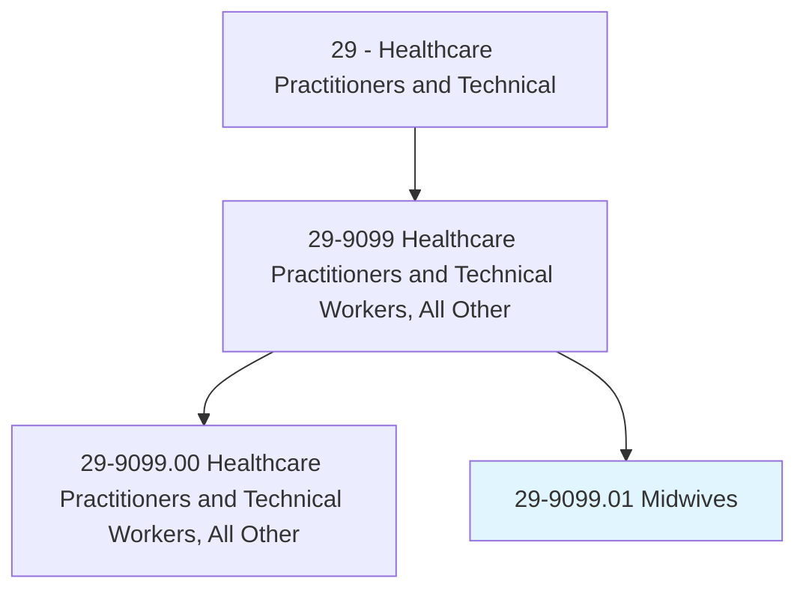
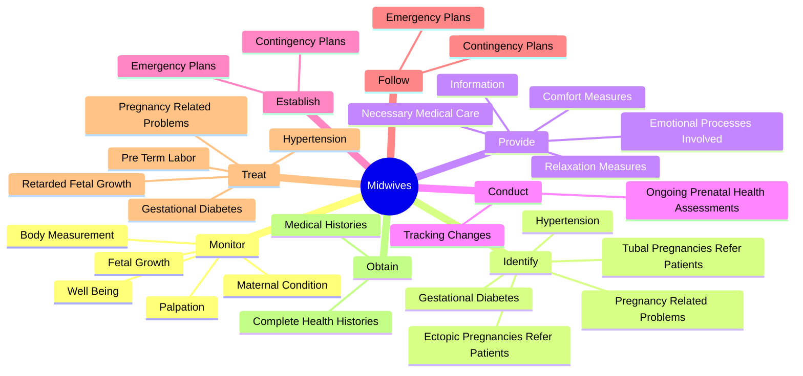
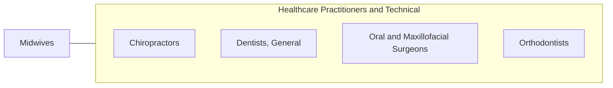

# Midwives

> Provide prenatal care and childbirth assistance.

## Overview

Midwives is classified under Healthcare Practitioners and Technical (SOC 29). Provide prenatal care and childbirth assistance.

## Classification Hierarchy

## Key Statistics

| Metric | Value |
|--------|-------|
| SOC Code | 29-9099.01 |
| Category | [Healthcare Practitioners and Technical](/occupations/HealthcarePractitioners) |
| Task Count | 113 |
| Source | O*NET |

## Core Tasks

### monitor.MaternalCondition

Midwives monitor maternal condition as part of their core responsibilities.

**Actions:**
- `monitor.MaternalCondition.during.Labor.by.CheckingVitalSigns`
- `monitor.MaternalCondition.during.Labor.by.MonitoringUterineContractions`
- `monitor.MaternalCondition.during.Labor.by.PerformingPhysicalExaminations`
- `monitor.FetalGrowth.through.HeartbeatDetection`

### identify.TubalPregnanciesReferPatients

Midwives identify tubal pregnancies refer patients as part of their core responsibilities.

**Actions:**
- `identify.TubalPregnanciesReferPatients.for.Treatments`
- `identify.EctopicPregnanciesReferPatients.for.Treatments`
- `identify.PregnancyRelatedProblems`
- `identify.Hypertension`

### provide.NecessaryMedicalCare

Midwives provide necessary medical care as part of their core responsibilities.

**Actions:**
- `provide.NecessaryMedicalCare.for.Infants.at.Birth`
- `provide.NecessaryMedicalCare.for.IncludingEmergencyCare`
- `provide.NecessaryMedicalCare.for.Resuscitation`
- `provide.Information.about.PhysicalProcesses.involved.in.Pregnancy`

## Skills & Competencies

### Technical Skills
- **Clinical Skills** - Advanced
- **Diagnostic Procedures** - Advanced
- **Patient Care** - Advanced

### Soft Skills
- **Communication** - Essential
- **Problem Solving** - Essential
- **Critical Thinking** - Important
- **Teamwork** - Important
- **Adaptability** - Important

## Related Occupations

## Industries

This occupation is found across multiple industries. See [Industries](/industries) for sector-specific employment data.

## Career Progression

---

*Source: O*NET 29-9099.01 - ONETOccupation*
