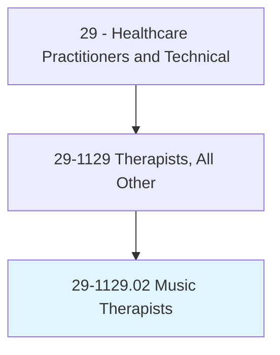
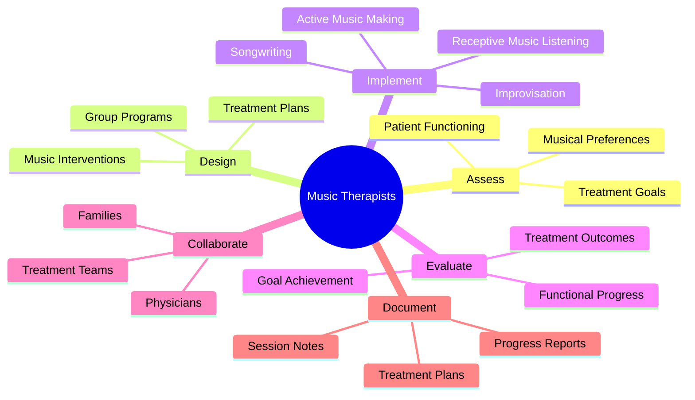
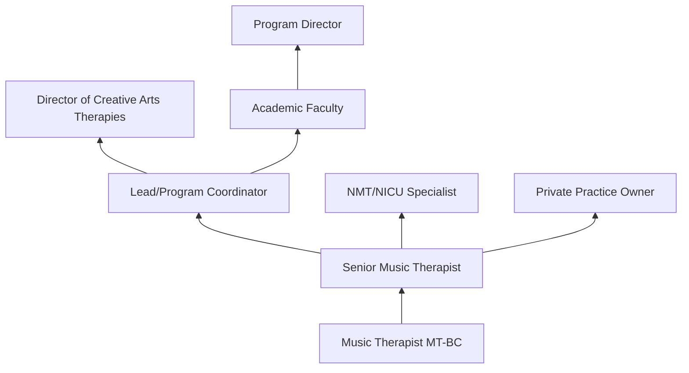
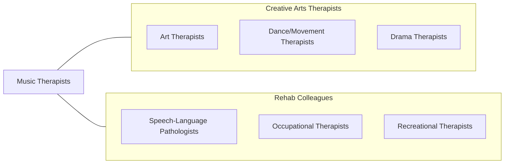

# Music Therapists

> Plan, organize, or direct medically prescribed music therapy activities designed to positively influence patients' psychological or behavioral status.

## Overview

Music Therapists are board-certified healthcare professionals who use music-based interventions to address physical, emotional, cognitive, and social needs of patients across the lifespan. They assess patient functioning, design individualized treatment plans using music experiences (singing, instrument playing, songwriting, music listening, improvisation), implement evidence-based interventions, and evaluate therapeutic outcomes for populations including psychiatric patients, individuals with developmental disabilities, stroke survivors, dementia patients, and children with autism.

The clinical application of music therapy is grounded in neuroscience research demonstrating music's effects on brain function, emotional regulation, motor rehabilitation, pain perception, and social engagement. Music therapists work in medical settings addressing pain management, anxiety reduction, procedural support, neonatal developmental care, and end-of-life comfort. In mental health settings, they facilitate emotional expression, coping skills development, and social interaction through structured musical experiences.

The profession has grown with neurologic music therapy (NMT), music-based cognitive rehabilitation, NICU music therapy, music psychotherapy, and integration of music therapy into palliative care and oncology programs. Research continues to validate music therapy's efficacy in areas including Parkinson's disease gait training, aphasia rehabilitation, PTSD treatment, and autism social communication.

## Classification Hierarchy

## Key Statistics

| Metric | Value |
|--------|-------|
| SOC Code | 29-1129.02 |
| Median Annual Salary | $55,300 |
| Employment | ~10,000 |
| Projected Growth | 14% (2022-2032) |
| Job Zone | 5 (Extensive Preparation) |
| Category | [Healthcare Practitioners](/occupations/HealthcarePractitioners) |
| Core Tasks | 25+ |
| Source | O*NET |

## Core Tasks

### assess.PatientNeeds

Music Therapists evaluate patient functioning.

**Actions:**
- `assess.PatientFunctioning.using.MusicTherapyAssessments` - Clinical assessment
- `identify.TreatmentGoals.based.on.PatientNeeds` - Goal setting
- `evaluate.MusicalPreferences.for.InterventionPlanning` - Preference assessment
- `design.IndividualizedTreatmentPlans.using.MusicInterventions` - Treatment planning

### implement.MusicInterventions

Music Therapists deliver therapeutic music experiences.

**Actions:**
- `facilitate.ActiveMusicMaking.for.MotorRehabilitation` - Motor therapy
- `implement.SongwritingInterventions.for.EmotionalExpression` - Expressive therapy
- `apply.NeurologicMusicTherapy.for.CognitiveRehabilitation` - NMT
- `provide.ReceptiveMusicListening.for.PainAndAnxietyReduction` - Receptive therapy

## Practice Settings

| Setting | Description |
|---------|-------------|
| Hospitals | Medical music therapy |
| Psychiatric Facilities | Mental health treatment |
| Rehabilitation Centers | Neurologic and physical rehab |
| Schools | Educational music therapy |
| Hospice/Palliative Care | End-of-life comfort |
| Developmental Disability Centers | DD services |
| Private Practice | Individual and group therapy |
| NICUs | Neonatal music therapy |

## Skills & Competencies

### Technical Skills
- **Music Performance (Multiple Instruments)** - Expert
- **Clinical Assessment** - Advanced
- **Neurologic Music Therapy** - Advanced
- **Group Facilitation** - Expert
- **Improvisation** - Expert
- **Songwriting** - Advanced
- **Treatment Planning** - Advanced

### Soft Skills
- **Empathy** - Critical
- **Creativity** - Essential
- **Patience** - Essential
- **Adaptability** - Essential
- **Communication** - Essential

## Education & Training

| Requirement | Details |
|-------------|---------|
| Education | Bachelor's degree in music therapy (minimum); master's preferred |
| Clinical Training | 1,200 hours supervised clinical training |
| Certification | MT-BC (Music Therapist - Board Certified) through CBMT |
| State Licensure | Required in some states |
| Continuing Education | 100 CMTE credits per 5-year cycle |

## Certifications

| Certification | Description |
|---------------|-------------|
| MT-BC | Music Therapist - Board Certified (CBMT) |
| NMT | Neurologic Music Therapy Fellow |
| NICU-MT | NICU Music Therapy Training |
| State License | State-specific licensure where required |

## Career Progression

## Specializations

| Focus Area | Description |
|------------|-------------|
| Neurologic Music Therapy | Stroke, TBI, Parkinson's rehab |
| NICU Music Therapy | Premature infant development |
| Hospice/Palliative Care | End-of-life support |
| Mental Health | Psychiatric treatment |
| Autism Spectrum | Social communication |
| Oncology | Cancer care support |
| Geriatric/Dementia | Memory care |

## Technology & Tools

| Technology | Purpose |
|------------|---------|
| Musical Instruments (Guitar, Piano, Percussion) | Active music interventions |
| Adaptive Musical Instruments | Accessibility for disabilities |
| Music Technology (iPads, apps) | Digital music interventions |
| Recording Equipment | Songwriting and documentation |
| Sound Systems | Receptive music interventions |
| Assessment Tools (MATADOC, IMTAP) | Clinical evaluation |

## Related Occupations

## Industries

- [Hospitals](/industries/Healthcare/Hospitals/index) - Medical Music Therapy
- [Psychiatric Facilities](/industries/Healthcare/Hospitals/index) - Mental Health
- [Nursing Facilities](/industries/Healthcare/NursingCare) - Geriatric Care
- [Schools](/industries/Education/ElementarySecondary) - Educational Therapy
- [Hospice](/industries/Healthcare/HomeHealth) - End-of-Life Care

## Departments

This occupation typically works in:
- [Music Therapy](/departments/MusicTherapy)
- [Creative Arts Therapies](/departments/CreativeArtsTherapies)
- [Rehabilitation Services](/departments/RehabilitationServices)
- [Behavioral Health](/departments/BehavioralHealth)
- [Palliative Care](/departments/PalliativeCare)

---

*Source: O*NET 29-1129.02 - ONETOccupation*
