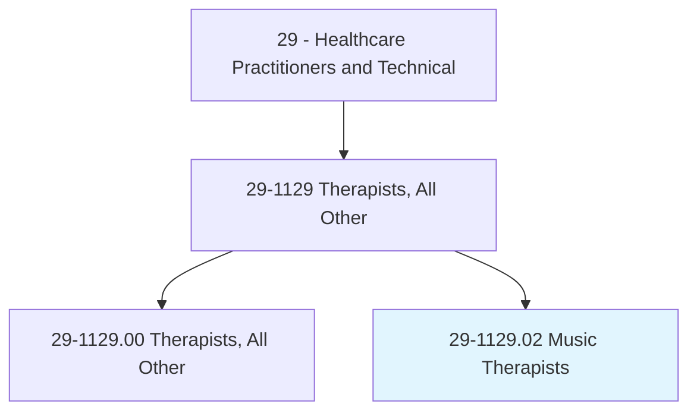
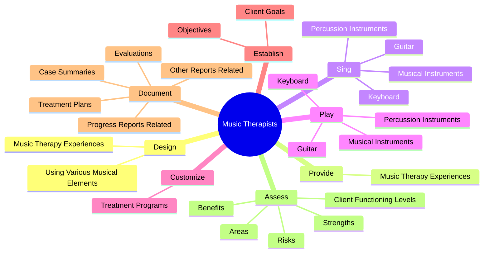
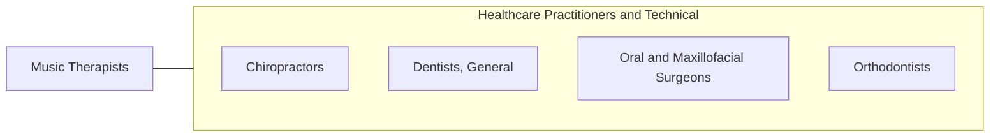

# Music Therapists

> Plan, organize, direct, or assess clinical and evidenced-based music therapy interventions to positively influence individuals' physical, psychological, cognitive, or behavioral status.

## Overview

Music Therapists is classified under Healthcare Practitioners and Technical (SOC 29). Plan, organize, direct, or assess clinical and evidenced-based music therapy interventions to positively influence individuals' physical, psychological, cognitive, or behavioral status.

## Classification Hierarchy

## Key Statistics

| Metric | Value |
|--------|-------|
| SOC Code | 29-1129.02 |
| Category | [Healthcare Practitioners and Technical](/occupations/HealthcarePractitioners) |
| Task Count | 155 |
| Source | O*NET |

## Core Tasks

### design.MusicTherapyExperiences

Music Therapists design music therapy experiences as part of their core responsibilities.

**Actions:**
- `design.MusicTherapyExperiences.to.address.ClientNeeds`
- `design.MusicTherapyExperiences.to.UsingMusicForSelfCare`
- `design.MusicTherapyExperiences.to.AdjustingToLifeChanges`
- `design.MusicTherapyExperiences.to.ImprovingCognitiveFunctioning`

### provide.MusicTherapyExperiences

Music Therapists provide music therapy experiences as part of their core responsibilities.

**Actions:**
- `provide.MusicTherapyExperiences.to.address.ClientNeeds`
- `provide.MusicTherapyExperiences.to.UsingMusicForSelfCare`
- `provide.MusicTherapyExperiences.to.AdjustingToLifeChanges`
- `provide.MusicTherapyExperiences.to.ImprovingCognitiveFunctioning`

### sing.MusicalInstruments

Music Therapists sing musical instruments as part of their core responsibilities.

**Actions:**
- `sing.MusicalInstruments`
- `sing.Keyboard`
- `sing.Guitar`
- `sing.PercussionInstruments`

## Skills & Competencies

### Technical Skills
- **Clinical Skills** - Advanced
- **Diagnostic Procedures** - Advanced
- **Patient Care** - Advanced

### Soft Skills
- **Communication** - Essential
- **Problem Solving** - Essential
- **Critical Thinking** - Important
- **Teamwork** - Important
- **Adaptability** - Important

## Related Occupations

## Industries

This occupation is found across multiple industries. See [Industries](/industries) for sector-specific employment data.

## Career Progression

---

*Source: O*NET 29-1129.02 - ONETOccupation*
