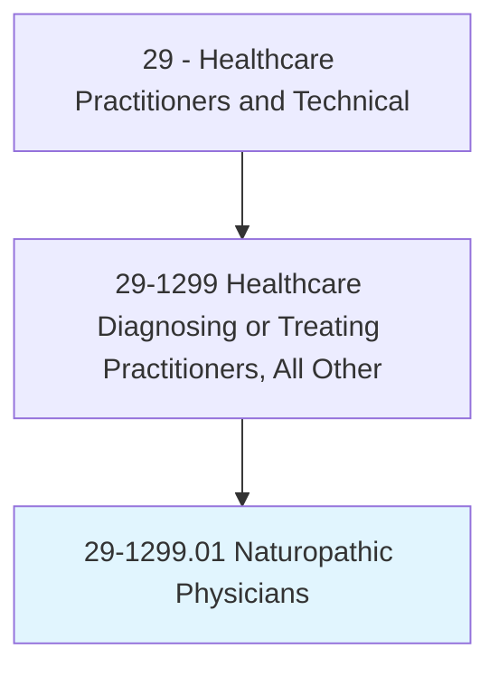
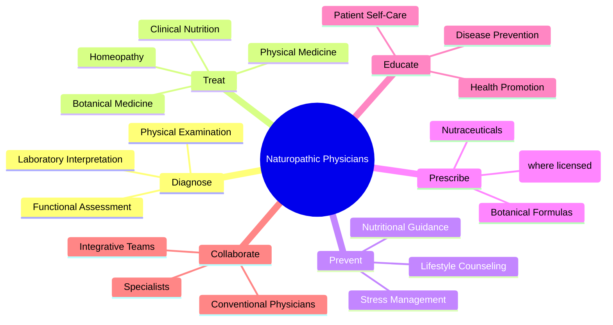
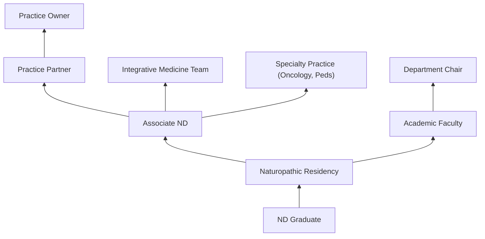
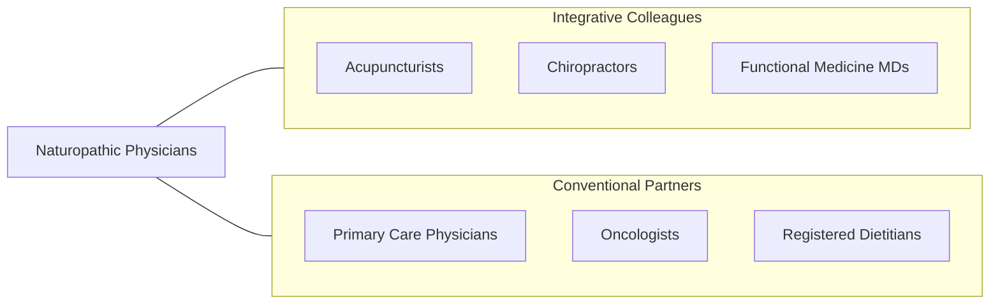

# Naturopathic Physicians

> Diagnose, treat, and help prevent diseases using a system of practice that is based on the natural healing capacity of individuals. May use physiological, psychological, or mechanical methods. May also use natural medicines, prescription or legend drugs, foods, herbs, or other natural remedies.

## Overview

Naturopathic Physicians (NDs) are doctoral-level practitioners who diagnose and treat disease using natural therapies and conventional medical diagnostics within an integrative framework. They complete four-year naturopathic medical programs covering biomedical sciences, clinical diagnosis, pharmacology, and natural therapeutics including botanical medicine, clinical nutrition, hydrotherapy, homeopathy, physical medicine, and counseling. NDs emphasize disease prevention, patient education, and stimulating the body's inherent healing capacity.

The scope of naturopathic practice varies by state but typically includes physical examination, laboratory and diagnostic imaging interpretation, nutritional and botanical prescribing, minor surgery, natural childbirth attendance, and in some jurisdictions, pharmaceutical prescribing. NDs use evidence-based natural therapies alongside conventional diagnostics, often serving as primary care providers or complementary practitioners integrated with conventional medical teams.

Naturopathic medicine has gained recognition through growing research on botanical medicine, clinical nutrition, mind-body medicine, and integrative oncology. NDs increasingly practice in integrative medicine clinics, cancer centers, community health settings, and academic medical centers. The profession continues to advocate for expanded licensure and insurance coverage across states.

## Classification Hierarchy

## Key Statistics

| Metric | Value |
|--------|-------|
| SOC Code | 29-1299.01 |
| Median Annual Salary | $80,640 |
| Employment | ~6,000 |
| Projected Growth | 10% (2022-2032) |
| Job Zone | 5 (Extensive Preparation) |
| Category | [Healthcare Practitioners](/occupations/HealthcarePractitioners) |
| Core Tasks | 30+ |
| Source | O*NET |

## Core Tasks

### diagnose.PatientConditions

Naturopathic Physicians evaluate patient health.

**Actions:**
- `diagnose.MedicalConditions.using.PhysicalExamination` - Clinical diagnosis
- `interpret.LaboratoryResults.for.FunctionalAssessment` - Lab interpretation
- `assess.NutritionalStatus.using.FunctionalTesting` - Nutritional assessment
- `evaluate.LifestyleFactors.for.DiseaseRiskAssessment` - Lifestyle evaluation

### treat.UsingNaturalTherapies

Naturopathic Physicians apply natural treatment approaches.

**Actions:**
- `prescribe.BotanicalMedicine.for.TherapeuticIntervention` - Herbal treatment
- `prescribe.NutritionalSupplements.for.NutrientOptimization` - Nutraceuticals
- `implement.DietaryProtocols.for.ChronicDiseaseManagement` - Nutrition therapy
- `perform.PhysicalMedicine.for.MusculoskeletalConditions` - Manual therapy

## Practice Settings

| Setting | Description |
|---------|-------------|
| Private Practice | Independent naturopathic clinic |
| Integrative Medicine Centers | Multi-disciplinary integrative care |
| Community Health Centers | Primary care access |
| Cancer Centers | Integrative oncology |
| Academic Medical Centers | Teaching and research |
| Wellness Centers | Preventive health programs |

## Skills & Competencies

### Technical Skills
- **Clinical Diagnosis** - Expert
- **Botanical Medicine** - Expert
- **Clinical Nutrition** - Expert
- **Physical Examination** - Expert
- **Laboratory Interpretation** - Advanced
- **Homeopathy** - Advanced
- **Physical Medicine** - Advanced
- **Counseling** - Advanced

### Soft Skills
- **Patient Communication** - Critical
- **Holistic Thinking** - Essential
- **Empathy** - Essential
- **Critical Thinking** - Essential
- **Lifelong Learning** - Essential

## Education & Training

| Requirement | Details |
|-------------|---------|
| Undergraduate | Bachelor's degree (pre-medical coursework) |
| Naturopathic Medical School | 4-year ND program (CNME-accredited) |
| Clinical Training | 1,200+ hours supervised clinical training |
| Licensure Exam | NPLEX Parts I and II |
| State License | Required in licensed states (~25 states) |
| Continuing Education | Per state requirements |

## Certifications

| Certification | Description |
|---------------|-------------|
| ND License | State naturopathic physician license |
| NPLEX | Naturopathic Physicians Licensing Examination |
| FABNO | Fellow of the American Board of Naturopathic Oncology |
| Specialty Certifications | Endocrinology, gastroenterology, etc. |

## Career Progression

## Specializations

| Focus Area | Description |
|------------|-------------|
| Naturopathic Oncology | Integrative cancer care |
| Pediatric Naturopathy | Children's natural health |
| Women's Health | Hormonal and reproductive health |
| Gastroenterology | Digestive health |
| Mental Health | Natural mental health approaches |
| Environmental Medicine | Toxin-related illness |
| Sports Medicine | Natural athletic performance |

## Technology & Tools

| Technology | Purpose |
|------------|---------|
| Laboratory Testing (Standard and Functional) | Diagnostic evaluation |
| Botanical Dispensary | Herbal medicine preparation |
| Hydrotherapy Equipment | Water-based treatments |
| Physical Medicine Tools | Manual therapy |
| EHR Systems | Patient documentation |
| Nutritional Analysis Software | Diet planning |

## Related Occupations

## Industries

- [Ambulatory Healthcare](/industries/Healthcare/AmbulatoryHealthCare) - Private Practice
- [Integrative Medicine](/industries/Healthcare/AmbulatoryHealthCare) - Integrative Clinics
- [Academic](/industries/Education) - Naturopathic Medical Schools
- [Wellness](/industries/Healthcare/AmbulatoryHealthCare) - Wellness Centers

## Departments

This occupation typically works in:
- [Naturopathic Medicine](/departments/NaturopathicMedicine)
- [Integrative Medicine](/departments/IntegrativeMedicine)
- [Primary Care](/departments/PrimaryCare)
- [Wellness Programs](/departments/WellnessPrograms)

---

*Source: O*NET 29-1299.01 - ONETOccupation*
