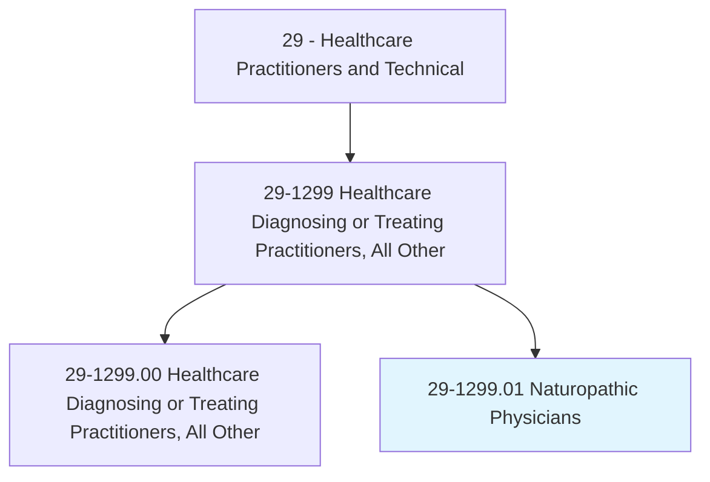
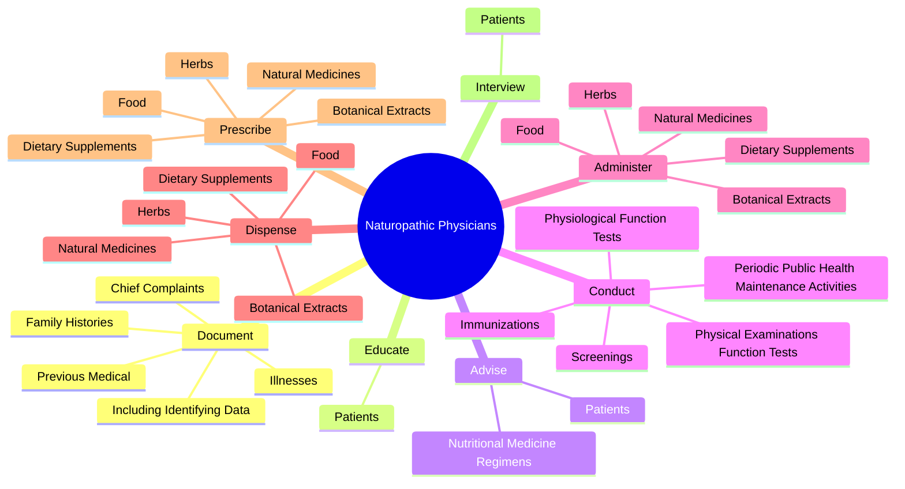
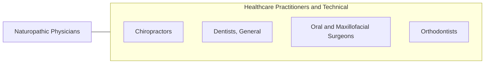

# Naturopathic Physicians

> Diagnose, treat, and help prevent diseases using a system of practice that is based on the natural healing capacity of individuals. May use physiological, psychological or mechanical methods. May also use natural medicines, prescription or legend drugs, foods, herbs, or other natural remedies.

## Overview

Naturopathic Physicians is a specialized variant within the Healthcare Practitioners and Technical category. Diagnose, treat, and help prevent diseases using a system of practice that is based on the natural healing capacity of individuals. May use physiological, psychological or mechanical methods.

## Classification Hierarchy

## Key Statistics

| Metric | Value |
|--------|-------|
| SOC Code | 29-1299.01 |
| Category | [Healthcare Practitioners and Technical](/occupations/HealthcarePractitioners) |
| Task Count | 126 |
| Source | O*NET |

## Core Tasks

### document.IncludingIdentifyingData

Naturopathic Physicians document including identifying data as part of their core responsibilities.

**Actions:**
- `document.IncludingIdentifyingData`
- `document.ChiefComplaints`
- `document.Illnesses`
- `document.PreviousMedical`

### educate.Patients

Naturopathic Physicians educate patients as part of their core responsibilities.

**Actions:**
- `educate.Patients.about.HealthCareManagement`

### advise.Patients

Naturopathic Physicians advise patients as part of their core responsibilities.

**Actions:**
- `advise.Patients.about.TherapeuticExerciseMedicineRegimens`
- `advise.NutritionalMedicineRegimens`

## Skills & Competencies

### Technical Skills
- **Clinical Skills** - Advanced
- **Diagnostic Procedures** - Advanced
- **Patient Care** - Advanced

### Soft Skills
- **Communication** - Essential
- **Problem Solving** - Essential
- **Critical Thinking** - Important
- **Teamwork** - Important
- **Adaptability** - Important

## Related Occupations

## Industries

This occupation is found across multiple industries. See [Industries](/industries) for sector-specific employment data.

## Career Progression

---

*Source: O*NET 29-1299.01 - ONETOccupation*
