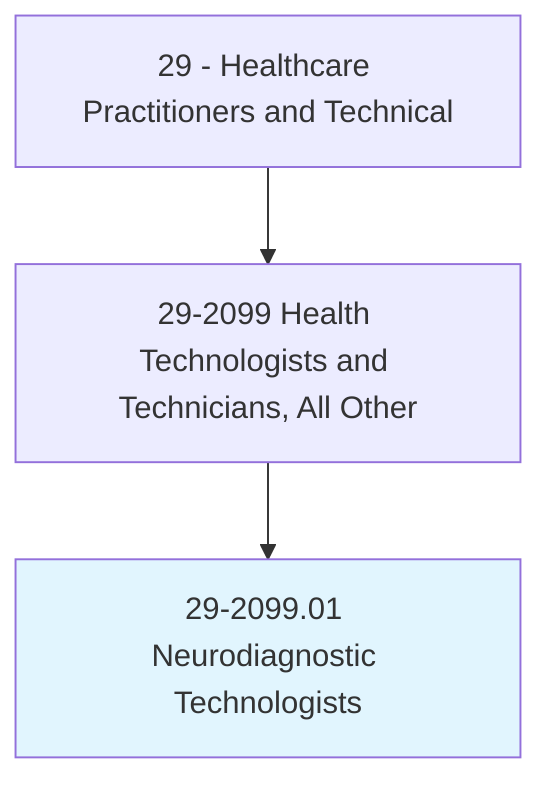
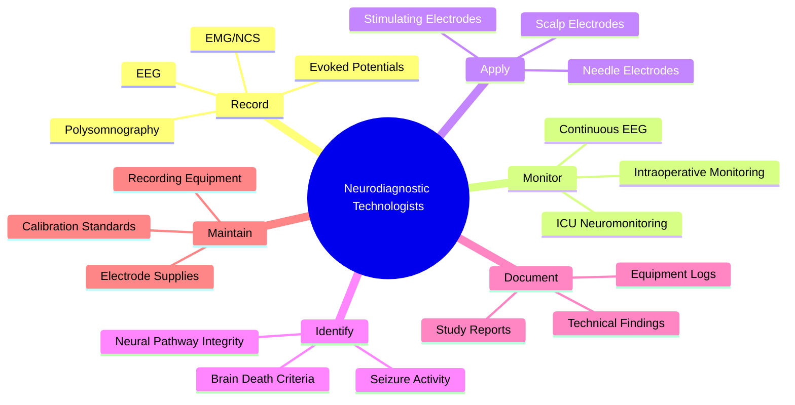
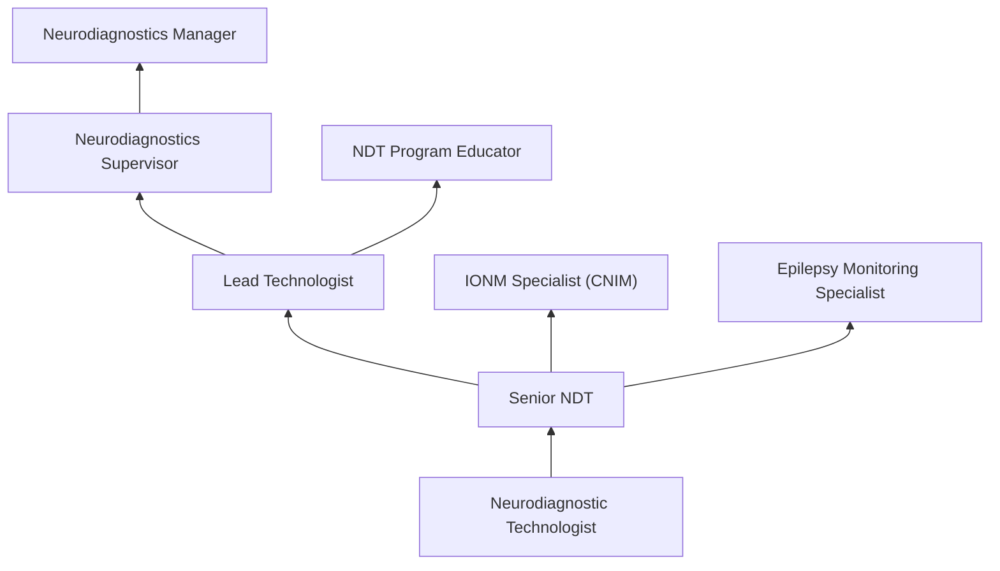
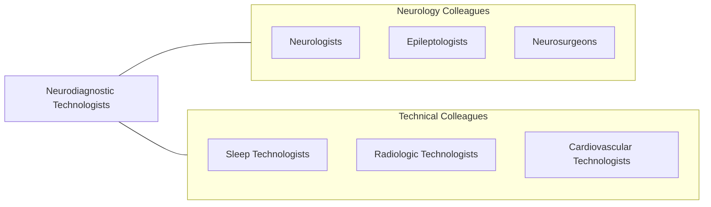

# Neurodiagnostic Technologists

> Conduct electroneurodiagnostic (END) tests such as electroencephalograms, evoked potentials, polysomnograms, or electronystagmograms. May perform nerve conduction studies.

## Overview

Neurodiagnostic Technologists (NDTs) are specialized healthcare professionals who record and monitor electrical activity of the brain and nervous system using electroencephalography (EEG), evoked potentials (EP), nerve conduction studies (NCS), intraoperative neurophysiological monitoring (IONM), and polysomnography. Their recordings are essential for diagnosing epilepsy, sleep disorders, brain death, neuropathies, spinal cord injuries, and other neurological conditions.

The role requires expertise in neuroanatomy, neurophysiology, instrumentation, and electrode placement. NDTs apply scalp and needle electrodes using the international 10-20 system, calibrate recording equipment, monitor and troubleshoot artifact, recognize normal and abnormal brain wave patterns, and identify seizure activity during continuous EEG monitoring. In surgical settings, they perform real-time intraoperative monitoring to protect neural structures during spine, brain, and vascular surgeries.

Modern neurodiagnostics has expanded with digital EEG, continuous video-EEG monitoring units, quantitative EEG analysis, long-term ambulatory monitoring, and remote EEG interpretation via telemedicine. NDTs increasingly participate in epilepsy monitoring units, intensive care neurophysiology, and surgical neurophysiology programs.

## Classification Hierarchy

## Key Statistics

| Metric | Value |
|--------|-------|
| SOC Code | 29-2099.01 |
| Median Annual Salary | $56,880 |
| Employment | ~10,000 |
| Projected Growth | 8% (2022-2032) |
| Job Zone | 3 (Medium Preparation) |
| Category | [Healthcare Practitioners](/occupations/HealthcarePractitioners) |
| Core Tasks | 25+ |
| Source | O*NET |

## Core Tasks

### record.NeurophysiologicStudies

NDTs perform diagnostic neurophysiology recordings.

**Actions:**
- `record.EEG.using.InternationalTenTwentySystem` - Electroencephalography
- `record.EvokedPotentials.for.NeuralPathwayAssessment` - EP testing
- `perform.NerveConductionStudies.for.NeuropathyDiagnosis` - NCS
- `monitor.IntraoperativeNeurophysiology.during.Surgery` - IONM

### monitor.ContinuousEEG

NDTs provide ongoing neurophysiological monitoring.

**Actions:**
- `monitor.ContinuousEEG.for.SeizureDetection` - cEEG monitoring
- `identify.EpileptiformActivity.for.NeurologistReview` - Seizure identification
- `perform.BrainDeathTesting.per.ClinicalProtocol` - Brain death EEG
- `monitor.ICUPatients.for.NonConvulsiveSeizures` - ICU monitoring

## Practice Settings

| Setting | Description |
|---------|-------------|
| Hospital EEG Labs | Routine and ambulatory EEG |
| Epilepsy Monitoring Units | Video-EEG monitoring |
| Operating Rooms | Intraoperative monitoring |
| ICUs | Continuous EEG monitoring |
| Sleep Labs | Polysomnography |
| Outpatient Neurology | Ambulatory EEG and EP |

## Skills & Competencies

### Technical Skills
- **Electroencephalography** - Expert
- **Electrode Application (10-20 System)** - Expert
- **Evoked Potentials** - Advanced
- **Intraoperative Monitoring** - Advanced
- **Pattern Recognition** - Expert
- **Equipment Troubleshooting** - Advanced
- **Polysomnography** - Advanced

### Soft Skills
- **Attention to Detail** - Critical
- **Patient Communication** - Essential
- **Adaptability** - Essential
- **Teamwork** - Essential
- **Composure Under Pressure** - Essential

## Education & Training

| Requirement | Details |
|-------------|---------|
| Education | Associate or bachelor's degree in neurodiagnostic technology |
| Clinical Training | CAAHEP-accredited NDT program |
| Certification | R.EEG T. through ABRET |
| Continuing Education | Per ABRET requirements |

## Certifications

| Certification | Description |
|---------------|-------------|
| R.EEG T. | Registered EEG Technologist (ABRET) |
| R.EP T. | Registered Evoked Potential Technologist |
| CNIM | Certified in Neurophysiologic Intraoperative Monitoring |
| RPSGT | Registered Polysomnographic Technologist |
| CLTM | Certified Long-Term Monitoring Technologist |

## Career Progression

## Specializations

| Focus Area | Description |
|------------|-------------|
| Epilepsy Monitoring | Video-EEG and seizure detection |
| Intraoperative Monitoring | Surgical neurophysiology |
| ICU Neuromonitoring | Critical care EEG |
| Sleep Medicine | Polysomnography |
| Evoked Potentials | Sensory pathway testing |
| Pediatric EEG | Children's neurophysiology |

## Technology & Tools

| Technology | Purpose |
|------------|---------|
| Digital EEG Systems (Natus, Nihon Kohden) | Brain wave recording |
| Video-EEG Monitoring Systems | Seizure correlation |
| IONM Equipment (Cadwell, NIM) | Surgical monitoring |
| Evoked Potential Systems | Neural pathway testing |
| Ambulatory EEG Recorders | Outpatient monitoring |
| Electrode Application Supplies | Patient setup |

## Related Occupations

## Industries

- [Hospitals](/industries/Healthcare/Hospitals/index) - Clinical Neurodiagnostics
- [Outpatient Neurology](/industries/Healthcare/AmbulatoryHealthCare) - Ambulatory Testing
- [IONM Companies](/industries/Healthcare/AmbulatoryHealthCare) - Surgical Monitoring Services
- [Academic Medical Centers](/industries/Education) - Epilepsy Centers

## Departments

This occupation typically works in:
- [Neurodiagnostics Laboratory](/departments/NeurodiagnosticsLab)
- [Neurology](/departments/Neurology)
- [Epilepsy Monitoring Unit](/departments/EpilepsyMonitoringUnit)
- [Operating Room](/departments/OperatingRoom)
- [Sleep Medicine](/departments/SleepMedicine)

---

*Source: O*NET 29-2099.01 - ONETOccupation*
