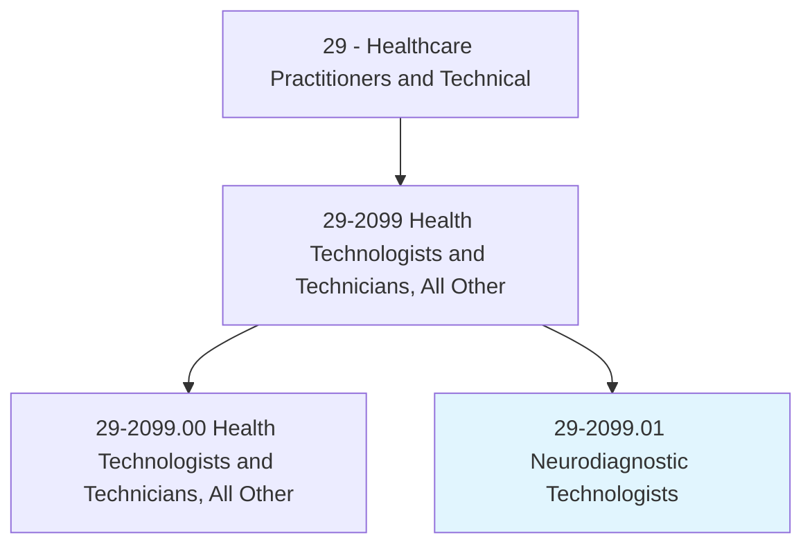
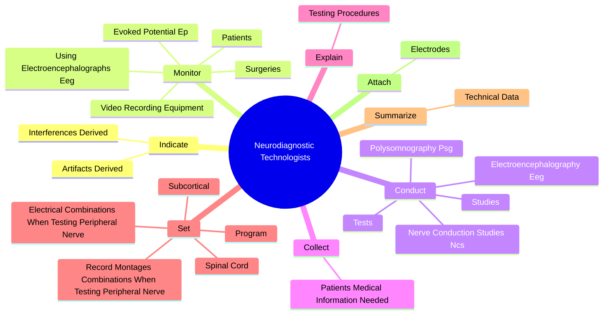
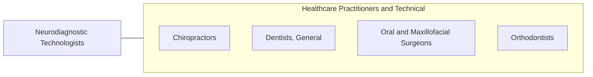

# Neurodiagnostic Technologists

> Conduct electroneurodiagnostic (END) tests such as electroencephalograms, evoked potentials, polysomnograms, or electronystagmograms. May perform nerve conduction studies.

## Overview

Neurodiagnostic Technologists is a specialized variant within the Healthcare Practitioners and Technical category. Conduct electroneurodiagnostic (END) tests such as electroencephalograms, evoked potentials, polysomnograms, or electronystagmograms. 

## Classification Hierarchy

## Key Statistics

| Metric | Value |
|--------|-------|
| SOC Code | 29-2099.01 |
| Category | [Healthcare Practitioners and Technical](/occupations/HealthcarePractitioners) |
| Task Count | 58 |
| Source | O*NET |

## Core Tasks

### indicate.ArtifactsDerived

Neurodiagnostic Technologists indicate artifacts derived as part of their core responsibilities.

**Actions:**
- `indicate.ArtifactsDerived.from.SourcesOutside.of.Brain`
- `indicate.ArtifactsDerived.from.PoorElectrodeContact`
- `indicate.ArtifactsDerived.from.PatientMovement`
- `indicate.ArtifactsDerived.from.OnElectroneurodiagnosticRecordings`

### monitor.Patients

Neurodiagnostic Technologists monitor patients as part of their core responsibilities.

**Actions:**
- `monitor.Patients.during.Tests`
- `monitor.Surgeries`
- `monitor.UsingElectroencephalographsEeg`
- `monitor.EvokedPotentialEp`

### conduct.Tests

Neurodiagnostic Technologists conduct tests as part of their core responsibilities.

**Actions:**
- `conduct.Tests`
- `conduct.Studies`
- `conduct.ElectroencephalographyEeg`
- `conduct.PolysomnographyPsg`

## Skills & Competencies

### Technical Skills
- **Clinical Skills** - Advanced
- **Diagnostic Procedures** - Advanced
- **Patient Care** - Advanced

### Soft Skills
- **Communication** - Essential
- **Problem Solving** - Essential
- **Critical Thinking** - Important
- **Teamwork** - Important
- **Adaptability** - Important

## Related Occupations

## Industries

This occupation is found across multiple industries. See [Industries](/industries) for sector-specific employment data.

## Career Progression

---

*Source: O*NET 29-2099.01 - ONETOccupation*
