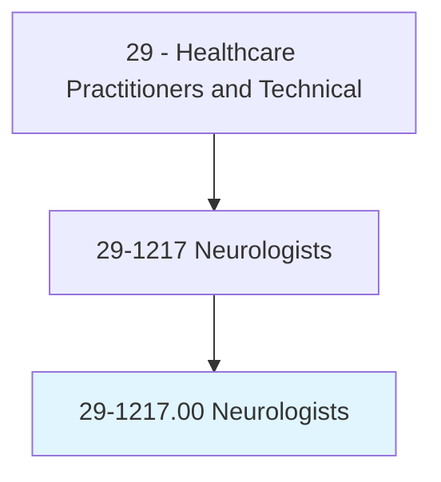
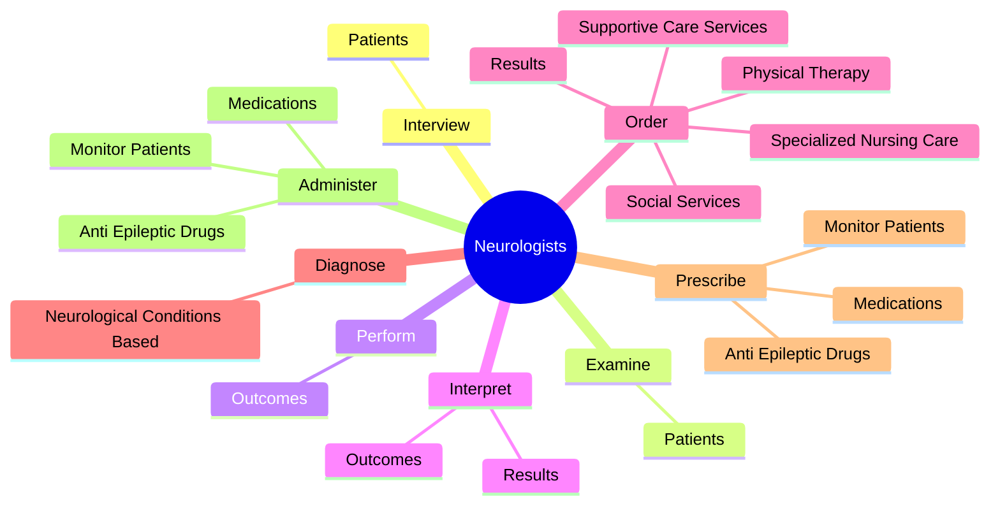
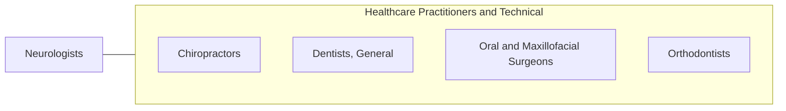

# Neurologists

> Diagnose, manage, and treat disorders and diseases of the brain, spinal cord, and peripheral nerves, with a primarily nonsurgical focus.

## Overview

Neurologists is classified under Healthcare Practitioners and Technical (SOC 29). Diagnose, manage, and treat disorders and diseases of the brain, spinal cord, and peripheral nerves, with a primarily nonsurgical focus.

## Classification Hierarchy

## Key Statistics

| Metric | Value |
|--------|-------|
| SOC Code | 29-1217.00 |
| Category | [Healthcare Practitioners and Technical](/occupations/HealthcarePractitioners) |
| Task Count | 112 |
| Source | O*NET |

## Core Tasks

### interview.Patients

Neurologists interview patients as part of their core responsibilities.

**Actions:**
- `interview.Patients.to.obtain.Information`
- `interview.Patients.to.Complaints`
- `interview.Patients.to.Symptoms`
- `interview.Patients.to.MedicalHistories`

### examine.Patients

Neurologists examine patients as part of their core responsibilities.

**Actions:**
- `examine.Patients.to.obtain.InformationAboutFunctionalStatusOfAreas`
- `examine.Patients.to.Vision`
- `examine.Patients.to.PhysicalStrength`
- `examine.Patients.to.coordination`

### perform.Outcomes

Neurologists perform outcomes as part of their core responsibilities.

**Actions:**
- `perform.Outcomes.of.ProceduresTests`
- `perform.Outcomes.of.DiagnosticTests`
- `perform.Outcomes.of.LumbarPunctures`
- `perform.Outcomes.of.Electroencephalography`

## Skills & Competencies

### Technical Skills
- **Clinical Skills** - Advanced
- **Diagnostic Procedures** - Advanced
- **Patient Care** - Advanced

### Soft Skills
- **Communication** - Essential
- **Problem Solving** - Essential
- **Critical Thinking** - Important
- **Teamwork** - Important
- **Adaptability** - Important

## Related Occupations

## Industries

This occupation is found across multiple industries. See [Industries](/industries) for sector-specific employment data.

## Career Progression

---

*Source: O*NET 29-1217.00 - ONETOccupation*
