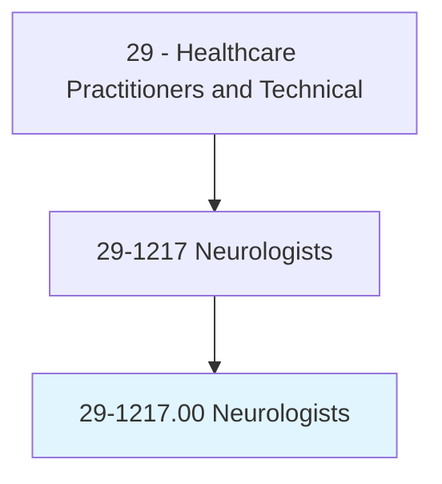
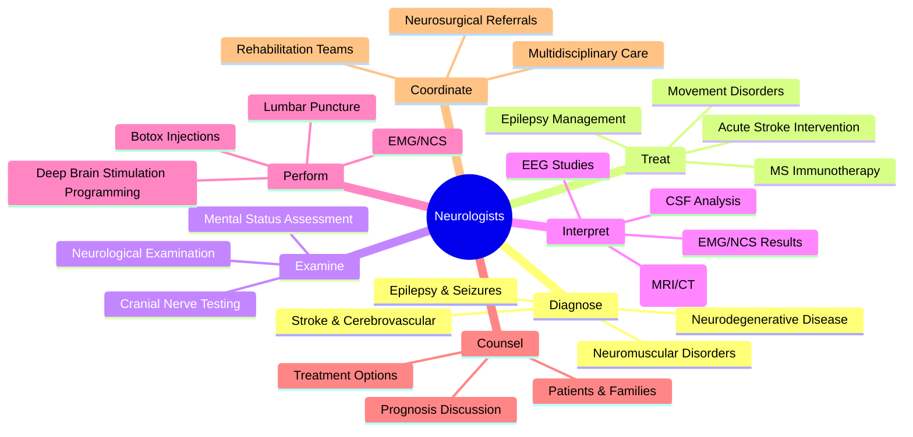
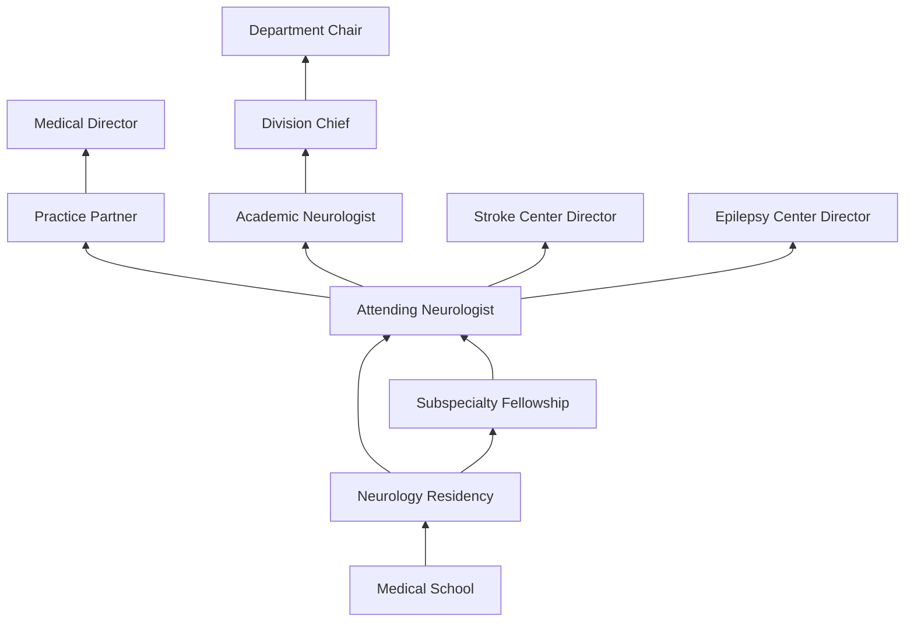
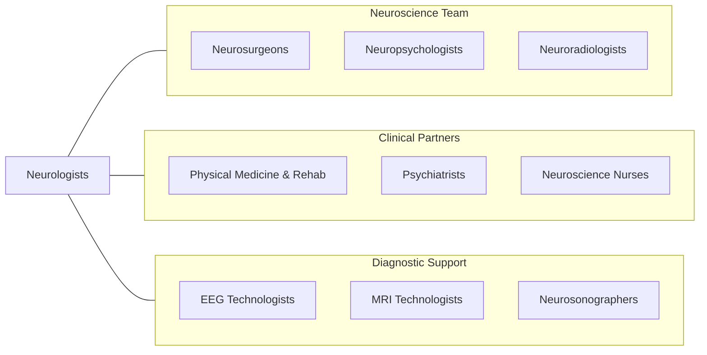

# Neurologists

> Diagnose, treat, and help prevent diseases and disorders of the nervous system, including the brain, spinal cord, peripheral nerves, and muscles.

## Overview

Neurologists are physician specialists who diagnose and treat disorders of the nervous system, encompassing the brain, spinal cord, peripheral nerves, neuromuscular junction, and muscles. They manage an extraordinarily diverse range of conditions including stroke, epilepsy, multiple sclerosis, Parkinson's disease, Alzheimer's disease, migraine, neuropathies, neuromuscular disorders, brain tumors, and movement disorders. Neurology is fundamentally a diagnostic specialty requiring exceptional clinical reasoning and pattern recognition.

The neurological examination remains the cornerstone of diagnosis, combining detailed history-taking with systematic assessment of mental status, cranial nerves, motor and sensory function, coordination, reflexes, and gait. Neurologists complement clinical findings with advanced diagnostic studies including electroencephalography (EEG), electromyography (EMG), nerve conduction studies, lumbar puncture analysis, and neuroimaging interpretation. They synthesize complex data from multiple sources to localize lesions within the nervous system and establish diagnoses.

Modern neurology has been revolutionized by advances in neuroimaging, molecular diagnostics, immunotherapy, gene therapy, and neuromodulation. The emergence of acute stroke intervention (thrombectomy, thrombolysis), disease-modifying therapies for multiple sclerosis, and targeted treatments for rare neurological diseases has transformed neurology from a predominantly diagnostic specialty to one with increasingly effective therapeutic options.

## Classification Hierarchy

## Key Statistics

| Metric | Value |
|--------|-------|
| SOC Code | 29-1217.00 |
| Median Annual Salary | $267,660 |
| Employment | ~19,000 |
| Projected Growth | 4% (2022-2032) |
| Job Zone | 5 (Extensive Preparation) |
| Category | [Healthcare Practitioners](/occupations/HealthcarePractitioners) |
| Core Tasks | 55+ |
| Source | O*NET |

## Core Tasks

### diagnose.NeurologicalConditions

Neurologists identify nervous system disorders through systematic evaluation.

**Actions:**
- `diagnose.Stroke.using.ClinicalAssessmentAndImaging` - Acute stroke evaluation
- `diagnose.Epilepsy.using.EEGAndClinicalHistory` - Seizure classification
- `diagnose.MultiplerSclerosis.using.McDonaldCriteria` - Demyelinating disease
- `diagnose.NeuromuscularDisorders.using.EMGAndNCS` - Electrodiagnostic evaluation

### treat.NeurologicalDisorders

Neurologists manage acute and chronic neurological conditions.

**Actions:**
- `treat.AcuteStroke.using.Thrombolysis` - tPA administration
- `treat.Epilepsy.using.AntiSeizureMedications` - Seizure control
- `treat.MultipleSclerosis.using.DiseaseModifyingTherapy` - MS management
- `treat.MovementDisorders.using.DeepBrainStimulation` - Neuromodulation

### interpret.NeurologicStudies

Neurologists analyze diagnostic test results.

**Actions:**
- `interpret.EEGStudies.for.SeizureLocalization` - EEG reading
- `interpret.Neuroimaging.for.LesionIdentification` - MRI/CT analysis
- `interpret.CSFAnalysis.for.InfectiousOrInflammatory.Conditions` - Spinal fluid interpretation
- `perform.EMGAndNCS.for.NeuromuscularDiagnosis` - Electrodiagnostics

## Practice Settings

| Setting | Description |
|---------|-------------|
| Hospital Neurology Services | Inpatient and consultation neurology |
| Outpatient Neurology Clinics | Ambulatory neurological care |
| Stroke Centers | Acute stroke teams and thrombectomy |
| Epilepsy Monitoring Units | Video-EEG and presurgical evaluation |
| Academic Medical Centers | Teaching, research, and subspecialty care |
| Neurorehabilitation Centers | Post-stroke and TBI recovery |
| Memory/Cognitive Clinics | Dementia evaluation and management |
| Teleneurology | Remote neurological consultation |

## Skills & Competencies

### Technical Skills
- **Neurological Examination** - Expert
- **EEG Interpretation** - Expert
- **EMG/NCS** - Expert
- **Neuroimaging Interpretation** - Expert
- **Lumbar Puncture** - Advanced
- **Stroke Management** - Expert
- **Epilepsy Management** - Expert
- **Neuropharmacology** - Expert

### Soft Skills
- **Clinical Reasoning** - Critical
- **Pattern Recognition** - Critical
- **Patient Communication** - Essential
- **Empathy** - Essential
- **Teaching** - Essential
- **Interdisciplinary Collaboration** - Essential
- **Research Skills** - Important

## Education & Training

| Requirement | Details |
|-------------|---------|
| Undergraduate | 4-year bachelor's degree (pre-med) |
| Medical School | 4-year MD or DO program |
| Neurology Residency | 4 years (including PGY-1 internship) |
| Fellowship | 1-2 years for subspecialization |
| Total Training | 12-14 years post-high school |
| Licensure | State medical license |
| Board Certification | ABPN (American Board of Psychiatry & Neurology) |
| MOC | Continuous certification requirements |

## Certifications

| Certification | Description |
|---------------|-------------|
| ABPN Neurology | Primary neurology board certification |
| ABPN Vascular Neurology | Stroke subspecialty |
| ABPN Epilepsy | Epilepsy subspecialty |
| ABPN Neuromuscular Medicine | Neuromuscular subspecialty |
| ABPN Clinical Neurophysiology | EEG/EMG subspecialty |
| ABPN Sleep Medicine | Sleep disorders |
| UCNS Headache Medicine | Headache subspecialty |
| FAAN | Fellow of the American Academy of Neurology |

## Career Progression

## Specializations

| Subspecialty | Focus Area |
|-------------|------------|
| Vascular Neurology (Stroke) | Acute stroke, cerebrovascular disease |
| Epilepsy/Clinical Neurophysiology | Seizure disorders, EEG monitoring |
| Movement Disorders | Parkinson's, tremor, dystonia |
| Neuromuscular Medicine | ALS, myasthenia, neuropathy |
| Neuro-Oncology | Brain and spinal cord tumors |
| Behavioral Neurology/Neuropsychiatry | Dementia, cognitive disorders |
| Headache Medicine | Migraine and headache disorders |
| Neuro-Immunology | MS and autoimmune neurology |

## Technology & Tools

| Technology | Purpose |
|------------|---------|
| EEG Systems (Routine and Continuous) | Brain electrical activity recording |
| EMG/NCS Equipment | Neuromuscular diagnostic testing |
| MRI (3T, Functional) | Brain and spine imaging |
| CT Angiography | Vascular imaging for stroke |
| Transcranial Doppler | Cerebral blood flow assessment |
| Deep Brain Stimulation Programmers | Neuromodulation adjustment |
| Video-EEG Monitoring Systems | Seizure localization |
| Teleneurology Platforms | Remote consultation and stroke evaluation |

## Related Occupations

## Industries

- [Hospitals](/industries/Healthcare/Hospitals/index) - Primary Employment
- [Physician Offices](/industries/Healthcare/PhysicianOffices) - Neurology Practices
- [Academic Medical Centers](/industries/Healthcare/Hospitals/Teaching) - Research & Teaching
- [Rehabilitation Centers](/industries/Healthcare/RehabilitationCenters) - Neurorehab
- [Pharmaceutical](/industries/Manufacturing/ChemicalManufacturing/Pharmaceutical) - Clinical Trials

## Departments

This occupation typically works in:
- Neurology
- Stroke Center
- Epilepsy Center
- Neuroscience ICU
- Movement Disorders Clinic

---

*Source: O*NET 29-1217.00 - ONETOccupation*
