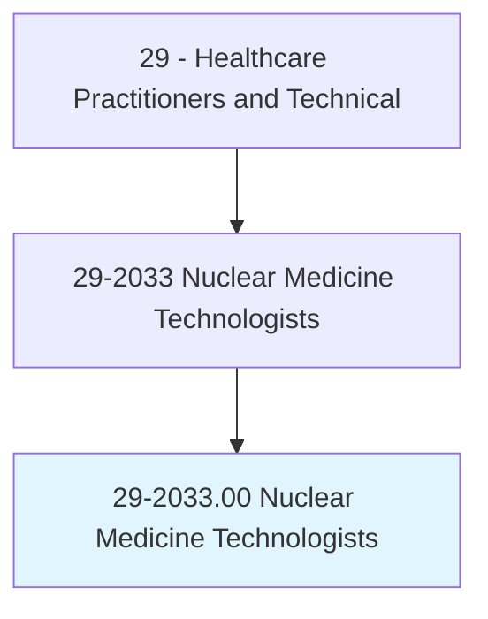
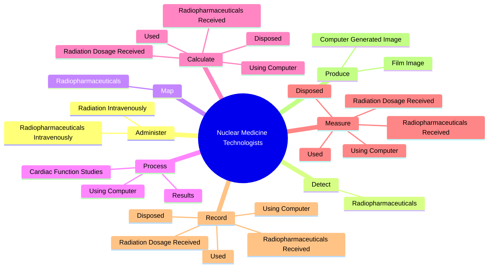
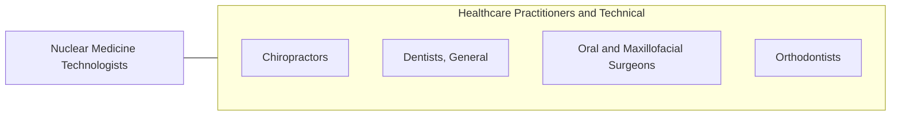

# Nuclear Medicine Technologists

> Prepare, administer, and measure radioactive isotopes in therapeutic, diagnostic, and tracer studies using a variety of radioisotope equipment. Prepare stock solutions of radioactive materials and calculate doses to be administered by radiologists. Subject patients to radiation. Execute blood volume, red cell survival, and fat absorption studies following standard laboratory techniques.

## Overview

Nuclear Medicine Technologists is an occupation within the Healthcare Practitioners and Technical category. Prepare, administer, and measure radioactive isotopes in therapeutic, diagnostic, and tracer studies using a variety of radioisotope equipment. Prepare stock solutions of radioactive materials and calculate doses to be administered by radiologists.

## Classification Hierarchy

## Key Statistics

| Metric | Value |
|--------|-------|
| SOC Code | 29-2033.00 |
| Category | [Healthcare Practitioners and Technical](/occupations/HealthcarePractitioners) |
| Task Count | 87 |
| Source | O*NET |

## Core Tasks

### administer.RadiopharmaceuticalsIntravenously

Nuclear Medicine Technologists administer radiopharmaceuticals intravenously as part of their core responsibilities.

**Actions:**
- `administer.RadiopharmaceuticalsIntravenously.to.detect.DiseasesUsingRadioisotopeEquipmentUnderDirectionOfPhysician`
- `administer.RadiopharmaceuticalsIntravenously.to.treat.DiseasesUsingRadioisotopeEquipmentUnderDirectionOfPhysician`
- `administer.RadiationIntravenously.to.detect.DiseasesUsingRadioisotopeEquipmentUnderDirectionOfPhysician`
- `administer.RadiationIntravenously.to.treat.DiseasesUsingRadioisotopeEquipmentUnderDirectionOfPhysician`

### detect.Radiopharmaceuticals

Nuclear Medicine Technologists detect radiopharmaceuticals as part of their core responsibilities.

**Actions:**
- `detect.Radiopharmaceuticals.in.PatientsBodies`
- `detect.Radiopharmaceuticals.in.UsingCamera.to.produce.Photographic`
- `detect.Radiopharmaceuticals.in.ComputerImages`

### map.Radiopharmaceuticals

Nuclear Medicine Technologists map radiopharmaceuticals as part of their core responsibilities.

**Actions:**
- `map.Radiopharmaceuticals.in.PatientsBodies`
- `map.Radiopharmaceuticals.in.UsingCamera.to.produce.Photographic`
- `map.Radiopharmaceuticals.in.ComputerImages`

## Skills & Competencies

### Technical Skills
- **Clinical Skills** - Advanced
- **Diagnostic Procedures** - Advanced
- **Patient Care** - Advanced

### Soft Skills
- **Communication** - Essential
- **Problem Solving** - Essential
- **Critical Thinking** - Important
- **Teamwork** - Important
- **Adaptability** - Important

## Related Occupations

## Industries

This occupation is found across multiple industries. See [Industries](/industries) for sector-specific employment data.

## Career Progression

---

*Source: O*NET 29-2033.00 - ONETOccupation*
