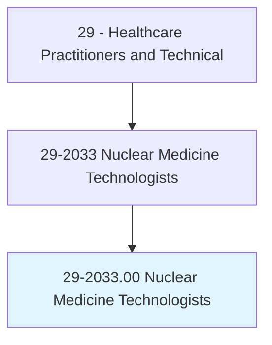
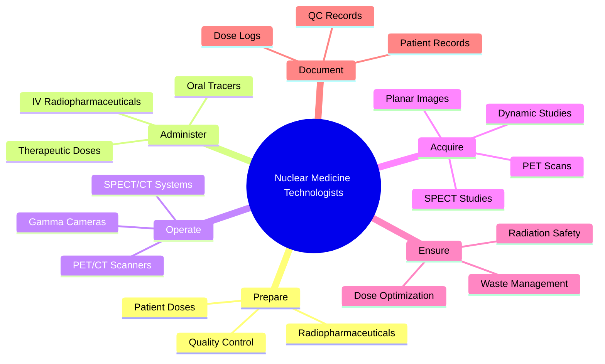
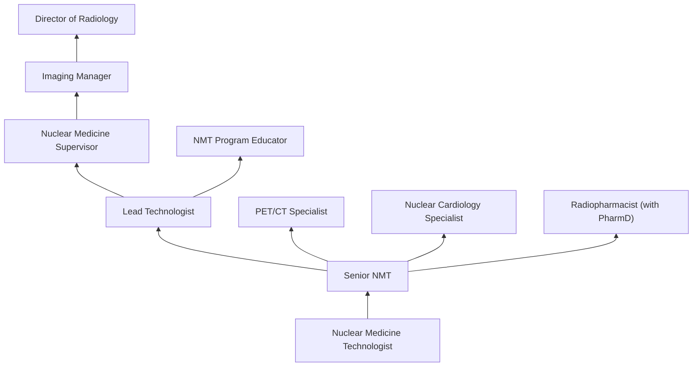
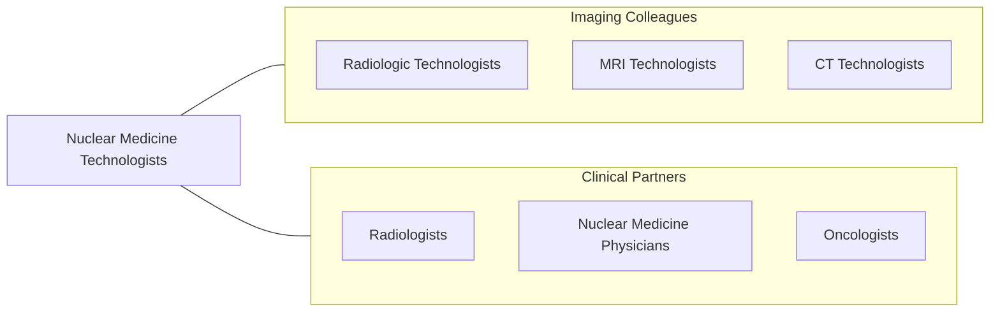

# Nuclear Medicine Technologists

> Prepare, administer, and measure radioactive isotopes in therapeutic, diagnostic, and tracer studies using a variety of radioisotope equipment. Prepare stock solutions of radioactive materials and calculate doses.

## Overview

Nuclear Medicine Technologists are imaging professionals who administer radioactive pharmaceuticals (radiopharmaceuticals) to patients and use specialized cameras to detect radiation emitted from the body, producing images that reveal organ function, blood flow, metabolism, and disease processes. Unlike other imaging modalities that show anatomy, nuclear medicine reveals physiological function, making it essential for diagnosing cancer, heart disease, thyroid disorders, bone abnormalities, and neurological conditions.

The scope includes preparation and quality control of radiopharmaceuticals, patient dose calculation, IV administration of radioactive tracers, operation of gamma cameras and PET/CT scanners, image acquisition and processing, radiation safety compliance, and radioactive waste management. Nuclear medicine technologists perform bone scans, cardiac stress tests (myocardial perfusion imaging), thyroid uptake studies, PET/CT scans for oncology staging, lung perfusion studies, and renal function studies.

Modern nuclear medicine has been revolutionized by PET/CT and PET/MRI hybrid imaging, theranostics (combining diagnostic imaging with targeted radionuclide therapy), SPECT/CT fusion, and new radiopharmaceuticals including PSMA agents for prostate cancer and amyloid tracers for Alzheimer's disease. The emerging field of theranostics positions nuclear medicine technologists at the forefront of precision medicine.

## Classification Hierarchy

## Key Statistics

| Metric | Value |
|--------|-------|
| SOC Code | 29-2033.00 |
| Median Annual Salary | $85,300 |
| Employment | ~18,000 |
| Projected Growth | 3% (2022-2032) |
| Job Zone | 3 (Medium Preparation) |
| Category | [Healthcare Practitioners](/occupations/HealthcarePractitioners) |
| Core Tasks | 30+ |
| Source | O*NET |

## Core Tasks

### prepare.Radiopharmaceuticals

Nuclear Medicine Technologists handle radioactive materials.

**Actions:**
- `prepare.Radiopharmaceuticals.using.AsepticTechnique` - Radiopharmacy
- `calculate.PatientDoses.based.on.WeightAndProtocol` - Dose calculation
- `perform.QualityControl.on.RadiopharmaceuticalPreparations` - QC testing
- `manage.RadioactiveWaste.per.NRCRegulations` - Waste management

### acquire.DiagnosticImages

Nuclear Medicine Technologists perform imaging studies.

**Actions:**
- `perform.PETCTScans.for.OncologyStaging` - PET/CT imaging
- `perform.MyocardialPerfusionImaging.for.CardiacAssessment` - Cardiac imaging
- `perform.BoneScans.for.MetastaticDiseaseDetection` - Skeletal imaging
- `perform.ThyroidUptakeStudies.for.ThyroidFunction` - Thyroid imaging

## Practice Settings

| Setting | Description |
|---------|-------------|
| Hospital Nuclear Medicine | Comprehensive nuclear imaging |
| PET/CT Centers | Oncology imaging |
| Cardiac Imaging Centers | Myocardial perfusion |
| Academic Medical Centers | Research and advanced imaging |
| Mobile Nuclear Medicine | Portable camera services |
| Radiopharmacy | Commercial dose preparation |

## Skills & Competencies

### Technical Skills
- **Radiopharmaceutical Preparation** - Expert
- **Gamma Camera Operation** - Expert
- **PET/CT Operation** - Expert
- **Radiation Safety** - Expert
- **IV Administration** - Expert
- **Image Processing** - Advanced
- **Quality Control** - Expert

### Soft Skills
- **Attention to Detail** - Critical
- **Patient Communication** - Essential
- **Safety Consciousness** - Critical
- **Problem Solving** - Essential
- **Teamwork** - Essential

## Education & Training

| Requirement | Details |
|-------------|---------|
| Education | Associate or bachelor's degree in nuclear medicine technology |
| Clinical Training | JRCNMT-accredited program |
| Certification | CNMT through NMTCB or RT(N) through ARRT |
| State License | Required in most states |
| Continuing Education | Per certification and state requirements |

## Certifications

| Certification | Description |
|---------------|-------------|
| CNMT | Certified Nuclear Medicine Technologist (NMTCB) |
| RT(N)(ARRT) | Nuclear Medicine Technologist (ARRT) |
| NCT | Nuclear Cardiology Technologist (NMTCB) |
| PET Certification | PET specialty credential |
| CT Certification | Hybrid imaging CT credential |

## Career Progression

## Specializations

| Focus Area | Description |
|------------|-------------|
| PET/CT Imaging | Oncology PET scanning |
| Nuclear Cardiology | Myocardial perfusion imaging |
| Theranostics | Targeted radionuclide therapy |
| Radiopharmacy | Radiopharmaceutical preparation |
| Pediatric Nuclear Medicine | Children's nuclear imaging |
| Research Imaging | Clinical trial imaging |

## Technology & Tools

| Technology | Purpose |
|------------|---------|
| PET/CT Scanners (GE, Siemens, Philips) | Hybrid molecular imaging |
| Gamma Cameras (SPECT) | Planar and SPECT imaging |
| Dose Calibrators | Activity measurement |
| Hot Lab Equipment (Shielding, Generators) | Radiopharmacy |
| Survey Meters (Geiger counters) | Radiation safety |
| PACS Systems | Image archival |
| Cyclotrons (at PET centers) | Radioisotope production |

## Related Occupations

## Industries

- [Hospitals](/industries/Healthcare/Hospitals/index) - Nuclear Medicine Departments
- [Imaging Centers](/industries/Healthcare/AmbulatoryHealthCare) - PET/CT Centers
- [Academic Medical Centers](/industries/Education) - Research Imaging
- [Radiopharmacy](/industries/Manufacturing/ChemicalManufacturing/Pharmaceutical) - Commercial Radiopharmacy

## Departments

This occupation typically works in:
- [Nuclear Medicine](/departments/NuclearMedicine)
- [PET/CT Center](/departments/PETCenter)
- [Diagnostic Imaging](/departments/DiagnosticImaging)
- [Radiopharmacy](/departments/Radiopharmacy)

---

*Source: O*NET 29-2033.00 - ONETOccupation*
