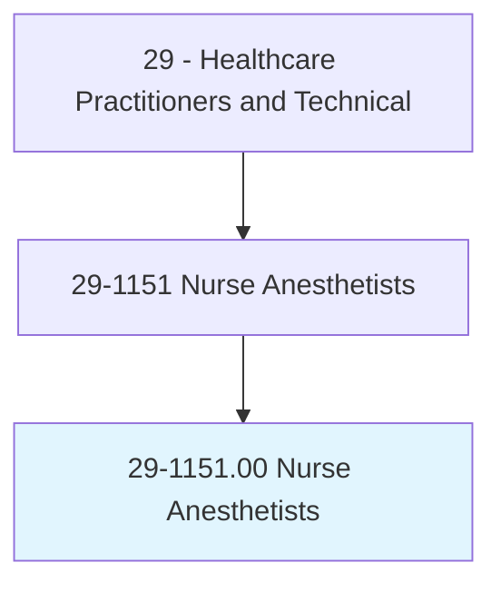
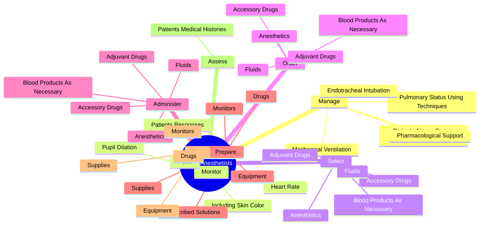

# Nurse Anesthetists

> Administer anesthesia, monitor patient's vital signs, and oversee patient recovery from anesthesia. May assist anesthesiologists, surgeons, other physicians, or dentists. Must be registered nurses who have specialized graduate education.

## Overview

Nurse Anesthetists is an occupation within the Healthcare Practitioners and Technical category. Administer anesthesia, monitor patient's vital signs, and oversee patient recovery from anesthesia. May assist anesthesiologists, surgeons, other physicians, or dentists.

## Classification Hierarchy

## Key Statistics

| Metric | Value |
|--------|-------|
| SOC Code | 29-1151.00 |
| Category | [Healthcare Practitioners and Technical](/occupations/HealthcarePractitioners) |
| Task Count | 122 |
| Source | O*NET |

## Core Tasks

### manage.PatientsAirwayStatusUsingTechniques

Nurse Anesthetists manage patients airway status using techniques as part of their core responsibilities.

**Actions:**
- `manage.PatientsAirwayStatusUsingTechniques`
- `manage.PulmonaryStatusUsingTechniques`
- `manage.EndotrachealIntubation`
- `manage.MechanicalVentilation`

### monitor.PatientsResponses

Nurse Anesthetists monitor patients responses as part of their core responsibilities.

**Actions:**
- `monitor.PatientsResponses`
- `monitor.IncludingSkinColor`
- `monitor.PupilDilation`
- `monitor.Pulse`

### select.Anesthetics

Nurse Anesthetists select anesthetics as part of their core responsibilities.

**Actions:**
- `select.Anesthetics`
- `select.AdjuvantDrugs`
- `select.AccessoryDrugs`
- `select.Fluids`

## Skills & Competencies

### Technical Skills
- **Clinical Skills** - Advanced
- **Diagnostic Procedures** - Advanced
- **Patient Care** - Advanced

### Soft Skills
- **Communication** - Essential
- **Problem Solving** - Essential
- **Critical Thinking** - Important
- **Teamwork** - Important
- **Adaptability** - Important

## Related Occupations

## Industries

This occupation is found across multiple industries. See [Industries](/industries) for sector-specific employment data.

## Career Progression

---

*Source: O*NET 29-1151.00 - ONETOccupation*
