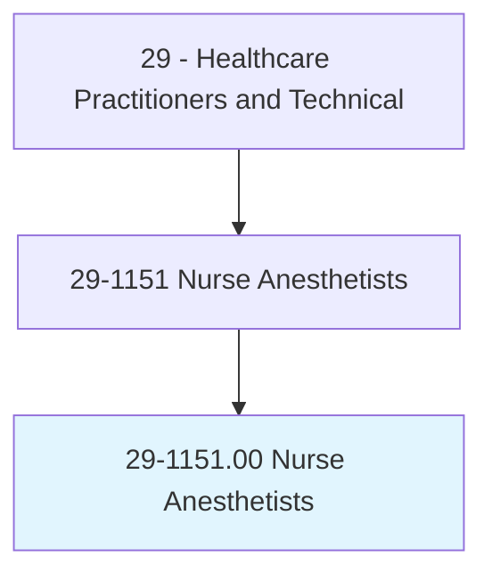
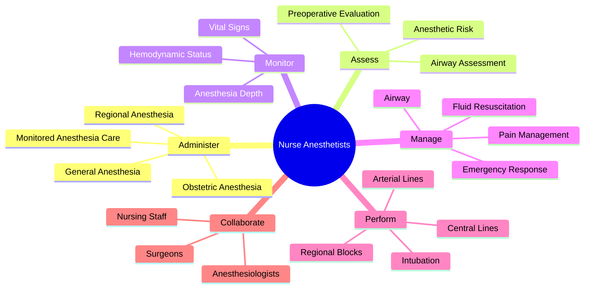
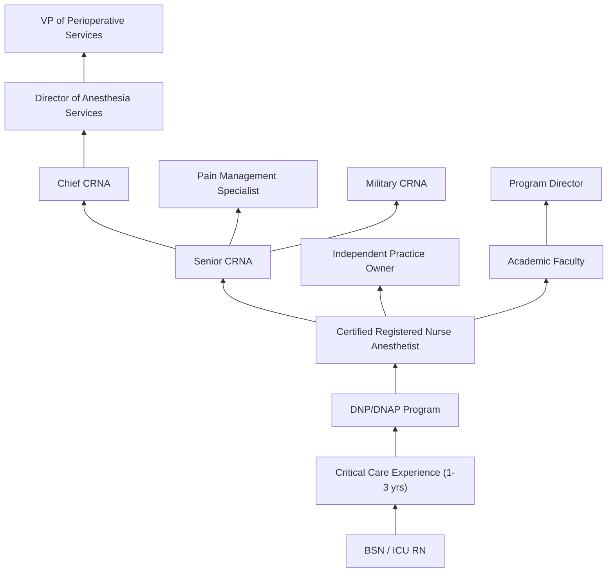
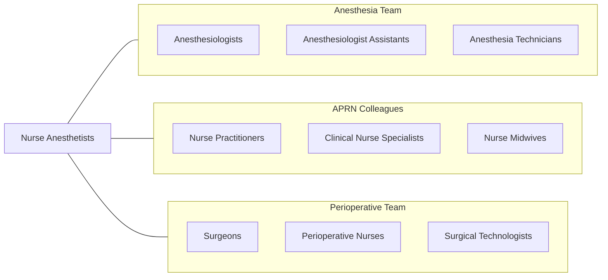

# Nurse Anesthetists

> Administer anesthesia, monitor patient's vital signs, and oversee patient recovery from anesthesia. May assist anesthesiologists, surgeons, other physicians, or dentists. Must be registered nurses who have specialized graduate education.

## Overview

Certified Registered Nurse Anesthetists (CRNAs) are advanced practice registered nurses who administer anesthesia for surgical, obstetric, and diagnostic procedures. They provide the full spectrum of anesthesia care including preoperative assessment, anesthesia plan development, induction and maintenance of anesthesia, and postoperative pain management. CRNAs are the primary anesthesia providers in the majority of rural hospitals and administer more than 50 million anesthetics annually in the United States.

CRNAs are trained to deliver all types of anesthesia including general, regional (spinal, epidural, nerve blocks), and monitored anesthesia care. They manage patients' airways, administer medications for sedation and pain control, monitor vital functions, and respond to emergent clinical changes during surgery. In many states, CRNAs practice with full autonomy and are the sole anesthesia providers, particularly in rural and medically underserved areas.

The CRNA role has evolved to be one of the highest-paid and most in-demand nursing specialties. Advances in anesthesia pharmacology, ultrasound-guided regional techniques, and enhanced recovery protocols have expanded the CRNA scope. The profession advocates for independent practice authority and has demonstrated equivalent patient outcomes to physician-led anesthesia models.

## Classification Hierarchy

## Key Statistics

| Metric | Value |
|--------|-------|
| SOC Code | 29-1151.00 |
| Median Annual Salary | $203,090 |
| Employment | ~48,000 |
| Projected Growth | 9% (2022-2032) |
| Job Zone | 5 (Extensive Preparation) |
| Category | [Healthcare Practitioners](/occupations/HealthcarePractitioners) |
| Core Tasks | 55+ |
| Source | O*NET |

## Core Tasks

### administer.Anesthesia

CRNAs deliver the full range of anesthetic techniques.

**Actions:**
- `administer.GeneralAnesthesia.for.SurgicalProcedures` - General anesthesia
- `administer.RegionalAnesthesia.using.UltrasoundGuidance` - Nerve blocks
- `administer.SpinalAnesthesia.for.LowerExtremityProcedures` - Neuraxial
- `administer.ObstetricAnesthesia.for.LaborAndDelivery` - OB anesthesia

### assess.PreoperativeStatus

CRNAs evaluate patients before anesthesia.

**Actions:**
- `assess.PreoperativeStatus.using.HealthHistory` - Pre-anesthetic evaluation
- `assess.AirwayDifficulty.using.MallampatiScore` - Airway assessment
- `assess.AnestheticRisk.using.ASAClassification` - Risk stratification
- `develop.AnesthesiaPlan.based.on.PatientFactors` - Plan development

### manage.IntraoperativeCare

CRNAs maintain patient stability during procedures.

**Actions:**
- `manage.Airway.using.EndotrachealIntubation` - Airway management
- `manage.FluidResuscitation.for.SurgicalBloodLoss` - Fluid therapy
- `manage.PainControl.using.MultimodalAnalgesia` - Pain management
- `respond.AnesthesiaEmergencies.using.CrisisProtocols` - Emergency management

## Practice Settings

| Setting | Description |
|---------|-------------|
| Hospital Operating Rooms | Primary surgical anesthesia |
| Ambulatory Surgery Centers | Outpatient procedures |
| Obstetric Units | Labor analgesia and cesarean |
| Pain Management Clinics | Chronic pain procedures |
| Dental Offices | Dental anesthesia |
| Rural Hospitals | Sole anesthesia provider |
| Military/VA | Armed forces and veteran care |
| Office-Based Surgery | In-office procedures |

## Skills & Competencies

### Technical Skills
- **Anesthesia Administration** - Expert
- **Airway Management** - Expert
- **Regional Anesthesia (Ultrasound-Guided)** - Expert
- **Hemodynamic Monitoring** - Expert
- **Pharmacology** - Expert
- **Ventilator Management** - Advanced
- **Arterial & Central Line Placement** - Advanced
- **Crisis Management** - Expert

### Soft Skills
- **Vigilance** - Critical
- **Decision Making Under Pressure** - Critical
- **Communication** - Essential
- **Teamwork** - Essential
- **Adaptability** - Essential
- **Attention to Detail** - Critical
- **Stress Management** - Essential

## Education & Training

| Requirement | Details |
|-------------|---------|
| BSN | Bachelor of Science in Nursing |
| Critical Care Experience | Minimum 1 year ICU nursing (most programs require 2+) |
| Doctoral Degree | DNP or DNAP in Nurse Anesthesia (3-4 years, required by 2025) |
| Clinical Hours | 2,000+ clinical anesthesia hours |
| Cases | Minimum 600 anesthesia cases |
| Licensure | NCLEX-RN + state APRN licensure |
| Board Certification | NBCRNA National Certification Exam |
| Recertification | Every 4 years with CPC program |

## Certifications

| Certification | Description |
|---------------|-------------|
| CRNA | Certified Registered Nurse Anesthetist (NBCRNA) |
| NSPM-C | Nonsurgical Pain Management Certification |
| ACLS | Advanced Cardiovascular Life Support |
| PALS | Pediatric Advanced Life Support |
| BLS | Basic Life Support |
| NRP | Neonatal Resuscitation Program |

## Career Progression

## Specializations

| Focus Area | Description |
|------------|-------------|
| Cardiac Anesthesia | Open heart and cardiac procedures |
| Pediatric Anesthesia | Neonatal and pediatric patients |
| Obstetric Anesthesia | Labor, delivery, and C-section |
| Regional Anesthesia | Advanced nerve blocks |
| Pain Management | Chronic pain interventions |
| Trauma Anesthesia | Emergency and trauma cases |
| Neurosurgical Anesthesia | Brain and spine procedures |
| Ambulatory Anesthesia | Outpatient surgery |

## Technology & Tools

| Technology | Purpose |
|------------|---------|
| Anesthesia Machines (Drager, GE) | Gas delivery and ventilation |
| Patient Monitors (Philips, GE) | Multi-parameter vital sign monitoring |
| Ultrasound (Point-of-Care) | Regional block guidance |
| BIS/Entropy Monitors | Anesthesia depth monitoring |
| Infusion Pumps (TCI capable) | Drug delivery |
| Video Laryngoscopes | Difficult airway management |
| Nerve Stimulators | Block confirmation |
| Automated Record Systems (AIMS) | Electronic anesthesia documentation |

## Related Occupations

## Industries

- [Hospitals](/industries/Healthcare/Hospitals/index) - Primary Employment
- [Ambulatory Surgery Centers](/industries/Healthcare/AmbulatoryHealthCare) - Outpatient Surgery
- [Physician Offices](/industries/Healthcare/PhysicianOffices) - Pain Management
- [Dental Offices](/industries/Healthcare/DentalOffices) - Dental Anesthesia
- [Government](/industries/Government) - VA and Military
- [Locum Tenens](/industries/Healthcare/StaffingAgencies) - Contract Coverage

## Departments

This occupation typically works in:
- [Anesthesia Services](/departments/AnesthesiaServices)
- [Perioperative Services](/departments/PerioperativeServices)
- [Obstetric Anesthesia](/departments/ObstetricAnesthesia)
- [Pain Management](/departments/PainManagement)
- [Ambulatory Surgery](/departments/AmbulatorySurgery)

---

*Source: O*NET 29-1151.00 - ONETOccupation*
