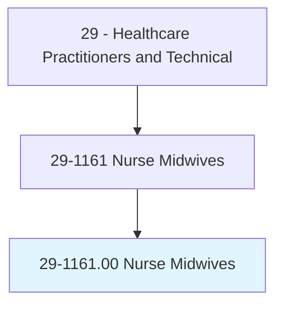
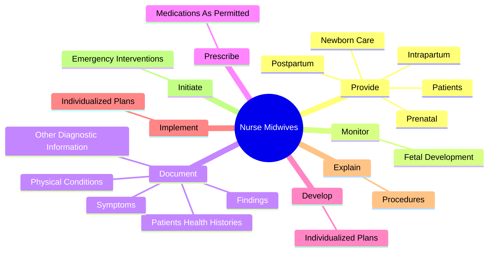
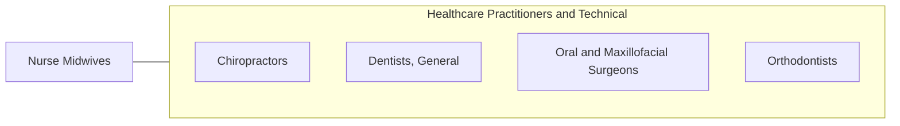

# Nurse Midwives

> Diagnose and coordinate all aspects of the birthing process, either independently or as part of a healthcare team. May provide well-woman gynecological care. Must have specialized, graduate nursing education.

## Overview

Nurse Midwives is an occupation within the Healthcare Practitioners and Technical category. Diagnose and coordinate all aspects of the birthing process, either independently or as part of a healthcare team. May provide well-woman gynecological care.

## Classification Hierarchy

## Key Statistics

| Metric | Value |
|--------|-------|
| SOC Code | 29-1161.00 |
| Category | [Healthcare Practitioners and Technical](/occupations/HealthcarePractitioners) |
| Task Count | 70 |
| Source | O*NET |

## Core Tasks

### provide.Prenatal

Nurse Midwives provide prenatal as part of their core responsibilities.

**Actions:**
- `provide.Prenatal.to.Patients`
- `provide.Intrapartum.to.Patients`
- `provide.Postpartum.to.Patients`
- `provide.NewbornCare.to.Patients`

### monitor.FetalDevelopment

Nurse Midwives monitor fetal development as part of their core responsibilities.

**Actions:**
- `monitor.FetalDevelopment.by.ListeningToFetalHeartbeat`
- `monitor.FetalDevelopment.by.TakingExternalUterineMeasurements`
- `monitor.FetalDevelopment.by.IdentifyingFetalPosition`
- `monitor.FetalDevelopment.by.EstimatingFetalSize`

### document.PatientsHealthHistories

Nurse Midwives document patients health histories as part of their core responsibilities.

**Actions:**
- `document.PatientsHealthHistories`
- `document.Symptoms`
- `document.PhysicalConditions`
- `document.OtherDiagnosticInformation`

## Skills & Competencies

### Technical Skills
- **Clinical Skills** - Advanced
- **Diagnostic Procedures** - Advanced
- **Patient Care** - Advanced

### Soft Skills
- **Communication** - Essential
- **Problem Solving** - Essential
- **Critical Thinking** - Important
- **Teamwork** - Important
- **Adaptability** - Important

## Related Occupations

## Industries

This occupation is found across multiple industries. See [Industries](/industries) for sector-specific employment data.

## Career Progression

---

*Source: O*NET 29-1161.00 - ONETOccupation*
