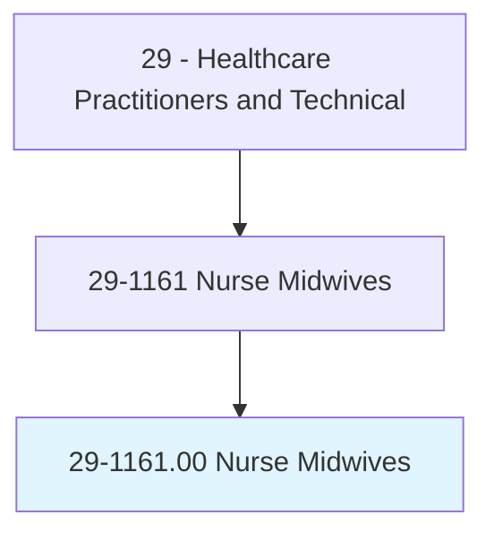
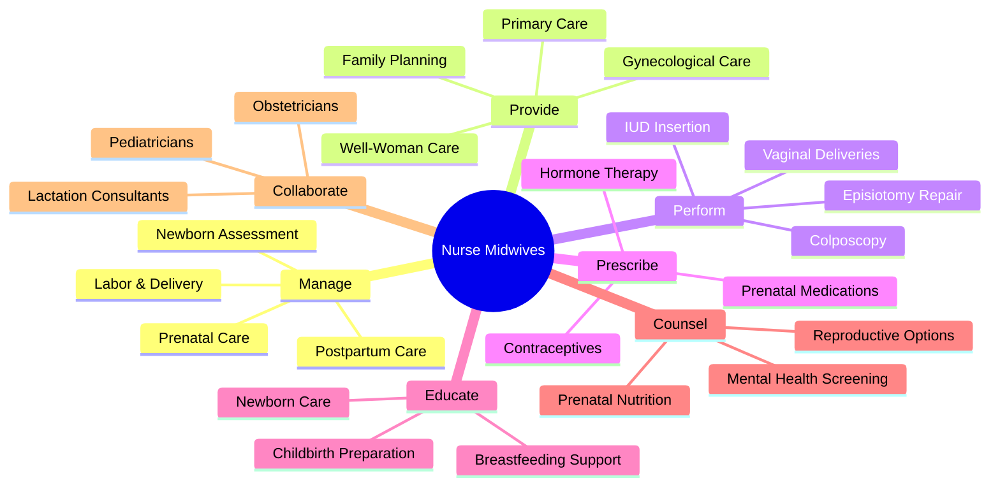
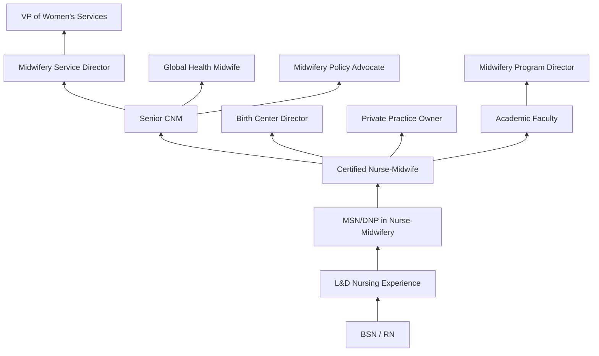
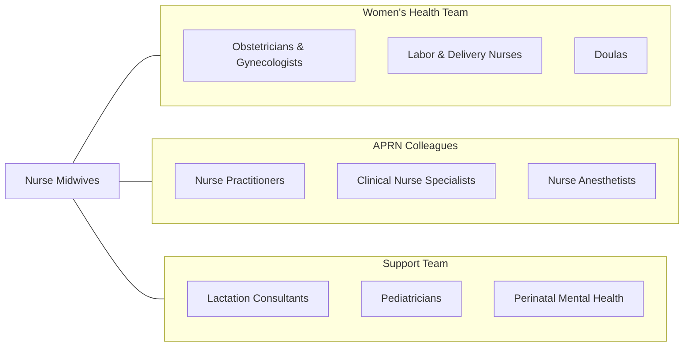

# Nurse Midwives

> Diagnose and coordinate all aspects of the birthing process, either independently or as part of a healthcare team. May provide well-woman gynecological care. Must be certified nurse-midwives (CNMs) with specialized graduate education.

## Overview

Certified Nurse-Midwives (CNMs) are advanced practice registered nurses who provide comprehensive primary and reproductive healthcare to women across the lifespan. They specialize in pregnancy, childbirth, postpartum care, newborn care, family planning, and gynecological health. CNMs are trained in both nursing and midwifery models of care, emphasizing physiologic birth, informed decision-making, patient autonomy, and continuity of care.

CNMs manage the full spectrum of normal pregnancy and birth, including prenatal care, labor support, delivery management, and postpartum follow-up. They are trained to identify complications and collaborate with or refer to obstetricians when medical or surgical intervention is needed. Beyond obstetric care, CNMs provide well-woman care including annual exams, contraceptive counseling, STI screening, menopause management, and primary care services.

Research consistently demonstrates that midwifery-led care is associated with lower rates of cesarean delivery, reduced use of interventions, higher breastfeeding rates, and greater patient satisfaction. The midwifery model emphasizes shared decision-making, non-pharmacological pain management, and support for physiologic birth while maintaining the clinical skills to manage complications when they arise.

## Classification Hierarchy

## Key Statistics

| Metric | Value |
|--------|-------|
| SOC Code | 29-1161.00 |
| Median Annual Salary | $120,880 |
| Employment | ~8,000 |
| Projected Growth | 7% (2022-2032) |
| Job Zone | 5 (Extensive Preparation) |
| Category | [Healthcare Practitioners](/occupations/HealthcarePractitioners) |
| Core Tasks | 50+ |
| Source | O*NET |

## Core Tasks

### manage.PregnancyAndBirth

CNMs provide comprehensive obstetric care.

**Actions:**
- `manage.PrenatalCare.through.RegularVisits` - Pregnancy monitoring
- `manage.LaborAndDelivery.using.MidwiferyModel` - Birth management
- `manage.PostpartumCare.for.MotherAndNewborn` - Recovery care
- `assess.NewbornHealth.using.APGARAndExam` - Newborn evaluation

### provide.WellWomanCare

CNMs deliver gynecological and primary health services.

**Actions:**
- `provide.WellWomanCare.including.AnnualExams` - Preventive health
- `provide.FamilyPlanning.including.ContraceptiveCounseling` - Reproductive planning
- `provide.GynecologicalCare.for.CommonConditions` - GYN management
- `prescribe.HormoneTherapy.for.MenopauseManagement` - Menopause care

### educate.PatientsAndFamilies

CNMs provide education throughout the reproductive lifecycle.

**Actions:**
- `educate.Patients.regarding.ChildbirthPreparation` - Birth preparation
- `educate.Mothers.regarding.Breastfeeding` - Lactation support
- `counsel.Patients.regarding.ReproductiveOptions` - Family planning
- `screen.PrenatalPatients.for.MentalHealth` - Perinatal mental health

## Practice Settings

| Setting | Description |
|---------|-------------|
| Hospital Labor & Delivery | Hospital-based birth |
| Birth Centers | Freestanding midwifery-led birth |
| Private Practice | Independent midwifery practice |
| Community Health Centers | FQHC women's health |
| Home Birth | Planned home deliveries |
| Academic Medical Centers | Teaching and complex care |
| Military/VA | Armed forces women's health |
| Telehealth | Prenatal and postpartum virtual visits |

## Skills & Competencies

### Technical Skills
- **Normal Birth Management** - Expert
- **Prenatal Assessment** - Expert
- **Gynecological Examination** - Expert
- **Newborn Assessment** - Expert
- **Contraceptive Management** - Expert
- **Suturing & Laceration Repair** - Advanced
- **Fetal Monitoring Interpretation** - Expert
- **Pharmacology** - Advanced

### Soft Skills
- **Patient Advocacy** - Critical
- **Empathetic Communication** - Critical
- **Shared Decision Making** - Essential
- **Cultural Competency** - Essential
- **Patience** - Essential
- **Crisis Management** - Essential
- **Collaboration** - Essential

## Education & Training

| Requirement | Details |
|-------------|---------|
| BSN | Bachelor of Science in Nursing |
| MSN or DNP | Graduate degree in Nurse-Midwifery |
| Clinical Hours | Extensive clinical rotations in midwifery |
| Births Attended | Minimum number of births as primary provider |
| Licensure | NCLEX-RN + state APRN licensure |
| Certification | AMCB Certified Nurse-Midwife exam |
| Continuing Education | AMCB recertification requirements |
| DEA Registration | For prescriptive authority |

## Certifications

| Certification | Description |
|---------------|-------------|
| CNM | Certified Nurse-Midwife (AMCB) |
| NRP | Neonatal Resuscitation Program |
| BLS | Basic Life Support |
| ACLS | Advanced Cardiovascular Life Support |
| Lactation Certification (IBCLC) | Optional lactation specialization |
| Colposcopy Training | Advanced cervical assessment |

## Career Progression

## Specializations

| Focus Area | Description |
|------------|-------------|
| High-Risk Obstetrics | Complex pregnancy management |
| Birth Center Practice | Freestanding birth center care |
| Home Birth | Planned out-of-hospital birth |
| Gynecology Only | Non-obstetric women's health |
| Adolescent Health | Teen reproductive health |
| Menopausal Health | Midlife women's health |
| Global Health | International maternal health |
| Lactation | Advanced breastfeeding support |

## Technology & Tools

| Technology | Purpose |
|------------|---------|
| Electronic Fetal Monitors | Labor monitoring |
| Portable Ultrasound | Bedside fetal imaging |
| Electronic Health Records | Prenatal and birth documentation |
| Fetal Doppler | Heart rate assessment |
| Nitrous Oxide Systems | Non-pharmacologic pain option |
| Telehealth Platforms | Virtual prenatal visits |
| Birth Pool Equipment | Water birth support |
| Patient Education Systems | Pregnancy education delivery |

## Related Occupations

## Industries

- [Hospitals](/industries/Healthcare/Hospitals/index) - Labor & Delivery
- [Birth Centers](/industries/Healthcare/BirthCenters) - Freestanding Facilities
- [Physician Offices](/industries/Healthcare/PhysicianOffices) - OB/GYN Practices
- [Community Health Centers](/industries/Healthcare/CommunityHealthCenters) - FQHCs
- [Government](/industries/PublicAdministration) - Military and VA
- [Home Birth Services](/industries/Healthcare/HomeHealth) - Community Midwifery

## Departments

This occupation typically works in:
- Labor & Delivery
- Women's Health
- Midwifery Services
- Prenatal Clinic
- Postpartum Unit

---

*Source: O*NET 29-1161.00 - ONETOccupation*
