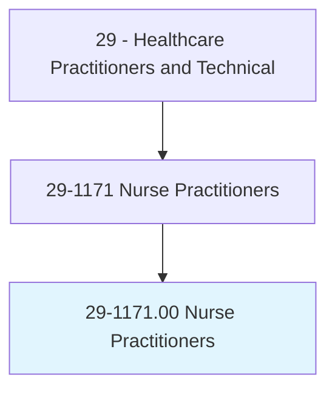
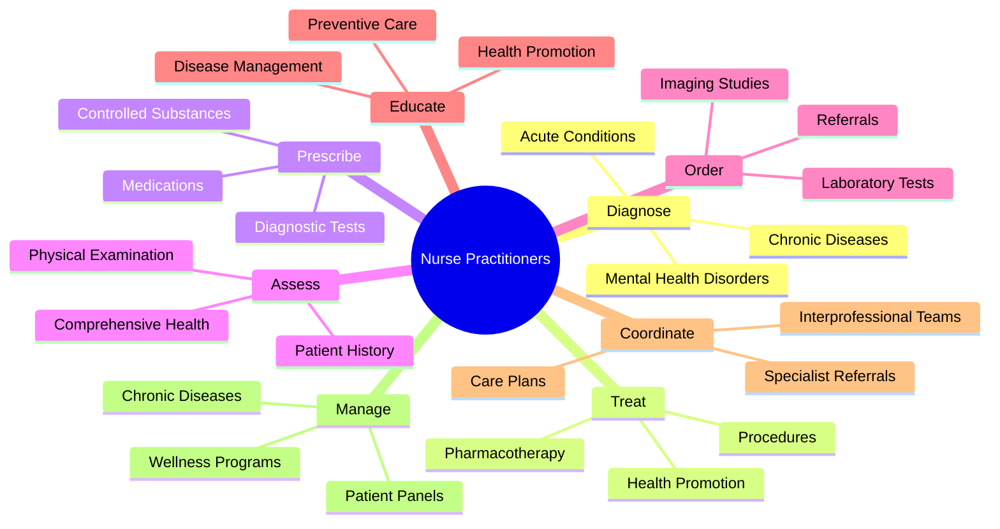
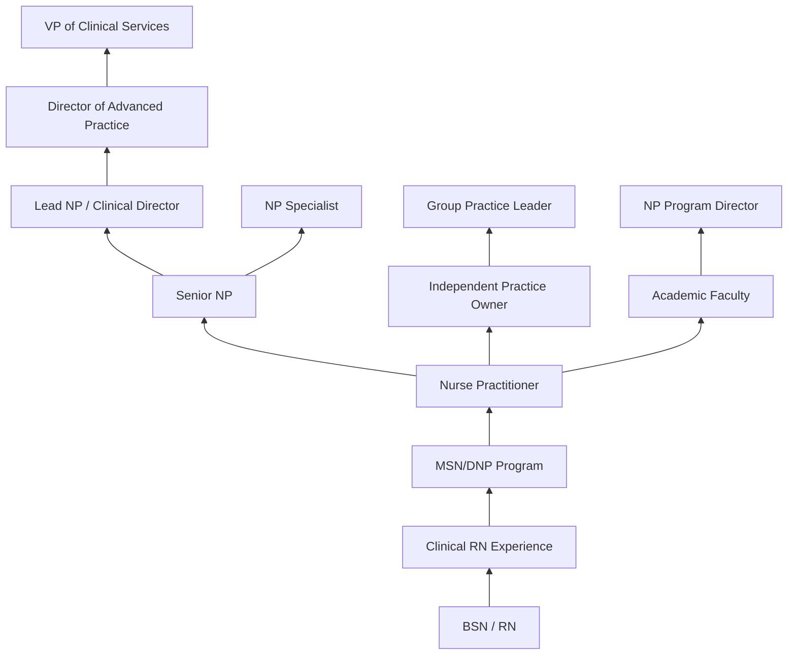
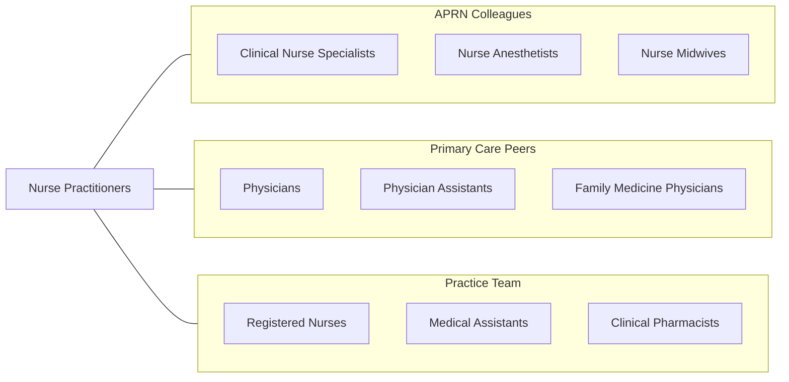

# Nurse Practitioners

> Diagnose and treat acute, episodic, or chronic illness, independently or as part of a healthcare team. May focus on health promotion and disease prevention. May order, perform, or interpret diagnostic tests. May prescribe medication. Must be registered nurses who have specialized graduate education.

## Overview

Nurse Practitioners (NPs) are advanced practice registered nurses who provide a full range of primary, acute, and specialty healthcare services. They conduct comprehensive health assessments, diagnose conditions, order and interpret diagnostic tests, prescribe medications including controlled substances, develop treatment plans, and manage patients independently or collaboratively depending on state practice authority. NPs represent one of the fastest-growing segments of the healthcare workforce.

NPs are trained in a nursing model that emphasizes holistic, patient-centered care while incorporating medical diagnostic and treatment competencies. They practice across all healthcare settings and specialty areas including family practice, adult-gerontology, pediatrics, women's health, psychiatric-mental health, acute care, and neonatal care. In full practice authority states, NPs can practice independently without physician supervision, significantly expanding healthcare access.

The demand for NPs has surged due to physician shortages, expansion of healthcare coverage, aging populations, and the demonstrated quality and cost-effectiveness of NP-delivered care. Research consistently shows that NPs provide care comparable to physicians for their scope of practice, with high patient satisfaction scores. The profession continues to advocate for full practice authority nationwide to maximize access to care.

## Classification Hierarchy

## Key Statistics

| Metric | Value |
|--------|-------|
| SOC Code | 29-1171.00 |
| Median Annual Salary | $121,610 |
| Employment | ~234,000 |
| Projected Growth | 38% (2022-2032, much faster than average) |
| Job Zone | 5 (Extensive Preparation) |
| Category | [Healthcare Practitioners](/occupations/HealthcarePractitioners) |
| Core Tasks | 80+ |
| Source | O*NET |

## Core Tasks

### diagnose.PatientConditions

NPs conduct comprehensive diagnostic evaluations.

**Actions:**
- `diagnose.AcuteConditions.using.ClinicalExamination` - Acute assessment
- `diagnose.ChronicDiseases.using.DiagnosticTesting` - Chronic disease identification
- `diagnose.MentalHealthDisorders.using.ScreeningTools` - Behavioral assessment
- `interpret.DiagnosticResults.for.ClinicalDecisionMaking` - Results analysis

### prescribe.Medications

NPs manage pharmacological therapy.

**Actions:**
- `prescribe.Medications.for.AcuteAndChronicConditions` - Drug therapy
- `prescribe.ControlledSubstances.per.DEAAuthority` - Controlled medications
- `order.LaboratoryTests.for.Diagnosis` - Lab ordering
- `order.ImagingStudies.for.DiagnosticWorkup` - Imaging ordering

### manage.ChronicDiseases

NPs provide longitudinal care for chronic conditions.

**Actions:**
- `manage.Diabetes.using.EvidenceBasedProtocols` - Diabetes management
- `manage.Hypertension.using.GuidelineDrivenTherapy` - HTN control
- `manage.HeartFailure.using.OptimizedPharmacotherapy` - HF management
- `educate.Patients.regarding.DiseaseSelfManagement` - Self-care education

## Practice Settings

| Setting | Description |
|---------|-------------|
| Primary Care Offices | Family and internal medicine |
| Hospitals | Inpatient care and hospitalist NPs |
| Urgent Care Centers | Walk-in acute care |
| Specialty Clinics | Cardiology, oncology, dermatology |
| Community Health Centers | FQHCs and safety-net clinics |
| Retail Health Clinics | Convenient care settings |
| Telehealth | Virtual healthcare delivery |
| Long-Term Care | Nursing home and geriatric care |

## Skills & Competencies

### Technical Skills
- **Advanced Health Assessment** - Expert
- **Pharmacology & Prescribing** - Expert
- **Diagnostic Reasoning** - Expert
- **Chronic Disease Management** - Expert
- **Procedure Skills** - Advanced
- **Health Promotion** - Expert
- **Evidence-Based Practice** - Advanced
- **Electronic Health Records** - Advanced

### Soft Skills
- **Patient Communication** - Critical
- **Clinical Judgment** - Critical
- **Empathy** - Essential
- **Leadership** - Essential
- **Collaboration** - Essential
- **Cultural Competency** - Essential
- **Time Management** - Essential

## Education & Training

| Requirement | Details |
|-------------|---------|
| BSN | Bachelor of Science in Nursing |
| MSN or DNP | Master's or Doctoral degree (NP specialty) |
| Clinical Hours | 500-1,000+ direct patient care hours |
| RN Experience | Often required or preferred |
| Licensure | NCLEX-RN + state APRN licensure |
| National Certification | ANCC or AANP board certification |
| DEA Registration | For prescriptive authority |
| Continuing Education | Per certifying body and state requirements |

## Certifications

| Certification | Description |
|---------------|-------------|
| FNP-BC | Family Nurse Practitioner (ANCC) |
| FNP-C | Family Nurse Practitioner (AANP) |
| AGPCNP-BC | Adult-Gerontology Primary Care NP |
| AGACNP-BC | Adult-Gerontology Acute Care NP |
| PMHNP-BC | Psychiatric-Mental Health NP |
| PNP-BC | Pediatric Nurse Practitioner |
| WHNP-BC | Women's Health Nurse Practitioner |
| NNP-BC | Neonatal Nurse Practitioner |

## Career Progression

## Specializations

| Focus Area | Description |
|------------|-------------|
| Family Practice | All-ages primary care |
| Adult-Gerontology Primary Care | Adult and elderly primary care |
| Adult-Gerontology Acute Care | Hospital-based acute care |
| Pediatric Primary Care | Children's health |
| Psychiatric-Mental Health | Mental health and substance abuse |
| Women's Health | Gynecologic and reproductive care |
| Neonatal | NICU and newborn care |
| Emergency/Urgent Care | Acute care in ED settings |

## Technology & Tools

| Technology | Purpose |
|------------|---------|
| Electronic Health Records (Epic, Cerner) | Documentation and e-prescribing |
| E-Prescribing Systems (Surescripts) | Electronic prescription management |
| Telehealth Platforms | Virtual patient visits |
| Point-of-Care Testing | In-office diagnostics |
| Clinical Decision Support | Evidence-based alerting |
| Patient Portal Systems | Patient communication |
| Otoscopes, Ophthalmoscopes | Physical exam instruments |
| Dermatoscopes | Skin lesion evaluation |

## Related Occupations

## Industries

- [Physician Offices](/industries/Healthcare/PhysicianOffices) - Primary Practice
- [Hospitals](/industries/Healthcare/Hospitals/index) - Inpatient NP Services
- [Community Health Centers](/industries/Healthcare/CommunityHealthCenters) - FQHCs
- [Retail Health](/industries/Retail) - Convenient Care Clinics
- [Telehealth](/industries/Healthcare/Telehealth) - Virtual Care
- [Long-Term Care](/industries/Healthcare/NursingCare) - SNF Coverage
- [Government](/industries/Government) - VA and Military

## Departments

This occupation typically works in:
- [Primary Care](/departments/PrimaryCare)
- [Specialty Clinics](/departments/SpecialtyClinics)
- [Urgent Care](/departments/UrgentCare)
- [Hospital Medicine](/departments/HospitalMedicine)
- [Advanced Practice Services](/departments/AdvancedPractice)

---

*Source: O*NET 29-1171.00 - ONETOccupation*
