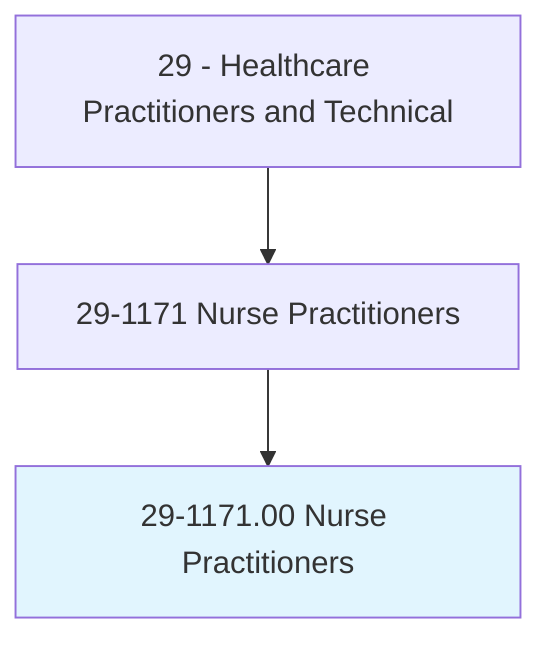
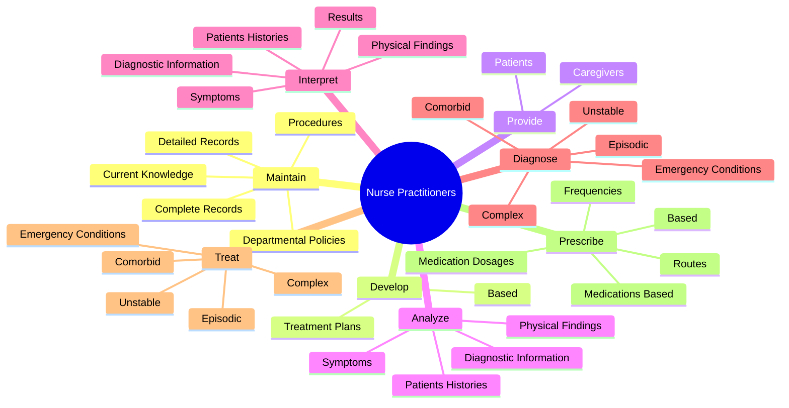
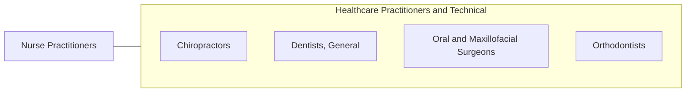

# Nurse Practitioners

> Diagnose and treat acute, episodic, or chronic illness, independently or as part of a healthcare team. May focus on health promotion and disease prevention. May order, perform, or interpret diagnostic tests such as lab work and x rays. May prescribe medication. Must be registered nurses who have specialized graduate education.

## Overview

Nurse Practitioners is an occupation within the Healthcare Practitioners and Technical category. Diagnose and treat acute, episodic, or chronic illness, independently or as part of a healthcare team. May focus on health promotion and disease prevention.

## Classification Hierarchy

## Key Statistics

| Metric | Value |
|--------|-------|
| SOC Code | 29-1171.00 |
| Category | [Healthcare Practitioners and Technical](/occupations/HealthcarePractitioners) |
| Task Count | 134 |
| Source | O*NET |

## Core Tasks

### maintain.CompleteRecords

Nurse Practitioners maintain complete records as part of their core responsibilities.

**Actions:**
- `maintain.CompleteRecords.of.PatientsHealthCarePlans`
- `maintain.CompleteRecords.of.Prognoses`
- `maintain.DetailedRecords.of.PatientsHealthCarePlans`
- `maintain.DetailedRecords.of.Prognoses`

### develop.TreatmentPlans

Nurse Practitioners develop treatment plans as part of their core responsibilities.

**Actions:**
- `develop.TreatmentPlans.on.ScientificRationale`
- `develop.TreatmentPlans.on.Standards.of.Care`
- `develop.TreatmentPlans.on.ProfessionalPracticeGuidelines`
- `develop.Based.on.ScientificRationale`

### provide.Patients

Nurse Practitioners provide patients as part of their core responsibilities.

**Actions:**
- `provide.Patients.with.InformationNeeded.to.promote.Health`
- `provide.Patients.with.ReduceRiskFactors`
- `provide.Patients.with.PreventDisease`
- `provide.Patients.with.Disability`

## Skills & Competencies

### Technical Skills
- **Clinical Skills** - Advanced
- **Diagnostic Procedures** - Advanced
- **Patient Care** - Advanced

### Soft Skills
- **Communication** - Essential
- **Problem Solving** - Essential
- **Critical Thinking** - Important
- **Teamwork** - Important
- **Adaptability** - Important

## Related Occupations

## Industries

This occupation is found across multiple industries. See [Industries](/industries) for sector-specific employment data.

## Career Progression

---

*Source: O*NET 29-1171.00 - ONETOccupation*
