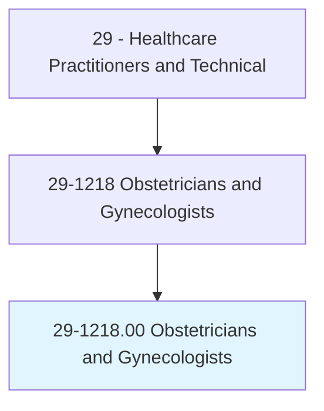
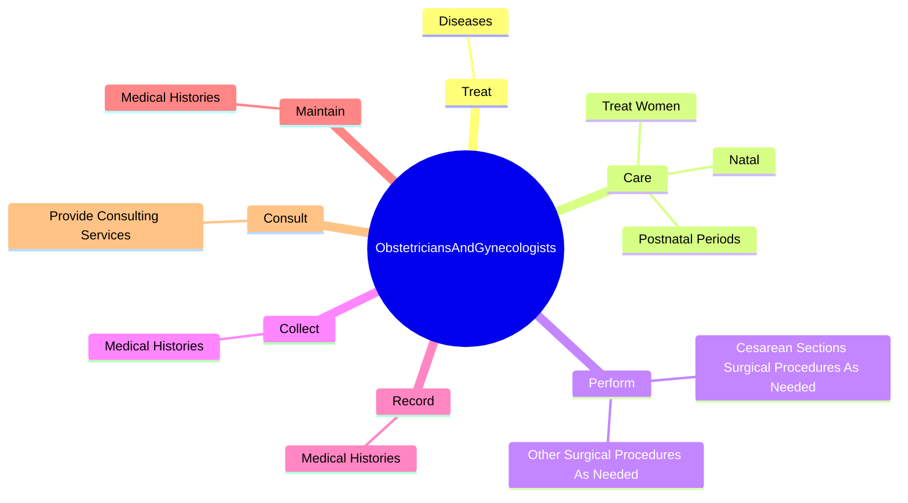
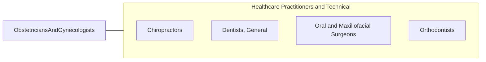

# Obstetricians and Gynecologists

> Provide medical care related to pregnancy or childbirth. Diagnose, treat, and help prevent diseases of women, particularly those affecting the reproductive system. May also provide general care to women. May perform both medical and gynecological surgery functions.

## Overview

Obstetricians and Gynecologists is an occupation within the Healthcare Practitioners and Technical category. Provide medical care related to pregnancy or childbirth. Diagnose, treat, and help prevent diseases of women, particularly those affecting the reproductive system.

## Classification Hierarchy

## Key Statistics

| Metric | Value |
|--------|-------|
| SOC Code | 29-1218.00 |
| Category | [Healthcare Practitioners and Technical](/occupations/HealthcarePractitioners) |
| Task Count | 12 |
| Source | O*NET |

## Core Tasks

### treat.Diseases

Obstetricians and Gynecologists treat diseases as part of their core responsibilities.

**Actions:**
- `treat.Diseases.of.FemaleOrgans`

### care.TreatWomen

Obstetricians and Gynecologists care treat women as part of their core responsibilities.

**Actions:**
- `care.TreatWomen.during.Prenatal`
- `care.Natal`
- `care.PostnatalPeriods`

### perform.CesareanSectionsSurgicalProceduresAsNeeded

Obstetricians and Gynecologists perform cesarean sections surgical procedures as needed as part of their core responsibilities.

**Actions:**
- `perform.CesareanSectionsSurgicalProceduresAsNeeded.to.preserve.PatientsHealth`
- `perform.CesareanSectionsSurgicalProceduresAsNeeded.to.deliver.BabiesSafely`
- `perform.OtherSurgicalProceduresAsNeeded.to.preserve.PatientsHealth`
- `perform.OtherSurgicalProceduresAsNeeded.to.deliver.BabiesSafely`

## Skills & Competencies

### Technical Skills
- **Clinical Skills** - Advanced
- **Diagnostic Procedures** - Advanced
- **Patient Care** - Advanced

### Soft Skills
- **Communication** - Essential
- **Problem Solving** - Essential
- **Critical Thinking** - Important
- **Teamwork** - Important
- **Adaptability** - Important

## Related Occupations

## Industries

This occupation is found across multiple industries. See [Industries](/industries) for sector-specific employment data.

## Career Progression

---

*Source: O*NET 29-1218.00 - ONETOccupation*
