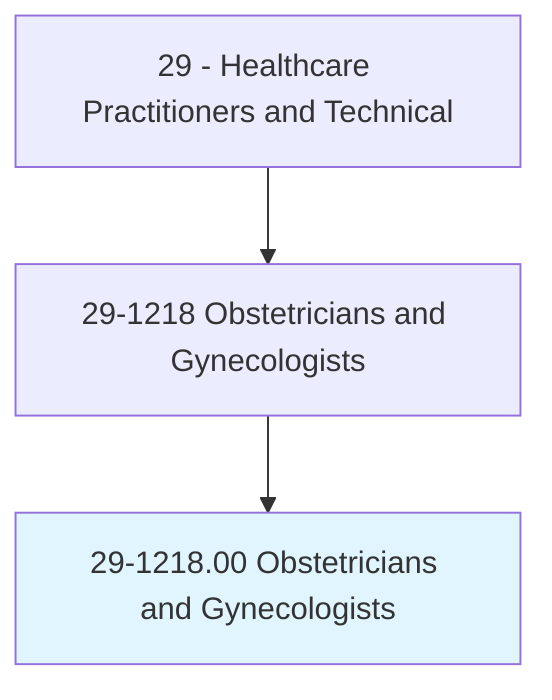
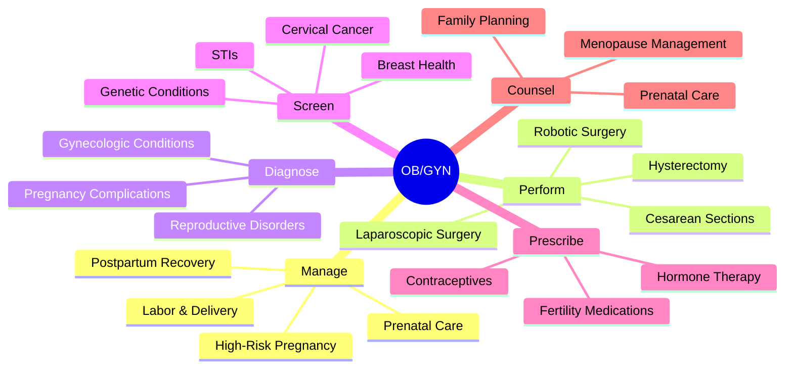
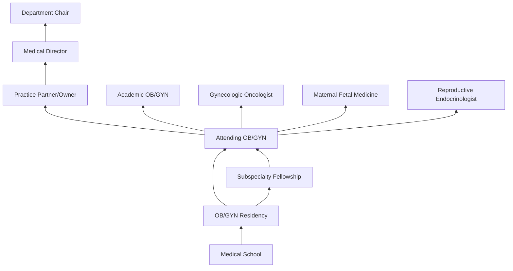
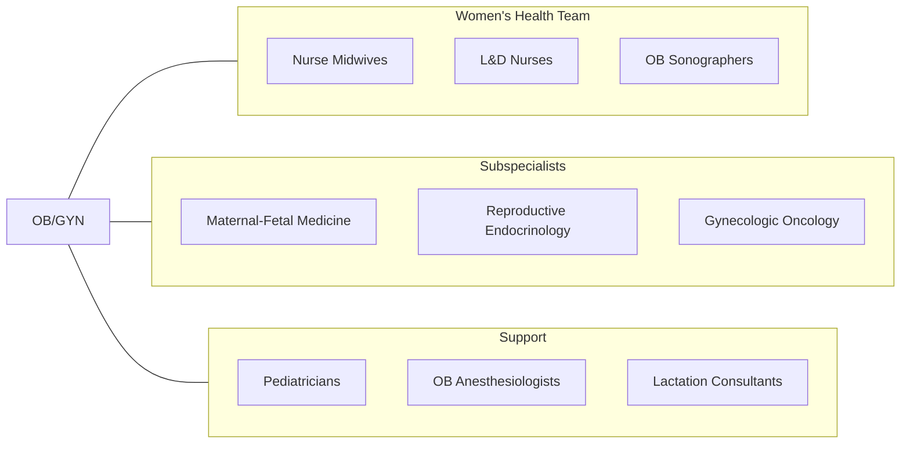

# Obstetricians and Gynecologists

> Provide medical care related to pregnancy or childbirth. Diagnose, treat, and help prevent diseases of women, particularly those affecting the reproductive system. May also provide general medical care to women.

## Overview

Obstetricians and Gynecologists (OB/GYNs) are physician specialists who provide medical and surgical care for the female reproductive system and manage pregnancy, labor, delivery, and postpartum care. They diagnose and treat conditions including infertility, endometriosis, ovarian cysts, uterine fibroids, pelvic floor disorders, sexually transmitted infections, and gynecologic cancers. OB/GYNs also serve as primary care providers for many women, managing preventive health screenings and chronic conditions.

The specialty encompasses both obstetric care (prenatal management, high-risk pregnancy, labor and delivery, cesarean sections) and gynecologic care (annual exams, contraception, menopause management, and gynecologic surgery). OB/GYNs perform a wide range of surgical procedures including cesarean deliveries, hysterectomies, laparoscopic surgeries, and minimally invasive procedures using robotic-assisted technology.

Modern OB/GYN practice has been transformed by advances in fetal monitoring, maternal-fetal medicine, reproductive endocrinology, minimally invasive gynecologic surgery, and genomic screening. The specialty increasingly emphasizes evidence-based protocols for labor management, shared decision-making, and reducing unnecessary interventions.

## Classification Hierarchy

## Key Statistics

| Metric | Value |
|--------|-------|
| SOC Code | 29-1218.00 |
| Median Annual Salary | $239,200 |
| Employment | ~22,000 |
| Projected Growth | 3% (2022-2032) |
| Job Zone | 5 (Extensive Preparation) |
| Category | [Healthcare Practitioners](/occupations/HealthcarePractitioners) |
| Core Tasks | 60+ |
| Source | O*NET |

## Core Tasks

### manage.PregnancyAndDelivery

OB/GYNs provide comprehensive obstetric care.

**Actions:**
- `manage.PrenatalCare.using.EvidenceBasedProtocols` - Prenatal management
- `manage.LaborAndDelivery.for.NormalAndComplicated.Births` - Delivery care
- `perform.CesareanSection.for.ObstetricIndications` - Surgical delivery
- `manage.HighRiskPregnancy.with.MaternalFetalConsultation` - High-risk care

### perform.GynecologicSurgery

OB/GYNs execute surgical procedures for gynecologic conditions.

**Actions:**
- `perform.Hysterectomy.using.MinimallyInvasiveTechniques` - Uterine surgery
- `perform.LaparoscopicSurgery.for.Endometriosis` - MIS procedures
- `perform.RoboticSurgery.for.ComplexGynecologic.Conditions` - Robotic-assisted
- `perform.ColposcopyAndBiopsy.for.CervicalAbnormalities` - Cervical evaluation

### screen.WomensHealth

OB/GYNs deliver comprehensive preventive care.

**Actions:**
- `screen.CervicalCancer.using.PapSmearAndHPVTesting` - Cervical screening
- `screen.BreastHealth.using.ClinicalExamAndMammography` - Breast evaluation
- `counsel.FamilyPlanning.using.SharedDecisionMaking` - Contraceptive counseling
- `manage.Menopause.using.HormoneTherapy` - Menopause management

## Practice Settings

| Setting | Description |
|---------|-------------|
| Private/Group Practice | Traditional OB/GYN office |
| Hospital Labor & Delivery | Inpatient obstetric care |
| Academic Medical Centers | Teaching and subspecialty care |
| Community Health Centers | Safety-net women's health |
| Ambulatory Surgery Centers | Outpatient gynecologic surgery |
| Maternal-Fetal Medicine Units | High-risk pregnancy |
| Fertility Clinics | Reproductive endocrinology |

## Skills & Competencies

### Technical Skills
- **Obstetric Management** - Expert
- **Gynecologic Surgery** - Expert
- **Cesarean Section** - Expert
- **Laparoscopic/Robotic Surgery** - Advanced
- **Fetal Monitoring Interpretation** - Expert
- **Ultrasound (OB/GYN)** - Advanced
- **Colposcopy** - Expert
- **Pharmacotherapy** - Expert

### Soft Skills
- **Patient Communication** - Critical
- **Empathy** - Critical
- **Decision Making Under Pressure** - Critical
- **Cultural Sensitivity** - Essential
- **Teamwork** - Essential
- **Emotional Resilience** - Essential

## Education & Training

| Requirement | Details |
|-------------|---------|
| Undergraduate | 4-year bachelor's degree (pre-med) |
| Medical School | 4-year MD or DO program |
| OB/GYN Residency | 4 years |
| Fellowship | 2-3 years for subspecialization |
| Total Training | 12-15 years post-high school |
| Licensure | State medical license |
| Board Certification | ABOG (American Board of Obstetrics & Gynecology) |

## Certifications

| Certification | Description |
|---------------|-------------|
| ABOG Diplomate | Primary OB/GYN board certification |
| ABOG MFM | Maternal-Fetal Medicine subspecialty |
| ABOG REI | Reproductive Endocrinology & Infertility |
| ABOG Gynecologic Oncology | GYN cancer subspecialty |
| ABOG Female Pelvic Medicine | Urogynecology subspecialty |
| NRP | Neonatal Resuscitation |
| ALSO | Advanced Life Support in Obstetrics |

## Career Progression

## Specializations

| Subspecialty | Focus Area |
|-------------|------------|
| Maternal-Fetal Medicine | High-risk pregnancy |
| Reproductive Endocrinology & Infertility | IVF and fertility |
| Gynecologic Oncology | GYN cancers |
| Female Pelvic Medicine & Reconstructive Surgery | Urogynecology |
| Minimally Invasive GYN Surgery | Laparoscopic/robotic |
| Adolescent Gynecology | Teen reproductive health |
| Menopause & Sexual Health | Midlife women's health |

## Technology & Tools

| Technology | Purpose |
|------------|---------|
| Fetal Monitors (External/Internal) | Labor monitoring |
| OB/GYN Ultrasound | Prenatal and gynecologic imaging |
| Robotic Surgical Systems (da Vinci) | MIS gynecologic surgery |
| Laparoscopic Towers | Minimally invasive surgery |
| Colposcopes | Cervical examination |
| Hysteroscopes | Intrauterine visualization |
| Electronic Health Records | Documentation and ordering |
| Fetal Fibronectin Testing | Preterm labor prediction |

## Related Occupations

## Industries

- [Physician Offices](/industries/Healthcare/PhysicianOffices) - OB/GYN Practice
- [Hospitals](/industries/Healthcare/Hospitals/index) - Labor & Delivery
- [Academic Medical Centers](/industries/Healthcare/Hospitals/Teaching) - Teaching & Research
- [Ambulatory Surgery](/industries/Healthcare/AmbulatoryHealthCare) - GYN Surgery Centers
- [Community Health Centers](/industries/Healthcare/CommunityHealthCenters) - Women's Health

## Departments

This occupation typically works in:
- [Obstetrics & Gynecology](/departments/OBGYN)
- [Labor & Delivery](/departments/LaborAndDelivery)
- [Women's Health Center](/departments/WomensHealth)
- [Maternal-Fetal Medicine](/departments/MFM)
- [Gynecologic Surgery](/departments/GYNSurgery)

---

*Source: O*NET 29-1218.00 - ONETOccupation*
