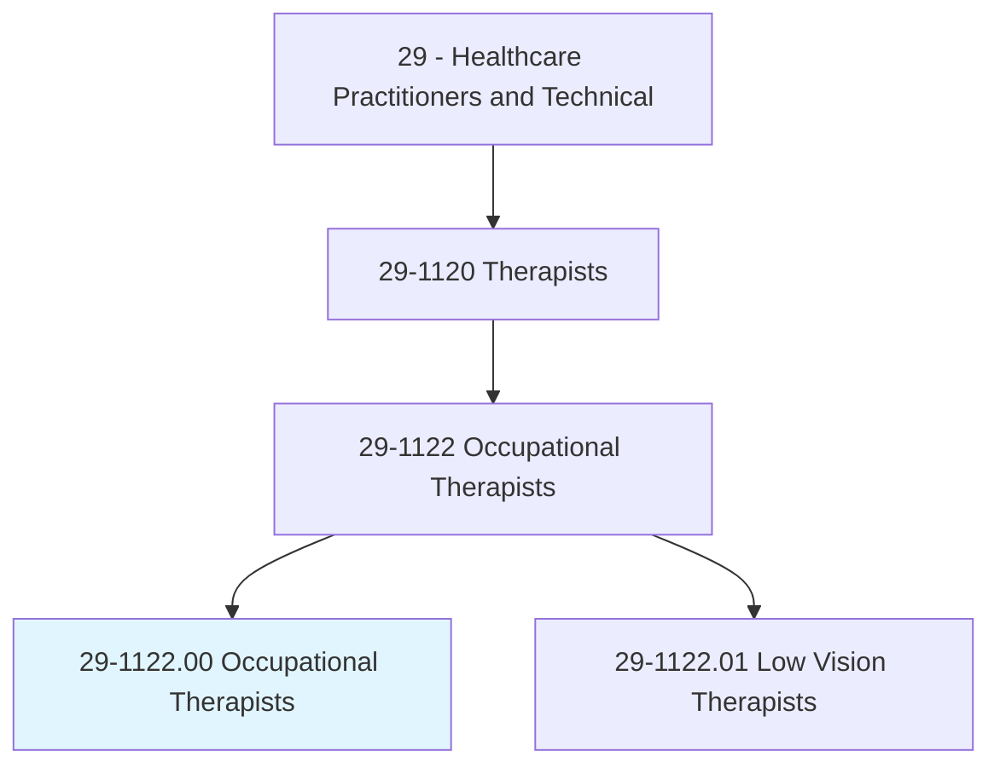
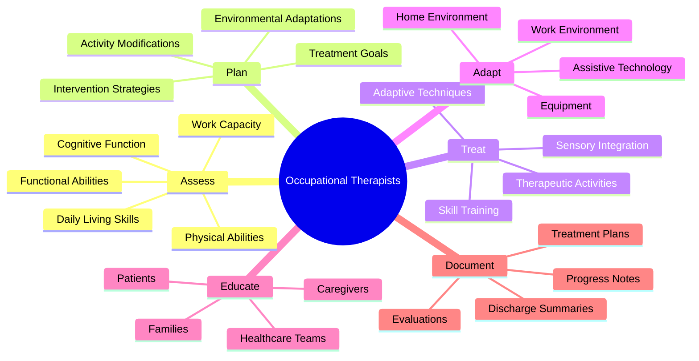
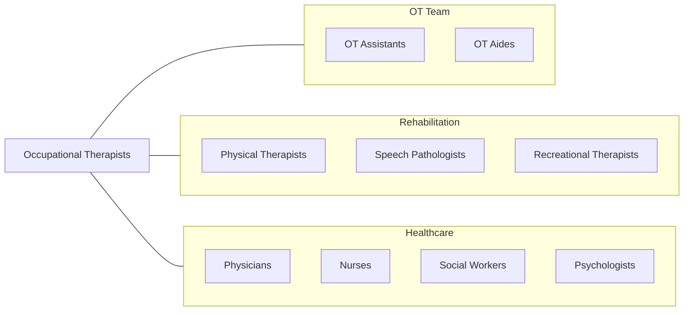
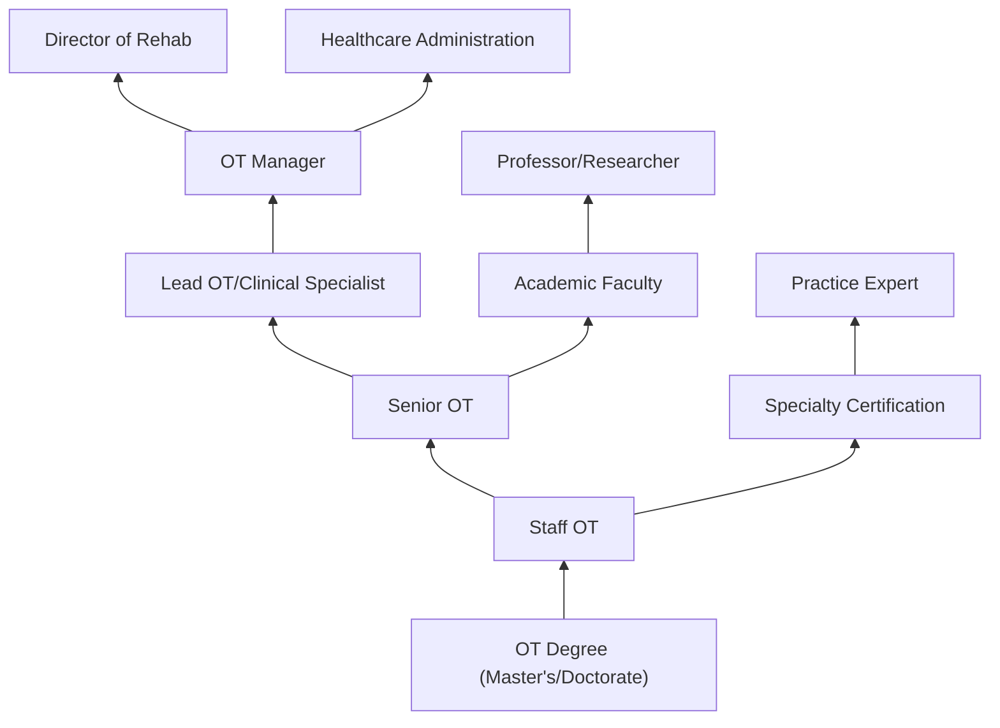

# Occupational Therapists

> Assess, plan, and organize rehabilitative programs that help build or restore vocational, homemaking, and daily living skills, as well as general independence, to persons with disabilities or developmental delays. Use therapeutic techniques, adapt the individual's environment, teach skills, and modify specific tasks that present barriers to the individual.

## Overview

Occupational Therapists (OTs) help people of all ages participate in the activities they want and need to do through therapeutic use of everyday activities (occupations). They work with individuals who have physical, sensory, or cognitive disabilities, developmental delays, mental health challenges, or injuries to develop, recover, or maintain the skills needed for daily living and working. OTs use a holistic approach, considering the physical, psychological, social, and environmental factors affecting each person's ability to function.

## Classification Hierarchy

## Key Statistics

| Metric | Value |
|--------|-------|
| SOC Code | 29-1122.00 |
| Job Zone | 5 (Extensive Preparation) |
| Category | [Healthcare Practitioners](/occupations/HealthcarePractitioners) |
| Core Tasks | 20+ |
| Source | O*NET |

## Core Tasks

### assess.FunctionalAbilities

OTs evaluate patients' ability to perform daily activities.

**Actions:**
- `assess.DailyLivingSkills` - Evaluate ADL performance
- `assess.WorkCapacity` - Determine vocational abilities
- `assess.CognitiveFunction` - Test mental processes
- `assess.MotorSkills` - Evaluate movement abilities
- `assess.SensoryProcessing` - Test sensory integration

### develop.TreatmentPlans

OTs create individualized intervention programs.

**Actions:**
- `develop.IndividualizedTreatmentPlans` - Create care plans
- `establish.TherapeuticGoals` - Set objectives
- `select.InterventionStrategies` - Choose approaches
- `plan.ActivityModifications` - Adapt activities

### provide.TherapeuticInterventions

OTs deliver hands-on treatment.

**Actions:**
- `provide.SkillTraining` - Teach daily living skills
- `provide.CognitiveRehabilitation` - Address mental function
- `provide.SensoryIntegration` - Treat sensory issues
- `implement.AdaptiveTechniques` - Teach compensatory strategies

### adapt.Environment

OTs modify surroundings to promote independence.

**Actions:**
- `recommend.HomeModifications` - Suggest home changes
- `prescribe.AssistiveTechnology` - Order adaptive devices
- `adapt.WorkEnvironment` - Modify job settings
- `train.Use.of.AdaptiveEquipment` - Teach device use

## Practice Settings

| Setting | Population | Focus |
|---------|------------|-------|
| Hospitals | Acute patients | Recovery, discharge planning |
| Rehab Centers | Post-acute | Intensive rehabilitation |
| Schools | Children | Developmental, educational |
| Home Health | Homebound | Independence, safety |
| Outpatient | Community | Ongoing therapy |
| Mental Health | Psychiatric | Life skills, recovery |
| Nursing Homes | Elderly | Maintenance, quality of life |
| Hand Therapy | Upper extremity | Hand/arm rehabilitation |

## Skills & Competencies

### Technical Skills
- **Functional Assessment** - Expert
- **Treatment Planning** - Expert
- **Therapeutic Activities** - Expert
- **Adaptive Equipment** - Expert
- **Environmental Modification** - Advanced
- **Documentation** - Expert

### Soft Skills
- **Patient Communication** - Critical
- **Creativity** - Essential
- **Problem Solving** - Critical
- **Empathy** - Essential
- **Collaboration** - Essential
- **Patience** - Critical

## Related Occupations

## Industries

- [Hospitals](/industries/Healthcare/Hospitals/index) - Acute Care
- [Nursing Care Facilities](/industries/NursingCare) - Long-term Care
- [Home Health Services](/industries/HomeHealth) - Home-based Care
- [Schools](/industries/Schools) - Pediatric Settings
- [Outpatient Rehab](/industries/OutpatientRehab) - Community Practice
- [Mental Health Facilities](/industries/MentalHealth) - Psychiatric Care

## Career Progression

## Education & Training

| Requirement | Details |
|-------------|---------|
| Typical Education | Master's or Doctoral degree in OT (OTD increasingly common) |
| Prerequisites | Bachelor's degree with prerequisite courses |
| Fieldwork | Required Level I and Level II fieldwork |
| Certification | NBCOT certification required |
| Licensure | State licensure required |
| Continuing Education | State-mandated requirements vary |

## Certifications

| Certification | Description |
|---------------|-------------|
| OTR | Occupational Therapist Registered (NBCOT) |
| Board Certifications | AOTA specialty certifications |
| CHT | Certified Hand Therapist |
| BCP | Board Certified in Pediatrics |
| BCG | Board Certified in Gerontology |
| BCMH | Board Certified in Mental Health |
| SCEM | Specialty Certification in Environmental Modification |

## Specialty Areas

| Specialty | Focus |
|-----------|-------|
| Pediatrics | Children and development |
| Geriatrics | Aging population |
| Mental Health | Psychiatric rehabilitation |
| Hand Therapy | Upper extremity |
| Neurology | Brain and spinal cord |
| Physical Rehabilitation | Physical disabilities |
| Low Vision | Visual impairment |
| Driving Rehabilitation | Return to driving |

## Departments

This occupation typically works in:
- [Occupational Therapy](/departments/OccupationalTherapy)
- [Rehabilitation Services](/departments/Rehabilitation)
- [Pediatric Therapy](/departments/PediatricTherapy)
- [Hand Therapy](/departments/HandTherapy)
- [Mental Health](/departments/MentalHealth)

---

*Source: O*NET 29-1122.00 - ONETOccupation*
